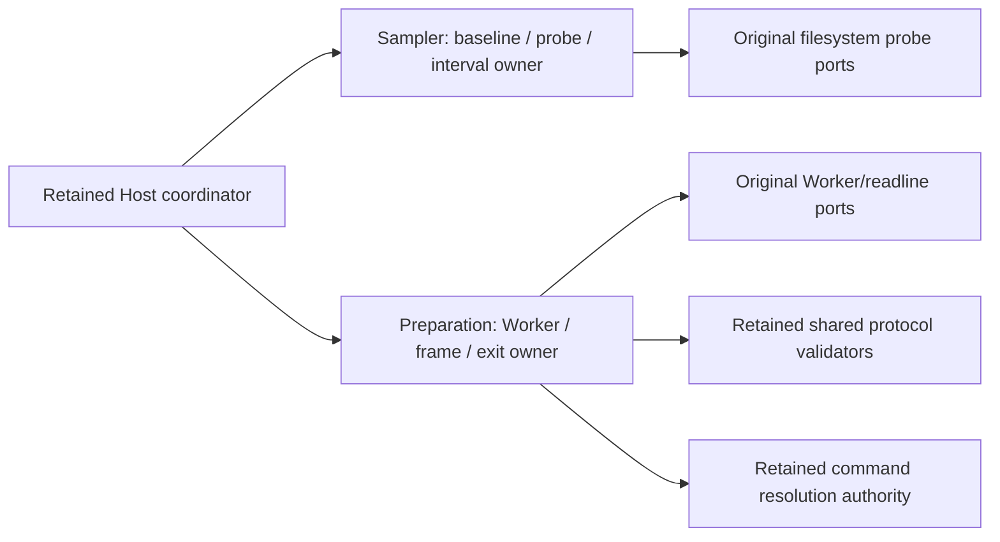

# Complete startup disk sampler and storage preparation owner candidates

Batch50 begins atde5d230a858cc17b9edcbbd0bfe6cceb9f4ef420 on same draft PR9. After exact visible receipt/current hash/fixed origin/PR filename screening, select at most two substantive owners: host/startupDiskSampler.ts (SHAc1c9ac53858e673dc7a3c936c4bd718ca75964762144493a726ee8cbc05760e0), host/storagePreparationProcesses.ts (SHAc6c69fa42f7997f10b3eb34af6bdadf73b60184efc4d37973e88572c7e6d6b8b). Empty reviews alone not eligibility; absence is bounded, not private-absence proof.

Sampler owns logical scope entries, baseline sealing, current measurement projection and stopped/busy/interval lifetime. Preserve original unknown insertion, scope migration, partial quality, cap8, time2000, callbacks, truthy timer handling and default directory metadata/statfs semantics. Preparation owns two original control paths,30s first-state clocks, message/frame/duplicate-path sequencing, failure identity and exit-only settlement. Preserve original imported validators/command/env/identity and canonical prepared reuse; no new auth/permission/lock/retry/cancel/backpressure policy. Host coordinator/DB locking/migration and A scheduler/runtime stay retained.

Private class/decomposition members and inherited comments stripped from body-free public declarations. Two fresh fork-none GPT-6.1 Sol/high authors receive only complete functional/API contracts/public dependencies. Freeze every whole raw version and access before curator inspection; correction is a new entire literal by same author memory+bounded facts, not source-exposed curator patch. Install full selected literals+formatter only, byte-proved. Curator read two inherited bodies and bounded shared public catalogs/direct Host consumer; source exposure disclosed.

Minimum fake-only tests: one synthetic sampler authority/lifetime group using injected probe/filesystem/clock/interval and one synthetic preparation group with fake Worker/readline/fs/command/env/signal/timeout/schema ports. No real probes/Worker/process/tasks/database/permissions/network/userfiles/credentials. Target semantics/public API/syntax/direct-consumer/lint/format/architecture only; no broad previous-owner suites/full build/native.

Complete prior browser/server/Cron sources, B/root paths, GuestManager, dormant RecoveryStore, database/realtime accepted/HOLD, private prompt-transfer acceptance and all private HASH HOLD remain excluded/retained. Old private checkpoint/accepted-byte records not overwritten by local/public source; no alternate access or restoration. Root LICENSE/global inventories/reviews/dependencies/policy untouched. Fixed schema/protocol/default/message/glue and normalized body/expression matches receive zero independent/MIT credit, parent classification pending. Same PR9 source submission, no main/cross-lane merge or aggregate acceptance.
