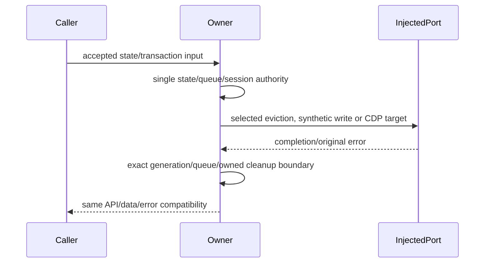

# Complete tab residency, recovery and clipboard owners

Batch42 continues PR9 from686ad40895582aa02e50ca34df0e9ccb9d17c5fc. Exactly browserTabResidencyCoordinator.ts, browserTabRecoveryStore.ts and browserVirtualClipboard.ts. Exact current hash/history/unaccepted receipt and PR8/10/11/12 occupation screen precedes authoring. Existing GitHub connector fixed-ref872ad960 publisher reads for all3 match inventory Git blob and normalized SHA; local missinggitobjects are not equivalent to publisher unavailability. Source mapping verification alone grants neither MIT nor independent expression. No new upstream/license claim/global inventory change.

Residency coordinator exclusively owns logical tab generation/residency and one serialized crosswindow eviction runner; policy selects victim through existing public port and guest manager retains native guest ownership. Recovery store owns cached schema1 snapshots, one recoverable mutation queue and atomic replacement intent; existing shallow-copy/user-data compatibility, quarantine/pruning/failure semantics retained. Clipboard owner exclusively owns one focused-frame transaction's attached sessions through focused target resolution and paste, while borrowed targets remain outside its cleanup authority. Fixed page script, schemas, policy and native ports stay retained.

Fresh nofork Sol/high authors receive body-free public behavior/declarations only. Freeze complete author-reported literal before candidate review; preserve all failures, corrections and access qualifications. Curator source exposed, integrates wholecopies/formatting only; instruction-only sharedfilesystem is not OS cleanroom. No novelty/extraction/line-reduction credit. Matching source bodies/expressions and static/script/protocol vocabulary receive0new independence/MIT credit pendingparent.

Five minimum fake-port groups cover stale residency/restore generations and serialized eviction; recovery queued write failure/cleanup/cache plus schema/quarantine; page state history/count/UTF8 pruning compatibility; clipboard borrowed/owned focused-frame authority, delayedregistry/cleanup/error identity; input token and pasteprojection through existing direct consumer. Necessary scoped synthetic declarations/public API comparison, directconsumer syntax/lint/format/directarchitecture only. No real browser/page/clipboard/data files/runtime network/credentials/permissions/SSH/deployment/database, fulltest/native/build. Priorpnpm ENOENT not retried; Node24.19.0/pinned24.14.0 difference retained. Rootbroadcast/databaseStartupRelay/taskRealtimeBus HOLD, Dprovider/config/registryservice, previousowners andotherlanes excluded; Library403/cancelledsourceupload neverretried. Same draftPR/recoverytarget, no main/crosslane integration.
