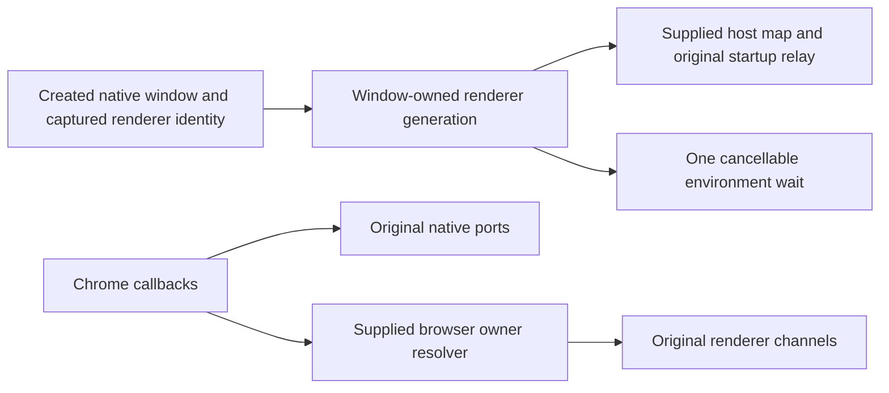

# Root-only desktop lifecycle/chrome allocation packet

At verified published E baseline `1b64757edf64aa5983915d948220be2b5f37999b`, root requests E to screen lifecycle and chrome and publish complete body-free public behavior/API/port/static-data packets. Root exclusively owns implementations/cohesive splits; E changes documentation/evidence only. G preload and B UI untouched. Retain existing config/common/accepted work, no novelty forcing or cross-lane import.

Origin inventories match current substantial sources, classify upstream-modified, and give exact upstream blob/digest identities. Exact licensing reviews null/absent and bounded receipts search found dependency bindings rather than accepted owner replacement. Eligibility is based on actual source and origin/history evidence, not missing receipt alone. Lifecycle423 lines15866 bytes SHA256 `7811b200fb288b56b677522996d45cd0d8ca4a8c5e742d956ad84dfbae150c23`; chrome536 lines19380 bytes `97f8d51ed30293aa00a69a84d8698a7a8760748a0ac50d6680cf03be326ad040`. Both implementation sources remain unchanged in this packet.

Nine named author inputs in `docs/evidence/desktop-window-root-packet-20261003/`: contract.md, lifecycle-public-api.d.ts, chrome-public-api.d.ts, dependency-api.d.ts, external-port-notes.md, imports.json, required-literal-data.json, public-dependency-data.json, event-bindings.json. Other reservation/curator/raw extraction/verifier/evidence files are curator/root review only. Actual public declarations inspected before qualification: createWindow's raw any return qualified BrowserWindow from original createBrowserWindow; six lifecycle/two chrome TS9007 retained. Existing zoom public numeric qualifications recorded; remaining opaque dependency anys retained. No semantic/type closure.

Preserve complete native window/bootstrap/renderer identities, generation/cancel/close/unread/focus/dock behavior, platform/theme/zoom/size/chrome, guest popup authority/context menu/navigation timing, exact data and original dependencies. Root may use cohesive below400-line whole sources with freeze/commit-before-review and same-author whole correction/full cumulative receipts. Packet does not prescribe private helpers/decomposition. Minimum synthetic groups are scoped in contract; no E native execution/implementation acceptance.

Scoped packet declaration/import/input/static-data/byte/source/dependency checks only. Ordinary suites/builds/lint/project/semantic typechecks/source-emitted matrices deferred; prior architecture environment failure retained, not repeated. Parent-reported root platform/Host PR12 ecf4968a771bdb736da8bbf88151722cd4cf7f2c remains report-only, no E revalidation/import. Source-exposed curator, historical broader exposures/repaired scratch-write breach, instruction-only shared executor/no OS audit remain qualified. No global licensing edits/MIT decisions/main merge/deploy/release/grants/contact/private bypass. All21 materials open.
