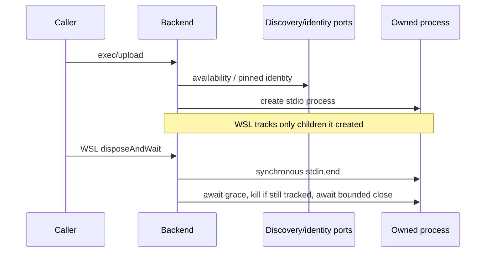

# Docker and WSL backend lifecycle owners

Captured baseline b088fe3883d162e61700a769faec4a624242678c. Scope complete
docker-backend.ts, wsl-backend.ts and wslProxy.ts. backend.ts public declarations
retained. Source-exposed curator compiled this functional/API packet; author
must not inspect inherited code/tests/history/dependency/other-author outputs.
Read only this packet, root AGENTS.md and architecture-governance SKILL.md.
Write whole replacements in /tmp/knorvia-docker-wsl-backends-authored only.
No runtime/test/build/native process/connection/network/filesystem-user-data
operations, credential access, SSH/auth/security/permission-repair/cache/CDN/
network implementation reads or changes. Generated commands are output contracts
to author, NEVER commands to execute. No repair/security policy changes.

## Public ports and imports

Canonical @knorvia/server/remote/<name>.js imports. backend.js retained:
IRemoteBackend detect/upload/exec/exists/readFile/dispose, optional disposeAndWait
and runtime proxy methods; RemoteEnvironment {platform:string;arch:string};
RemoteUploadOptions {onProgress?:(progress:{uploadedBytes:number;totalBytes:number})=>void;
signal?:AbortSignal}; StdioStream {stdin:NodeJS.WritableStream;stdout/stderr:
NodeJS.ReadableStream;onClose:Event<number>} with event callback->IDisposable.
@knorvia/shared DockerConnectOptions {kind:'docker';container:string},
WSLConnectOptions {kind:'wsl';distro?:string;user?:string} types.
closeEvent.js createCloseEventController()=>{event:Event<number>;fire(code):void};
use this first-close/replay owner, don't copy its implementation.
detectEnv.js normalizeRemotePlatform(raw):string,normalizeRemoteArch(raw):string,
resolveRemotePlatform(reported,kernel):string. docker-detect.js
resolveDockerCommand():string, isDockerAvailable():Promise<boolean>,
listDockerContainers({all?:boolean}?):Promise<DockerContainerInfo[]>;
DockerContainerInfo has string id/name/state (other fields unused).
wsl-detect.js isWSLAvailable(executor?:(args:string[])=>Promise<Buffer>):Promise<boolean>,
listWSLDistros(same executor?):Promise<WSLDistro[]>; WSLDistro has name:string,
isDefault:boolean,version:1|2,state:string (only name/default/version used).
Call the existing ports, don't copy discovery/normalization implementations.

Node APIs: child_process spawn, execFile, ChildProcess; fs createReadStream;
fs/promises stat,access,copyFile,mkdir,readFile; path dirname,posix; net isIP.
No new runtime injection public API: preserve existing Node/dependency ports;
curator can inject synthetic module imports for an actual safety check only.

## State owner and stream ordering

Docker owns cached resolved container/home Promise but no long-lived connection
or child-disposal registry: dispose intentionally no-op. WSL owns cached identity
Promise, ownedChildren map and disposed/dispose-in-flight barrier. No global
process/session registry or distro termination. Path/proxy helpers are pure.
Existing file-owner policy retained: Docker writes through container current user
stdin (never docker cp/chown/chmod); WSL prefers existing UNC copy when caller
has no progress/signal and otherwise writes stdin. No permission repair, mkdir
mode changes, new commands or arbitrary host process control.

## Common local shell quoting / outputs

Backend-local quote function must remain fully literal single quotes with each
embedded apostrophe replaced by five-byte '"'"' sequence, then surrounding
single quotes. Do NOT substitute shared quotePosixShellArg (it rejects NUL and
would change existing compatibility/error policy). No '~' expansion in this
local helper; resolved paths already handle home. Docker normalization removes
ALL carriage returns only. WSL normalization removes all NULs, ONE leading BOM,
ALL carriage returns. WSL buffer decoding: empty -> ''; contains ANY byte0 ->
toString('utf16le'), else toString('utf8'); no decoder streaming/BOM inference.

## DockerBackend complete owner

Export DockerBackend implements IRemoteBackend. Class initialization calls
resolveDockerCommand() once BEFORE storing original options ref in constructor.
Cached info Promise initially null, lazily memoizes success/rejection indefinitely.
No public kind/new disposal contract. All Docker exec args exactly
['exec','-i',containerName,...commandArgs]. Max buffer 8*1024*1024; windowsHide:true.

ensureAvailable async await isDockerAvailable() each invocation (not own memo),
false -> Error('当前系统未检测到可用的 Docker 环境'). resolveContainer async await
listDockerContainers({all:true}); first match name===CURRENT options.container OR
id===current container OR id.startsWith(current container). No trimming/exact-id
preference beyond array order. Missing -> Error
`未找到名为 ${options.container} 的 Docker 容器`; state.toLowerCase()!=='running'
-> Error `Docker 容器 ${name} 当前未运行（state=${state||'unknown'}）`. Empty
container therefore prefix-matches first existing id; preserve.

execDirect(commandArgs) always resolves container AGAIN, even cached info exists;
then new Promise around execFile(dockerCommand,args,{encoding:'utf8',maxBuffer,
windowsHide:true},callback). Error -> reject NEW Error(normalized stderr.trim()
|| original error.message); success -> normalized stdout. No raw error identity
retention here, no kill/tracker/timeouts. execSimple(command) async returns
execDirect(['sh','-lc',command]). readKernelOstype try execSimple
'if [ -r /proc/sys/kernel/ostype ]; then cat /proc/sys/kernel/ostype; fi',
normalize/trim; catch ANY -> ''.

resolveInfo when existing Promise returns it via async wrapper. Else start/store
async IIFE: await resolveContainer(); then await execDirect(['sh','-lc','printf %s ~'])
(this performs second container resolution); normalize/trim home. Return
{containerName:FIRST selected container.name,homeDir}. Empty home accepted; no
retry/evict on failure or cache invalidation on dispose. Linux path helper:
'~' -> home; starts '~/' -> home.replace(/\/$/,'')+'/'+path.slice(2); other unchanged.
Remove only ONE trailing slash from home. dirname helper collapses /\/+ /g
(without illustrative space: /\/+/g) to '/' then last slash; index<=0 -> '/';
else prefix before last slash, including relative input behavior.

detect: availability; execSimple uname -s normalizeDockerOutput then platform
normalizer; uname -m similarly arch; readKernel; resolveRemotePlatform. If
resolved platform !== reported, console.warn
`[docker] detect: uname reported ${reported}, but kernel ostype is ${kernel}; fallback to ${platform}`.
Return object platform then arch. No support gate added.

exec(command): availability; await cached resolveInfo; new Promise spawn
(dockerCommand,['exec','-i',resolved container,'sh','-lc',command],{stdio:'pipe',windowsHide:true}).
child.once('error',reject) first, then once spawn callback. Callback read stdin,
stdout,stderr in order; any falsy -> reject Error('Docker exec stdio is not available')
(do NOT kill child). Create close controller and local fired flag; child.on exit
then close, code??0; first event sets flag before controller.fire. Resolve stdio
object ordered stdin,stdout,stderr,onClose:event. No early exit listener before
spawn callback or disposal registry; preserve process race/failure behavior.

exists(path): try cached info, resolve path, execSimple
`test -f <localquoted path> && printf OK`; true if success, catch ALL including
identity/path/exec -> false. Does NOT directly call ensureAvailable. readFile:
info/path, execSimple `cat <quoted>`, normalize Docker output, all errors propagate.
dispose() has no side effects; do not add kill/disposeAndWait or sharing changes.

upload(local,remote,options?): availability; info; resolved Linux path; dirname;
execSimple `mkdir -p <quoted parent>` BEFORE any abort/stat check. Then stream
upload(local,resolvedRemote,options??{}). Stream path await stat(local).then(size);
if CURRENT options.signal?.aborted new Error('Remote upload canceled'),
name='AbortError' regardless reason. Then await this.exec(`cat > <quoted path>`).
New Promise: createReadStream(local), snapshot stream.stdin, stderrText='',bytes0,
settled=false. stderr data listener first appends chunk.toString then .slice(-2048)
(tail cap). finishError(error): if settled return, mark settled; remove CURRENT
signal abort listener; remove stderr listener; readStream.destroy() without reason;
stdin structural .destroy?.(error) (no .end fallback); reject SAME Error.
abort callback creates fresh cancellation Error/name then finishError. Register
CURRENT signal once; readStream data increments chunk.length and calls CURRENT
options.onProgress?.({uploadedBytes,totalBytes}); listener failures unguarded.
Then readStream error, stdin error, stream.onClose callback, finally pipe(stdin).
Close first flag, signal listener removal, stderr removal; code!==0 reject NEW
Error(normalized tail.trim truthy ? `Docker upload failed with exit code ${code}: ${summary}`
: `Docker upload failed with exit code ${code}`); don't destroy read/stdin on
close failure. Zero -> final progress({uploadedBytes:totalBytes,totalBytes}) then
resolve. No second aborted check after exec or registration; no close listener
disposal on stream error; preserve late callbacks and data/progress policy.

## WSL args, paths and identity

Export buildWslArgs(commandArgs:string[],distroName?:string|null,userName?:string|null):string[].
Truthy distro -> ['-d',distro], truthy user -> ['-u',user], then ['--',...commandArgs].
No trim, clone command data via spread. UNC candidates: linuxPath replaceAll '\\'
with '/', split '/', filter(Boolean), join '\\' segments, optional leading '\\'.
Ordered paths '\\\\wsl.localhost\\'+distro+suffix then '\\\\wsl$\\'+distro+suffix.
Do not escape/normalize distro or collapse dot segments. accessAnyPath loops
sequentially await access, returns first successful candidate; catch per path,
otherwise null. copyFileToAnyPath loops each mkdir(dirname(target),{recursive:true})
then copyFile(source,target) inside same try; first success true; all errors
continue candidate; false if none. No signal/chmod/concurrent copies.

Export ResolvedWSLIdentity {distro:string;user:string}. WSLBackend implements
IRemoteBackend, readonly kind='wsl'. Store original options ref. Info private
shape distroName:string|null,userName:string|null,version:1|2|null,homeDir:string.
resolveIdentity: availability; cached info; falsy distro/user -> Error
'无法解析 WSL 实际 distro/user 身份'; return distro,user in order.

ensureAvailable: first process.platform !=='win32' -> Error
'WSL 连接仅支持在 Windows 上使用'. Then await isWSLAvailable with NEW arrow
executor args=>this.execWslForBuffer(args) each call; false -> Error
'当前系统未检测到可用的 WSL 环境'. Do not stabilize arrow/cache identity;
discovery caching remains its existing port responsibility. safeListDistros try
listWSLDistros(new arrow executor), catch ANY -> [] (including disposed failure).
pickDistro snapshots requested=options.distro?.trim(); if truthy and list empty
return null; otherwise first localeCompare(requested,undefined,{sensitivity:'base'})===0;
none -> Error `未找到名为 ${CURRENT options.distro} 的 WSL distro`. No request:
first isDefault ?? first element ?? null.

resolveInfo async memo Promise forever including reject, created IIFE: await
safeListDistros(); pick; launchDistro=selected?.name ?? CURRENT options.distro?.trim()??null;
requestedUser=CURRENT options.user?.trim()||null. execDirect with command args
['bash','-lc',`printf '%s\\n' "$WSL_DISTRO_NAME"; id -un; printf %s "$HOME"`]
(generated command printf contains literal backslash-n) and these launch/user values.
Normalize identity text; split LF into first distro(default''), second actualuser
(default''), remaining home lines. distro=trim reported||launch; user=trim actual
||requested; home=remaining.join(LF).trim(); falsy home -> Error('无法解析 WSL 用户 HOME').
Return distroName,userName,version:selected?.version??null,homeDir in that order.
Do not resolve identity twice, strip newlines beyond rules or reset cached Promise.
resolveLinuxPath is PRIVATE ASYNC: exact '~' -> home; '~/' -> posix.join(home,slice2);
other unchanged. Preserve async adoption, unlike Docker string concatenation.

execSimple async await info then execDirect(['bash','-lc',command],resolved distro/user).
readKernelOstype same fixed /proc command as Docker, normalize WSL/trim, catch ''.
detect availability; execSimple uname -s -> WSL normalize -> platform normalize;
uname -m -> normalize -> arch; kernel; resolveRemotePlatform; return platform,arch;
no fallback warning or support gate.

## WSL owned process / disposed barrier

State: ownedChildren Map<ChildProcess,{closed:Promise<void>;resolveClosed:()=>void}>,
disposed=false,disposeInFlight:Promise<void>|null=null. assertNotDisposed throws
NEW Error('WSL backend 已释放，无法启动新命令') iff disposed. trackOwnedChild
creates closed promise/resolver, map.set child state; registers child.once error,
exit,close in order with same finish callback. finish checks map state; absent
return; delete THEN resolve. Any first event resolves tracked close; don't wait
for exit after error or register external children. Track every spawn/execFile
owned child and no other processes; only these can be killed during disposal.

execWslForBuffer(args): assertNotDisposed before Promise. execFile('wsl.exe',args,
{encoding:'buffer',maxBuffer:8*1024*1024,windowsHide:true},callback). Callback
stdoutBuffer=Buffer.isBuffer(stdout)?stdout:Buffer.from(stdout??''); then analogous
stderrBuffer; stderrText=normalize/decode stderr.trim() EVEN on success. Error
reject new Error(stderrText||error.message), else resolve stdoutBuffer. Immediately
after execFile returns, trackOwnedChild(child). Do not add other options/events.
execDirect async await buffer(buildWslArgs(args,distro,user)), decode+normalize.

exec(command): assertNotDisposed; availability; await info; assertNotDisposed
AGAIN immediately before child creation (no extra await in between). New Promise
spawn('wsl.exe',buildWslArgs(['bash','-lc',command],info distro/user),
{stdio:'pipe',windowsHide:true}); trackOwnedChild immediately BEFORE error and
spawn listeners. child.once error reject, once spawn callback; read three streams;
missing -> Error('WSL process stdio is not available'), no kill/extra cleanup.
Create close controller/local firedflag; child.on exit then close; first code??0
sets flag then fire; resolve ordered stdin/stdout/stderr/onClose. No dispose
fallthrough when discovery continuation is late, no native distro termination.

dispose(): void this.disposeAndWait() (don't catch rejection). disposeAndWait
(options?:{graceTimeoutMs?:number;killWaitTimeoutMs?:number}):Promise<void> nonasync,
memo exact first Promise. If inFlight return it. disposed=true BEFORE calculating
Math.max(current grace??300,0) then killwait??250. Snapshot entries into array.
Synchronously for all snapshot children end stdin BEFORE creating asynchronous
workers. end helper: if !child.stdin OR child.stdin.writableEnded return; try
child.stdin.end(), catch ignored. Don't destroy stdout/stderr or kill yet.
Set inFlight=Promise.all(children.map(async([child,state])=>{ await close/grace
helper; true return; if ownedChildren.has(child) then child.kill() NO arguments;
await close/killwait helper })).then(()=>undefined). Preserve zero/NaN/Infinity
semantics, shared first deadline options, children map ordering and errors; no
reset/retries, no rejection suppression. close helper PRIVATE ASYNC race
[closed.then(()=>true), Promise false with setTimeout(timeoutMs)], if timer
truthy clearTimeout, return boolean. No timer unref or finally. Already closed
children absent snapshot; late children prevented by existing gates only.

## WSL upload and file read/existence

upload: availability, info, await resolveLinuxPath. If options?.onProgress OR
options?.signal truthy -> await uploadViaExec(local,resolved,options), return
(even un-aborted signal means no UNC). Otherwise if distro truthy, await
copyFileToAnyPath with ordered UNC candidates; success return. Fallback parent
posix.dirname(resolved); command `mkdir -p <localquoted parent> && cat > <quoted resolved>`;
await exec. New Promise createReadStream(local), snapshot stdin,settled=false.
finishWithError: flag guard, set flag; read.destroy(); if typeof stdin.destroy
==='function' call destroy(error), else stdin.end(); reject original. Read error
wrapper calls finish; stdin error wrapper likewise; pipe(stdin) BEFORE onClose
registration. Close first settled=true, nonzero new Error
`WSL upload failed with exit code ${code}`, zero resolve. No progress/stat/signal
handling in fallback and no stream error/close listener removal.

uploadViaExec (progress or signal path): stat(local).then(size); CURRENT signal
aborted -> new Error('Remote upload canceled'), name='AbortError', ignoring reason.
parent dirname; same mkdir&&cat command; await exec. New Promise read stream,
stdin,uploadedBytes0,settledfalse. finishError first flag, remove CURRENT signal
abort listener, read.destroy(), stdin.destroy?.(error) with no .end fallback,
reject SAME Error. abort new named cancel Error -> finishError. Register once
abort listener, read data increments chunk.length/calls current progress callback,
read error, stdin error, onClose, THEN pipe. Close first flag, remove abortlistener;
nonzero new WSL upload failure Error; zero final progress(total,total) then resolve.
No stderr buffer/collection in either WSL path; no post-exec signal check;
pipe and event order distinction is intentional. No permission/chmod changes.

exists: availability/info/await Linux path OUTSIDE catch; if distro, access
UNC candidates and any accessible path => true, including directories. Otherwise
try execSimple `test -f <quoted resolved> && printf OK`, true; catch only shell
fallback -> false. Early availability/identity/path errors propagate. readFile:
same prelim; UNC access if found return fs/promises readFile(accessible,'utf8')
AS RAW (no WSL output normalization; read error propagates, no fallback). Otherwise
execSimple cat quoted resolved then normalize WSL. Preserve async private path.

## WSL runtime proxy resolution and pure helper owner

resolveRuntimeProxy(proxyUrl): normalized=normalizeWslProxyUrl; falsy return RAW
input. Parse normalized URL; if !isLoopbackProxyHostname(hostname), return raw
input (not normalized). Availability OUTSIDE catch; local probe normalized;
true -> normalized return. Then try gateway command via execSimple, parse;
none -> normalized; replacement=replaceProxyHostname(normalized,gateway); probe
replacement; true return replacement otherwise normalized. Catch gateway/rewrite/
second probe failures -> normalized. No extra addresses/requests. probe helper:
build probe command outside try; null -> undefined; try execSimple then parser;
catch -> undefined. Do not modify network/security authority settings.

wslProxy.ts uses net isIP and existing posixShell quotePosixShellArg (unlike
backend local helper) and global URL. Export functions all pure:

- normalizeWslProxyUrl(value:string):string|null. trim BEFORE try; empty null;
  scheme regex /^[a-z][a-z\d+.-]*:\/\//iu else prepend http://; try URL,
  protocol.length>0 && hostname.length>0 ? url.toString():null; catch null.
- isLoopbackProxyHostname(hostname:string):boolean. replace /^\[|\]$/gu with '',
  lower; exact localhost/::1 OR isIP==4 and starts '127.'. No '.localhost' suffix.
- replaceProxyHostname(proxyUrl,hostname):string. URL constructor errors propagate;
  isIP(hostname)==6 => url.hostname='['+hostname+']', else hostname; toString().
- buildWslProxyPortProbeCommand(proxyUrl):string|null. Try URL only, catch null.
  port=url.port||(protocol==='https:'?'443':'80'); /^\d+$/u else null. hostname
  strip edge brackets; IPv6 target re-bracket; script `:</dev/tcp/${target}/${port}`.
  Return SPACE-joined: 'if command -v timeout >/dev/null 2>&1 &&',
  `timeout 1 bash -c ${quotePosixShellArg(script)} >/dev/null 2>&1; then`,
  'printf reachable','else','printf unreachable','fi'. No port range/scheme policy.
- parseWslProxyPortProbeOutput(output):boolean|undefined trim; exact reachable true,
  unreachable false, others undefined.
- buildWslHostGatewayCommand():string. Four '; '-joined command parts:
  'gateway=';
  `if command -v ip >/dev/null 2>&1; then gateway=$(ip route show default 2>/dev/null | awk '$1=="default" && $2=="via" {print $3; exit}'); fi`;
  `if [ -n "$gateway" ]; then printf "route=%s " "$gateway"; fi`;
  `if [ -r /etc/resolv.conf ]; then awk '$1=="nameserver" {print "resolv=" $2}' /etc/resolv.conf; fi`.
- parseWslHostGatewayOutput(output):string|null. output.trim().split(/\s+/u),
  first accepted token only. Regex /^(route|resolv)=(.+)$/u gives source and raw
  candidate, otherwise source='resolv' and entire token. Strip edge brackets.
  isIP must4/6; reject ::1 and IPv4 127.*. source!=='resolv' accepts ANY remaining
  valid IP including public; resolv requires private/linklocal: IPv6 lowercase
  fc*/fd*/regex /^fe[89ab]/u; IPv4 split('.') map Number, length4 and first10
  OR first192 second168 OR first172 second16..31 OR raw starts169.254.
  Preserve token order, no route re-prioritization/global/private policy change.
- formatWslProxyForLog(proxyUrl):string. try URL; strip edge brackets from host;
  IPv6 bracket display; return protocol+'//'+displayHost+(port?':'+port:''); catch
  '<invalid-proxy>'. Omit userinfo/path/query/hash from logs. Pure, no requests.

## Evidence and validation

WSL baseline already has file-local max-lines exemption; retaining equivalent
owner-only comment is allowed, no global lint setting or splitting for novelty.
Scoped lint, syntax/transpile diagnostics and changed architecture only. One
minimal injected safety check if actual candidate-owned-child/write/disposal risk
is found; do not add ordinary upload/proxy/platform suites or run processes.
Defer semantic types, native discovery/UNC/proxy/Docker/WSL operations, full
cancellation/backpressure/error/disposal matrices and builds. Record exact input
access, source-exposed curator, author/format hashes, frozen failures and bounded
evidence; no MIT/provenance classification or main/cross-lane merge.

## Bounded review clarifications

Private WSL resolveLinuxPath receives already-resolved info, remains async,
reads homeDir only for '~'/'~/' branches, and adds no identity await. Buffer
executor remains private async: disposed assertion becomes returned Promise
rejection, not synchronous executor throw. Docker stream upload and both WSL
stream upload paths await their newly created Promise<void>; preserve the
original outer async settlement boundary rather than returning the inner Promise.
Curator observed these timing differences statically and author corrected them
from bounded descriptions without inherited source reads. No concrete owned-child/
write/permission-risk candidate defect otherwise warranted runtime safety tests.
