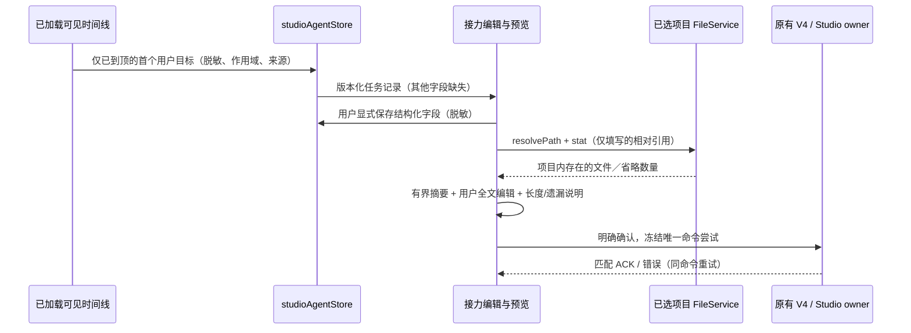

# 持久结构化会话接力（lane 2）

2026-10-07，基于 v0.8.8。此规格扩展 `knorvia-session-handoff-export.md`，不改变导出或原生／外部会话命令所有者。设计独立实现，仅借鉴公开产品概念，不复制 Paseo 代码。

## 产品行为与事实边界

接力是为**新会话提供用户审核的上下文**，不转换模型供应商的私有状态。现有全文预览、编辑、取消、确认与凭据脱敏保留。

弹窗最多占当前视口高度的 90%；结构化编辑与全文预览位于可滚动主体，预览文本框有界高度，标题与确认／取消动作始终可访问。摘要使用稳定的可访问名称，字符计数不混入输入名称。

任务记录包含目标、约束、决策、当前进展、失败尝试、剩余步骤、验收标准、不确定事项及相关文件／成果引用。唯一自动填充是：界面已确认到达历史开头时，第一个真实用户可见正文作为目标的脱敏正文摘录（移除首尾空白并限长）。来源消息 ID、来源类型及截断字符数一起保存。首次只加载尾部时目标明确缺失，不能把最近用户请求冒充原目标；不读取完整历史或任何文件正文补齐。助手可见摘录只能表示该消息曾如此陈述，不是已核验事实。其余字段只有用户编辑后保存；空字段明确标记缺失，不猜测约束、决策、进展或验收结果。目标保存后不因尾部窗口滚动而消失；用户清空或替换目标也不能被自动回填覆盖。

引用由用户逐行填写项目相对文件路径（文件／成果共用此入口），不支持 URL、绝对路径、父目录跳转或常见凭据路径形态。预览刷新只通过已选 workspace 的 FileService resolvePath/stat 检查元数据，不读取正文；解析后的路径必须仍在项目内（阻止 symlink 逃逸）。丢失、过期、跨项目及无法核验的引用不进入发送摘要，报告省略数量。每次刷新重新核验，不持久化“仍然存在”的事实。全文用户编辑可保留自己的陈述，标明用户已编辑，仍执行提交时脱敏。

预算：字段最多 1,000 字符，目标 2,000 字符，引用最多 20 条／每条 240 字符；最近摘录最多 24 条／每条 700 字符，完整发送不超过 20,000 字符。预览显示当前长度、已加载可见数、纳入数、预算省略数、隐藏／非可见记录排除数、引用省略数和截断字符数。未知未加载历史数量明确写为未知，不用零冒充完整。已知原生总行数只能称记录数，不能冒充可见消息数。

## 单一状态所有者与兼容边界

`studioAgentStore` 的现有 localStorage envelope 是本机任务记录的唯一持久 UI 所有者（不是服务端任务事实／内核记忆）。新 envelope v2 在同一 storage key 保留 configs/drafts 并增加 handoffs；接受旧 v1，自动填默认空记录，无破坏性迁移。任务 schema 自身 version=1，由 `@knorvia/shared` 的纯解析／脱敏／范围函数定义。每个记录按 workspaceIdentity.trim() || workspacePath、kernelId、sessionId 三元组隔离，同时验证 workspacePath。原生和外部共用 schema，不创建第二个 dispatch。旧记录、缺失字段或 malformed handoff 条目降级为缺失任务上下文，不能破坏已有 prefs/drafts；未知 envelope 版本与原有 prefs/drafts 损坏沿用原 store 的禁止覆盖机制。拒绝过量记录，不静默驱逐目标；写失败保留内存值、显示错误，并提供重试。

持久任务字段与最终发送全文分开：任务编辑显式“保存并刷新预览”；未保存任务编辑关闭即丢弃，全文编辑不默默重写任务字段。确认发送冻结一次已脱敏摘要，重试复用原 native V4 envelope 或 external 固定 target/command IDs；重复点击由原 UiAsyncActionGate 拒绝。source session/workspace/service 改变使迟到刷新／ACK 失效。native ACK 的 commandId 必须匹配尝试，accepted/duplicate + createSession ID 才能导航。发送或导航失败保留原尝试与错误供重试。

本 lane 无 mobile、新账号、鉴权、进程管理、签名配置、付费模型调用、部署或 release。集成器负责最终 merge/release。

## 验收场景

- 已到顶捕获原目标；100+消息或重载只剩尾页时目标不消失；仅尾页的新旧会话均显示缺失目标。
- user edits/clear 不被自动填充覆盖；保存字段与全文预览不混淆；完整预览脱敏，提交后再脱敏；推理、合成用户输入、原始工具输出不纳入。
- v1 数据升级、v2 reload、malformed handoff、wrong conversation/workspace、记录上限及存储错误重试不丢现有配置／草稿。
- 引用 stale/missing、路径穿越、其他项目、symlink 逃逸、凭据路径不被带入摘要；不读正文。
- bounded payload、省略计数与未知上下文准确；原生／外部错误恢复、重复确认／ACK、迟到 ACK／刷新不得导航另一会话。
- 运行格式、provenance generate/check、根 lint/typecheck、architecture 和目标离线测试。交互用本地服务替身验证，报告 GUI 运行条件与证据；无真实模型请求。
