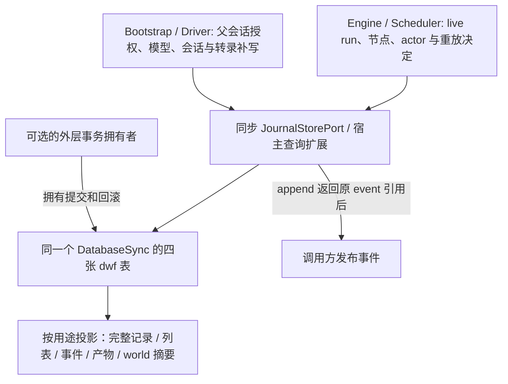

<!-- SPDX-License-Identifier: MIT; Copyright (c) 2026 Knorvia Studio contributors -->

# 动态工作流 journal 持久存储

2026-09-28。先行规格；替换现有四个 dwf-journal 模块的实现，保留全部同步领域方法、宿主查询扩展、内部导出、schema、数据与 UI。基线四目标在 947b126、5167e0d 和本批开始的 5290aa0 相同。范围是 adapters 存储边界，CLI owner unassigned、managed false；跨包只从 @knorvia/dynamic-workflow 引入类型。没有新增业务能力或迁移。

## 1. 已确定的设计与边界

DatabaseSync 的四张 dwf 表是唯一持久真相；Engine/Driver 继续决定业务状态、授权与恢复。同步端口不得引入 await、队列、缓存、后台任务或额外连接。维持现有语句级原子性和调用者外层事务，不新增 BEGIN/COMMIT/ROLLBACK。事件序号仍由单条原生 SQLite 写入分配，禁止改成 JS 先读再加一。

本批是纯兼容独立替换，不强行附带其他批次的事务策略。createRun 的重复诊断保留公开 receiver 调用：try 内失败后 this.getRun 回查，有可解码行则以原错误为 cause 包装，诊断读抛错则按既有行为传播。不增加错误码筛选或预查。取消状态的 failure_json 文本 null 所导致的 TypeError 也保留，不静默容错。这是两个有限已知边界，不是已决定修复的产品缺陷；记录合成证据而不声称真实用户事故。

新代码从以下行为/结构合同组织，不能逐行改写或仅改名。原四个文件路径继续提供兼容导出；确有职责需要时可加内部模块，每份生产文件少于 400 行。复用已独立复核的 ../json.js，不新建泛型 SQL builder、事务框架或重复状态所有者。公开字段、固定顺序、数据库约束和标准表达是兼容事实，不是原创性或排他权依据。

主代理/复核者读过旧实现以提取合同；隔离作者只可读最终 contract.md、approved-types.ts 和明确授权的后续行为反馈，不可读旧源、历史、dist/maps、冻结 bundle、测试或其他实现。以前会话上下文仍在，不能将整个过程宣称为 clean-room 或法律保证。根 Apache-2.0、预览版本和其余文件/第三方许可继续有效。

## 2. 所有者和同步边界

- 12 个领域方法和 9 个宿主扩展全部同步，成功立即返回值/`undefined`，失败同步抛出；不得包装为 Promise 或增加微任务边界。
- `createDwfJournalStore(db: DatabaseSync): JournalStorePort` 创建对象并持有传入连接；不关闭连接，不新建连接，不维护第二份业务状态。
- `SqliteSessionStore.workflowJournalStore()` 惰性创建并缓存同一个对象，使用 facade 的现有连接。返回类型是领域端口，具体对象另有宿主通过结构能力检测读取的扩展。
- 当前写入不自行 BEGIN/COMMIT/ROLLBACK。调用方已有事务时直接参加，失败不擅自结束它；没有外层事务时按 SQLite 的语句事务语义执行。原生约束或触发器可自行影响事务状态，仓储不补清理。
- 事件分配和插入已经是一个原生写入操作；其序号从 0 起。不能把上批异步 script-workflow 的序号/事务缺口套到本批。
- 仓储不拥有授权、live registry、lease、CAS、业务去重、自动重试、恢复决策或跨调用的结算事务。不得引入队列、缓存、迁移或新的业务状态。
- Engine 的正常序列是先同步落事件，再向观察端发布同一事件引用；结算状态写入与 `run-settled` 事件是两个调用。不能在本批偷偷合并或改变其故障边界。
- Actor/Node 是完整记录 upsert。Engine/Driver 要保留他方字段时自行读取并带回；不能改成“未传字段保留”的 patch。

## 3. 公开表面和类型

领域类型来自 `@knorvia/dynamic-workflow`，可向受限作者提供公开声明。`RunStatus` 为 pending/running/completed/errored/stopped；停止原因是 user/model/provider/interrupted/superseded。Node 状态为 running/completed/failed；kind 为 ask/world-read/world-run/report/artifact。

| 同步领域方法                                                                          | 返回值                       |
| ------------------------------------------------------------------------------------- | ---------------------------- |
| `createRun(record: RunRecord)`                                                        | `void`                       |
| `getRun(runId: string)`                                                               | `RunRecord` 或 `undefined`   |
| `updateRunStatus(runId: string, status: RunStatus, settlement?: RunSettlementRecord)` | `void`                       |
| `updateRunUsage(runId: string, spentTokens: number)`                                  | `void`                       |
| `putActor(record: ActorRecord)`                                                       | `void`                       |
| `getActor(runId: string, siteId: string, ordinal: number)`                            | `ActorRecord` 或 `undefined` |
| `listActors(runId: string)`                                                           | `ActorRecord[]`              |
| `putNode(record: NodeRecord)`                                                         | `void`                       |
| `getNode(runId: string, siteId: string, ordinal: number)`                             | `NodeRecord` 或 `undefined`  |
| `listNodes(runId: string)`                                                            | `NodeRecord[]`               |
| `appendEvent(runId: string, event: RunEvent)`                                         | `StoredEvent`                |
| `listEvents(runId: string, opts?: ListEventsOptions)`                                 | `StoredEvent[]`              |

| 同步宿主扩展                                                                         | 返回值                           |
| ------------------------------------------------------------------------------------ | -------------------------------- |
| `listNonTerminalRuns(parentSessionId: string)`                                       | `RunRecord[]`                    |
| `listRuns(query: DwfListRunsQuery)`                                                  | `DwfRunListItem[]`               |
| `getRunRow(runId: string)`                                                           | `DwfRunDetailRow` 或 `undefined` |
| `countNodesByStatus(runId: string)`                                                  | `DwfNodeStatusCounts`            |
| `listRecentLogEvents(runId: string, limit: number)`                                  | `StoredEvent[]`                  |
| `listRunsByParentSession(parentSessionId: string, limit: number)`                    | `DwfRunSessionListItem[]`        |
| `listArtifactRows(runId: string)`                                                    | `NodeRecord[]`                   |
| `listWorldNodes(runId: string)`                                                      | `DwfWorldNodeRow[]`              |
| `listArtifactItems(runId: string, artifactId: string, query: DwfArtifactItemsQuery)` | `DwfArtifactItem[]`              |

`DwfListRunsQuery` 是 `{cwd?: string; limit: number; statuses?: readonly RunStatus[]; name?: string}`；`DwfArtifactItemsQuery` 是 `{afterSequence?: number; limit: number}`；`ListEventsOptions` 是 `{afterSequence?: number; limit?: number}`。

需保留现有导出路径：`storage/session-store.ts` 的 factory 和公开查询/行类型 reexport；原 `dwf-journal.ts` 的查询类型 reexport。`DwfRunIntrospectionQueries` 不含 `listRunsByParentSession`，后者由独立宿主能力接口检测，不能要求第三方领域 journal 新增所有扩展。

另有内部模块导出：artifacts 的两个查询函数、introspection 的六个查询函数均接收 `db` 为第一参数；codecs 的 `encodeRunSettlement`、`encodeRunStatusPredicate`、`encodeResultJson` 与 `decodeRun` / `decodeRunListItem` / `decodeRunDetailRow` / `decodeRunSessionListItem` / `decodeActor` / `decodeNode` / `decodeEvent`，以及公开行类型。入口可以委派，但不应在没有调用审计时删掉这些原有路径。

## 4. 物理存储事实，不改库结构

表由现有迁移 `0019_dwf_journal` 的合并基线创建。下面列的是声明与约束事实，不是实现模板。

| 表          | 标识、约束和字段                                                                                                                                                                                                                                                                                                                                    |
| ----------- | --------------------------------------------------------------------------------------------------------------------------------------------------------------------------------------------------------------------------------------------------------------------------------------------------------------------------------------------------- |
| `dwf_run`   | 文本主键 `id`；可空 parent_session_id/cwd/name/script_text/script_hash/tool_call_id/args_json/resumed_from/result_json/failure_json；必需 caps_max_concurrency、spent_tokens（缺省 0）、status、time_created/time_updated；物理 status CHECK 为 pending/running/completed/failed/cancelled。parent_session_id、resumed_from 没有 session/run 外键。 |
| `dwf_actor` | 自增整数 id；run_id 外键到 run、级联删除；site_id/ordinal 必需，三元组(run_id,site_id,ordinal)唯一；可空 name/persona_json/session_id/resolved_model；必需两个时间。session_id 没有 session 外键。                                                                                                                                                  |
| `dwf_node`  | 自增整数 id；同样 run 外键和三元组唯一；kind 五值 CHECK；status 三值 CHECK；input_hash 必需；actor_site_id/actor_ordinal/actor_seq、result_json/error_json/stats_json、message_boundary/artifact_id/input_json 可空；必需两个时间。                                                                                                                 |
| `dwf_event` | 自增整数 id；run 外键级联删除；sequence/type/payload_json/time_created 必需；(run_id,sequence)唯一。                                                                                                                                                                                                                                                |

现有索引支持 run 的 cwd/更新时间、actor/node 的 run、node 的 run/artifact_id，以及 event 的 run/从 JSON 取 artifactId/sequence。最后一个是 JSON 表达式索引，因此普通非法 event JSON 的写入可能在查询之前就被 SQLite 拒绝。

公开 Node 注释提到的 actor 序号唯一性不是当前 SQLite 的额外 UNIQUE；不能据此添加约束。数值亲和性、外键/约束、原生绑定错误沿用 DatabaseSync；不自行增加 schema 验证、修正负数或强转存储值。

## 5. Run 写入、时钟与失败阶段

### 5.1 createRun

- 入口先读取一次 `Date.now()`，两个时间列同值；随后编码逻辑结算状态，再进入插入及重复诊断的 try 边界。
- 只插入、不 upsert。身份元数据只在创建写入：runId、父会话、cwd、名字、脚本文本/hash、toolCallId、args、resumedFrom。后续 status/usage 更新不修改这些字段。
- 可空标量用 nullish 缺席；caps 只保存 maxConcurrency；spentTokens 按给定值保存。args 用普通可空 JSON 编码，result 用保留显式 null 的特殊编码。
- 原生准备在 args/result 序列化之前；但结算 failure/envelope 编码在准备之前。普通循环对象/BigInt 与缺表同时存在时，应保留这个错误先后，而不承诺任意 getter 的读取次数。
- try 内任何失败都会调用公开 `this.getRun(record.runId)` 做诊断：若已有可解码记录，抛出 `Error("dwf journal: run already exists: <id>", {cause: original})`；没有记录则抛原错误。诊断读本身失败会遮住原错误。它不只检查 UNIQUE 错误码。
- 成功无读回。重复失败不更新原行，也不自行结束外层事务。对合成 RAISE(FAIL) 的特殊结果见第 11 节，不能默默当作已修复。

### 5.2 updateRunStatus

- 先取一次时钟。pending/running 写入清除旧 failure 和 result；完全忽略传入的结算袋，不能因其坏 JSON 而失败。
- terminal 状态先编码结算，之后准备写入，再序列化 result。failure/envelope 整体替换，不做字段级 merge。
- terminal 的 result 编码为 SQL NULL 时保留原 result；显式 JS null 编成 JSON 文本 `null`，必须替换并在读回时作为自有 `result: null` 保留。undefined，以及 JSON.stringify 产生 undefined 的值，均不替换 terminal result。
- completed 的传入 failure 仍可保存；不能因类型注释/预期理想状态而无条件删掉已给 failure。
- native changes 为 0 时抛 `Error("dwf journal: unknown run: <id>")`。没有额外状态机/CAS，重复同状态、terminal→terminal、terminal→running 均按上述列规则写。

### 5.3 updateRunUsage

- 替换绝对累计值，不是增量；只修改 spent_tokens 和 time_updated。保持 status/failure/result 和所有身份字段。
- 准备写语句后、绑定参数阶段读一次时钟；缺表失败不会先消费该时钟。
- changes 为 0 使用同一个 unknown-run 错误。存储不解决上层绝对累计值计算之间的竞争。

## 6. Actor、Node 与事件的持久合同

### 6.1 Actor / Node

- putActor 与 putNode 都在入口取一次时钟，随后准备并编码参数；每次以(runId,siteId,ordinal)完整 upsert。
- 首次插入生成 id 和两时间；冲突更新保持 id/time_created，只更新 time_updated 和所有其余记录字段。列表继续按物理 id 插入顺序返回，不按 siteId 或 ordinal 排序。
- Actor 可选 name/persona/sessionId/resolvedModel 后次缺省会清掉旧值；persona 用普通可空 JSON。未知 JSON 内部字段不删，未知顶层记录字段不另存。
- Node 每次替换 kind、所有 actor 坐标、inputHash/status、result/error/stats/messageBoundary/artifactId/input。缺省清空，不保留旧列；坐标、boundary 的 0 是有效值，空字符串也不是缺席。
- Node result 保留显式 null；error/stats/input 用普通可空 JSON，null 写为 SQL NULL。get/list 返回新的对象和解析值，无返回输入引用保证。
- getActor/getNode 只查精确三元组；缺席 undefined。listActors/listNodes 只查精确 run，缺席 []。get/list 对选中的坏 JSON 同步抛错，不跳坏行、不返回部分结果。

### 6.2 appendEvent / listEvents

- appendEvent 先取一次时钟；准备成功后才 JSON.stringify 完整 event。单一原生写入按该 run 的现有最大 sequence 加一，空 run 从 0 开始，并返回分配值。
- type 列按 event.type 单独保存，payload 保存整个 JSON 快照；没有额外事件验证、原型清洗、字段过滤、固定大小上限、业务去重或重试。
- 成功返回自有键顺序 `{sequence, event, timeCreated}`，其中 `event === 原入参`。后来修改入参会改变这个返回对象的 event，但不会改变数据库里的 JSON 快照。
- 原生没有返回序号行时抛 `Error("dwf journal: event insert returned no sequence for run: <id>")`。外键/绑定/JSON/native 错误不包成其他领域错误。
- listEvents 的 run 精确匹配、cursor 严格大于 afterSequence；升序按 sequence；在存储层先筛选和限量，再解析选中的行，不能全量解析再 slice。
- limit 缺省不限；显式负数会归零，0 返回空页；不能把显式 -1 当作不限。没有额外 ceiling。非整数/非有限 number 继续交给原生绑定和 SQLite，不能悄悄截整。
- 缺 run 或超出 cursor 返回 []。返回事件是重新解析的对象，且使用落库时间，不以当前 Date.now 代替。此读取不获取时钟。
- 当前单语句分配防止先读最大值再写的普通竞争；本轮没有多进程压力证明。删除最高事件之后仍以现有最大值分配，不引入永久计数器或隐藏状态。

## 7. JSON、逻辑状态与记录形状

### 7.1 编码和 legacy 解码

普通 encodeJson 将 null/undefined 变为 SQL NULL，其他值交给原生 JSON.stringify；普通 decodeJson 对 SQL NULL/空字符串等 falsy 原值返回 undefined，否则原生 JSON.parse。native 异常原样保留。

特殊 encodeResultJson 只把 undefined 或 stringify 后仍为 undefined 的值变 SQL NULL；显式 null 必须保存为 JSON `null`。没有自定义 BigInt 替换、循环兜底或大小裁剪。

| 逻辑写入状态      | 物理状态 / failure 内容                                                                                                            |
| ----------------- | ---------------------------------------------------------------------------------------------------------------------------------- |
| stopped           | cancelled；信封自有键顺序 stopReason（nullish 缺省 user）、supersededBy（不为 undefined 时）、error（failure 不为 undefined 时）。 |
| errored           | failed；普通 failure JSON。                                                                                                        |
| completed         | completed；普通 failure JSON，给了就保留。                                                                                         |
| pending / running | 同名；failure SQL NULL，忽略结算袋。                                                                                               |

- 每次 run 解码先解析 failure，即使物理状态是 pending/running；这些状态最终忽略解析结果，不代表可以忽略坏 JSON。
- cancelled 缺 failure/无合法信封时逻辑 stopped、stopReason user；识别只接受五个停止原因。信封 supersededBy 只有非空字符串才投影；error 不为 undefined 就投影，允许历史 JSON null；其余信封键丢弃。
- failed 且 failure.code 精确为 `Interrupted` 时读作 stopped/interrupted，并保留 failure；其他 failed 读作 errored。completed 可同时带 failure。普通 parsed failure 为 null 不当作 undefined 删除。
- cancelled 的 `failure_json = 'null'` 当前会 TypeError，不是合法信封 fallback；这是本轮证实的旧数据边界，本批明确保留，不做容错。
- 不回填历史行，不将逻辑 errored/stopped 直接存入旧物理 CHECK 列。关系字段只是元数据，仓储不验证 supersededBy/resumedFrom 对称性。
- 状态查询在存储层按同一逻辑分组：stopped 包含 cancelled 和 failed/Interrupted；errored 为其余 failed；其他状态精确对应物理值。空集合不匹配；不是取一页后用 JS 过滤。
- `encodeRunStatusPredicate` 返回 `{sql, params: string[]}`；保留可执行谓词语义、输入顺序与重复项的参数顺序。无证据表明 SQL 空白文本是外部协议，不以复制原 SQL 字符串为独立实现方法。

### 7.2 自有字段、顺序、缺席和未知数据

所有普通返回记录为正常 Object 原型；不返回 SQLite 的原生行对象。不把“自有 undefined”随意替换成省略，不新增空数组/空对象默认。已存 JSON 的未知内部字段和原生解析值保留；未知物理列不会散入领域返回值。

| 投影             | 自有键顺序与条件                                                                                                                                                                                                                                  |
| ---------------- | ------------------------------------------------------------------------------------------------------------------------------------------------------------------------------------------------------------------------------------------------- |
| Run metadata     | runId、caps（只有 maxConcurrency）、spentTokens、status；之后有值时 stopReason、supersededBy；再按 parentSessionId、cwd、name、toolCallId、scriptText、scriptHash、resumedFrom、args。物理可空元数据列仅 SQL NULL 省略，空字符串/0 不替代成缺席。 |
| Run 完整值       | 上述 metadata 后接有值 failure，再接 result（只要 result_json 非 SQL NULL）。args/result 都直接 JSON.parse，空字符串会报错；不是普通 nullable decoder 的空值语义。                                                                                |
| Run list         | metadata 后 timeCreated、timeUpdated；不含 failure/result。虽然不输出 failure，逻辑状态仍依赖其解析。                                                                                                                                             |
| Run detail       | 完整 Run 后 timeCreated、timeUpdated。                                                                                                                                                                                                            |
| Session run list | Run list 后追加有值 failure；仍不解析 result。                                                                                                                                                                                                    |
| Actor            | runId、siteId、ordinal；可选 name、persona、sessionId、resolvedModel 依此次序。persona 走普通 decoder；JSON null 会保留为自有 persona:null。                                                                                                      |
| Node             | runId、siteId、ordinal、kind、inputHash、status；可选 actorSiteId、actorOrdinal、actorSeq、result、error、stats、messageBoundary、artifactId、input 依此次序。result 特殊保留 null；其他 JSON 字段以普通 decoder 是否为 undefined 决定是否出现。  |
| Event            | sequence、event、timeCreated；event 直接解析 payload_json，不使用冗余 type 列重写 event.type。                                                                                                                                                    |

完整 run 解码的错误先后为：failure（metadata 状态）、args、完整 failure 投影、result。该事实对多列同时损坏的错误边界有意义；不把重复解析次数扩大成任意可变 getter 的契约。

## 8. Run 查询扩展

- `listNonTerminalRuns`：精确 parentSessionId；物理排除 completed/failed/cancelled；按 id 升序。返回完整 Run，所以会解析 result。没有分页、时钟、修复或 lease 判断。
- `listRuns`：statuses 显式 [] 立即 []；其次 limit<=0 立即 []；均不接触 DB。cwd/name 仅 undefined 时不加过滤，空字符串是精确字面键；不做路径归一化、LIKE、大小写转换。
- listRuns 按 time_updated 降序，仅该排序键，没有额外 id tie-break。相同时间顺序维持原生查询选择，不自行承诺或新增稳定 id 顺序。
- listRuns 的 limit 是调用方给定值，无默认、无 ceiling，必须容许上层 limit+1 的 truncated 探测。过滤、排序、限量全部先于行解码。
- listRuns 读取元数据和 failure 来解逻辑状态，但不取/解析 result；坏 result 不应破坏列表。getRunRow 则完整读取并解析，缺席 undefined。
- `listRunsByParentSession`：精确父会话；按 time_updated 降序，随后 id 降序；limit 归为不小于 0，但即使 0 仍会准备查询。读取 failure、不读取 result，投影顺序见上表。无额外 ceiling。
- `countNodesByStatus`：精确 run 的所有 kind；返回键顺序 running、completed、failed，全为 0 起步，按原生 count 转 Number。缺 run 返回三个 0，不解任何 JSON。
- `listRecentLogEvents`：limit<=0 在 DB 前返回 []；只依据冗余 type 列等于 log 选择；取最高 sequence 的最近 N 条，再以升序返回。只解析选中行，没有时钟或 run 存在检查。

## 9. Artifact 和 world 查询

### 9.1 产物

- listArtifactRows 读 node 的 kind=artifact、精确 run，按物理 id 升序；不只选 completed，也不按 artifactId 去重。返回完整 Node，保留自己的坐标；存在不同坐标的同标签版本就都返回。
- listArtifactItems 以 event 为唯一数据源，不从 report node 拼 cursor。limit<=0 在 DB 前返回 []；否则无 ceiling、无截整。
- 必须同时满足精确 run、冗余 type 列为 report、payload 顶层 artifactId 与目标字面相等；cursor 严格大于；按 sequence 升序再 limit。没有标签的报告和其他 event.type 不混入；空 artifactId 仍可精确查。
- 输出每项键顺序 sequence、siteId、ordinal、item；后三者取自 JSON event 的 instance 和 item。item 保留完整原生解析值；缺 item 为自有 undefined，缺 instance 可能抛错。仓储不验证领域结构、不做展示格式化。
- 同一个异常行是否影响页由原生过滤/JSON 表达式执行决定，不能以“选后 JSON.parse”代替必需的存储层过滤。表达式索引维护的异常也要沿用。

### 9.2 World 摘要

- listWorldNodes 只读 world-read/world-run 两种 node，所有状态都保留，按物理 id；不把 result 本体送出 SQLite，不在 JS 中 parse/stringify 大结果来计算大小。
- resultBytes 是存储 JSON 文本的 UTF-8 字节数（含字符串 JSON 引号/转义），不是 JS 字符数。SQL NULL 时省略。
- resultCount 仅根为 JSON array 时出现；exitCode/stdoutBytes/stderrBytes 仅根为 object 才参与计算。
- exitCode 只有 SQLite 提取值的 JS typeof 为 number 时输出；原生 JSON true→1 也会输出，字符串数字不会强转。stdout/stderr 按提取值原生转换后的字节长度，不额外要求字符串；缺/null 省略，数字 123 的字节数为 3。
- 即使不输出 result 本体，坏 result JSON 仍会在 SQLite JSON 运算阶段抛错。
- 其余字段与完整 Node 一致，但绝无自有 result；随后 timeCreated/timeUpdated，再按 resultBytes、resultCount、exitCode、stdoutBytes、stderrBytes 顺序追加存在的摘要。错误/stats/input 的解析失败仍会影响该行。
- 上层只对 completed 展示摘要、只允许同父会话查看结果等属于调用方职责，不在仓储增加过滤或权限。

## 10. 实际调用者依赖

1. Engine 使用同步 create/get/resume，重放时改 running 清除旧结算。caps/hash/args 等身份及节点输入判定由 Engine 拥有；仓储不重做业务校验。
2. sequence capture 包装器转发 12 个方法；append 返回的 `StoredEvent.event` 必须与稍后发布的事件是同一引用，才能在不查询日志的情况下找到 sequence。
3. Engine/Driver 以 get+spread+put 保留 sessionId、resolvedModel、stats、messageBoundary。完整 upsert 合同本身没有字段级并发合并保证；本轮没有证明常规单线程同步序列会发生丢更新。
4. 宿主通过能力检测接入列表、详情、产物和 world 查询；domain-only 的其他实现不因缺扩展而失效。没有持久端口时明确记录，不偷偷接内存作为持久库替身。
5. 父会话 run 枚举调用方控制上限、捕获日志后可返回空列表；冷重放先按仓储降序取，再反转为旧到新。这依赖 parent 列表的两个排序键。
6. 孤儿恢复由宿主按父会话查 nonterminal 后再确认终态，写 stopped/interrupted 和错误；不会伪造 journal 事件。仓储不独立运行该恢复，不新增跨进程 lease。
7. artifact/introspection 调用方需要 limit+1 探测，最大值由服务层决定；仓储不能再钳制同一个最大值。world 查询权限由服务用 parentSessionId 检查。
8. 同库 facade 的访问器只是公开该对象；没有查到这些直接 DWF driver 调用处实际显式 BEGIN 的代码。支持外层事务是原生合同和合成 probe 证据，不宣称真实 driver 已把节点/事件/转录合并成一个事务。

## 11. 先行验收与证据

旧目标已一次性冻结为外部 knorvia-dwf-journal-baseline-5167e0d.mjs，SHA-256 c6ac8080e1993d36a26ff6e37e383e95e47af7d0079d116445ac7f1d7badddf7；不得重捕。实现作者不能读取该文件。主代理读过四个原文件、公开端口、同库 facade 和完整准备合同；复核者的更细读取清单保留在隔离准备记录。

准备阶段原生内存探针 8 场景、47 断言通过；错误分类探针 3 场景、6 条分类断言通过。仅证明具体样本：主键冲突扩展码 1555，触发器 FAIL 为 1811，通用 ERR_SQLITE_ERROR 不足以区分；当前实现仍按回查规则诊断。AFTER INSERT RAISE(FAIL) 可以保留新行并被包装为重复；已有 id 加循环 args 也会被包装为重复。正常 stopped writer 总写对象信封，尚无正常业务生成 cancelled/null 历史行的证据。本批不改变这两处结果。

切换之前先用原生 SQLite 写兼容测试并确认旧版结果，再授权隔离实现。覆盖所有 21 个实例方法、10 个 codec 导出、8 个 db-first 查询导出，特别是同步/receiver/事务归属、状态兼容、结果 null、省略清空、事件引用、准备与编码错误顺序、时钟、精确过滤与分页下推、窄查询不读取大结果、产物版本和 world 原生 UTF-8 摘要。

有限对照比较返回 own keys/顺序/原型、事件引用要求、原始行和 JSON 字节、错误名/message/cause（不比栈）、时钟及最终事务状态。状态谓词对比执行语义和参数顺序，不要求复制 SQL 文本空白；没有声明次级排序键的相同时间查询不自造全局稳定顺序保证。对照是有限行为证据，不能当作来源许可证明。

主代理实际执行根/CLI 类型和 lint、定向严格检查、架构、CLI 构建、源码与公开编译入口验收、完整离线及来源/格式/暂存密钥扫描。构建、会触发预构建的 CLI 类型检查不得与编译入口或全量回归并发。核对实际 CLI 内各可达模块与最终 dist 一致，防止只测了源文件。

只使用新内存数据库和合成失败。未验证真实数据升级、UI、模型、设备、跨进程压力、断电/磁盘满或打包安装；没有模型调用、真实凭据、生产服务器、便携目录或官网部署。本批完成不等于全部独立目标或最终稳定发行完成。

## 12. 接口细节补充

2026-09-28。只补充接口与运行事实，不提供旧实现代码。

### 12.1 状态谓词

`encodeRunStatusPredicate` 返回自有键依次是 `sql`、`params`。按调用者输入顺序逐项产生一个匹配分支；不去重。空数组返回恒假谓词和空参数。

每个 pending、running、completed 分支贡献一个同名字符串参数；stopped、errored 分支各只贡献一个 `Interrupted` 字符串参数，物理 cancelled/failed 不贡献参数。例：`[stopped, running, errored, stopped]` 的参数顺序为 `[Interrupted, running, Interrupted, Interrupted]`。SQL 空白、排版不构成契约；参数和 SQLite 执行结果/错误构成契约。

stopped 匹配所有物理 cancelled，以及物理 failed 且其 failure JSON 顶层 code 等于 Interrupted 的行。errored 只匹配物理 failed 且提取出的 code（NULL 按空串处理）不等于 Interrupted 的行。不能用 JSON 有效性兜底改变 SQLite 错误。

原生有限观察：单个 failed 行的 failure_json 是 SQL NULL、文本 null、空对象时，stopped 不匹配，errored 匹配；文本空串或非法 JSON 时，这两个过滤器均抛原生 ERR_SQLITE_ERROR / errcode 1 / malformed JSON。同样 malformed 行在仅 running 过滤下不匹配且不触发 JSON 解析。cancelled 的 stopped 过滤不需要解析 failure_json；后续记录解码仍按主合同执行，可能抛错。上述是实际筛选行为，不能通过提前全表解析来模拟。

### 12.2 Node result

`decodeNode` 的 result_json 只在 SQL NULL 时省略结果键；非 NULL 直接按 JSON 解码。因此空字符串抛 SyntaxError，文本 null 产生自有 result:null，与 Run result 一致。error、stats、input 仍使用普通 JSON helper 的既有规则；各解析先后见主合同。

### 12.3 入口类型重导出

`dwf-journal.ts` 保留这五个类型的兼容重导出：

- 从 artifacts 模块：DwfArtifactItem、DwfArtifactItemsQuery。
- 从 introspection 模块：DwfListRunsQuery、DwfNodeStatusCounts、DwfRunIntrospectionQueries。

其它类型继续在 approved-types.ts 所标明的原模块导出，不新增公开运行时 API。
