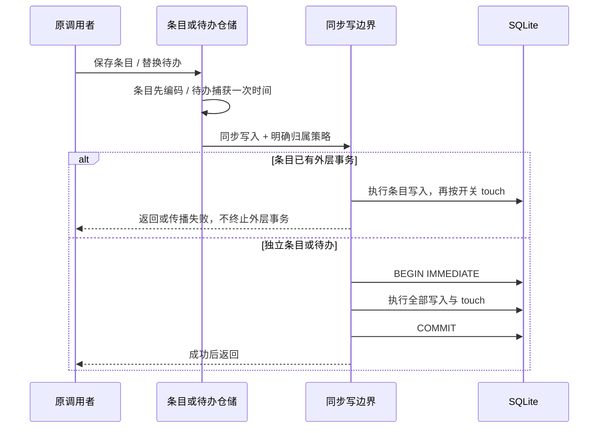

<!-- SPDX-License-Identifier: MIT; Copyright (c) 2026 Knorvia Studio contributors -->

# 会话条目与待办的持久写入

基线 `0758673`。重建 session-store/repositories/session-entries.ts 与 todos.ts，并给两者提供明确的同步事务执行边界。先写规格与失败测试，再从合同独立实现。保留所有当前功能、公共签名、表结构、迁移和 UI；本批不访问真实用户数据库、模型、网络或设备。

## 已复现并决定修复的失败

只读审查在全新内存 SQLite 复现两项：Todo 插入触发 RAISE(ROLLBACK) 后，第二次 ROLLBACK 用“没有活动事务”覆盖真正失败；独立 saveSessionEntry 已插入条目后，session touch 触发 RAISE(ABORT) 会让 Promise 拒绝但条目留下。新实现必须保留 Todo 首因，并让独立条目写入和其 touch 一起提交或撤销。操作与回滚同时失败时保留两个原因，不能伪装成成功。

## 状态与事务所有者

SQLite 行是唯一持久状态，仓储不新增缓存、重试队列或模型状态。新增一个有限同步写边界，只区分“必须自己取得事务”与“已有外层事务时借用”。两仓储描述写入意图，边界负责自己取得的 BEGIN/COMMIT/ROLLBACK；不引用权限业务入口、不接管其他模块的事务。

- 条目序列化必须先于取得事务或任何 SQL 修改；保留原无效编码错误。独立调用现在原子提交；已有外层事务时执行于该事务，失败只传播，由外层决定回滚。不得为单条目结束 Full-access、fork 或共享导入的事务，也不额外引入 savepoint。
- Todo 始终要求自己的事务。连接已有事务时 BEGIN 失败，既有事务及其写入保留。BEGIN 在操作/清理 catch 外，失败不执行写入或 ROLLBACK。
- 自有事务中写入/COMMIT 失败：仍活动才 ROLLBACK；SQLite 已自动终止则直接传播首因。清理再次失败用 AggregateError 保留主失败和清理失败。
- 借用分支不主动终止外层事务，但不能阻止 SQLite 自身的 RAISE(ROLLBACK) 终止它；该情况保留首因，不再发送事务控制命令。
- 全过程同步，不在事务中新增 await。原 async 公共 facade 返回 Promise，但数据库行为在返回前完成。事件、UI、Desktop continuous 与移动 replay 仍由原调用者管理。

## 会话条目合同

表 session_entry 的列为 id、session_id、type、time_created、time_updated、data；id 全库唯一。保留单条原子 upsert，不改成无保护的读改写或 INSERT OR REPLACE。

1. 模型选择类型使用公开 SESSION_ENTRY_MODEL_SELECTION，存储形状为 `{modelSelection: input.data ?? null}`；普通条目直接通过已有 encodeJson 编码。普通根 null/undefined/function/Symbol 因没有有效文本而拒绝，错误 `Session entry data must be JSON-serializable`；false、0、空字符串、数组和对象均有 JSON 文本，可保存。保留原生序列化异常。
2. 同 ID 冲突只更新 session_id、type、time_updated、data；time_created 和 rowid 保持，可以改绑 session/type。不能因为更新时间降低而重排创建顺序。
3. 仅新类型为模型选择、旧类型和 session 均相同且旧 data 的 JSON 根为对象时，使用 SQLite JSON1 只更新旧对象的 modelSelection 成员，保留所有旧平铺及未知成员；否则整个 data 替换。旧 JSON 在该判断分支损坏时保留解析失败，换成其他类型不强迫解析旧值。JSON1 值投影继续沿用现有布尔等越界输入可能转成 0/1 的行为，不把它扩展成模型选择公开合同。
4. 条目写入后，只有 input.touchSession === false 跳过 touch；其余调用现有 touchSession(db, sessionID, time.updated)。该接口只提升 session.time_updated 至 max(旧值, 输入)，不改写其它 session 字段。touchSession 及 sessions.ts 不在本批重写或重新许可范围。
5. sessionEntries 同步返回解码数组，按 time_created、rowid 升序。仅真值 type 筛选；空字符串等同没有筛选。使用既有 decodeSessionEntryRow，坏 JSON 使整个读取抛错，不删行或静默跳过。

## 待办合同

表 todo 列为 session_id、content、status、priority、position、time_created、time_updated。readTodos 按 position 升序读本 session，交给已有 decodeTodoRow；不新增 status/priority 校验。

updateTodos 捕获一次 Date.now，取得自有事务后删除本 session 旧列表，按输入次序 position=0..n-1 插入，所有新行 created/updated 均为该 now。其他 session 不受影响；重复内容保留。空列表也清空并 touch session，session 时间仍保持单调。删除、任意插入、touch、COMMIT 的失败必须保留原列表和 session 时间（除非数据库自身回滚也失败，此时明确传播双失败）。readTodos/updateTodos 的 async 签名和错误拒绝形式保持。

## 验收与来源

先行测试：公开存储往返、ID 改绑/时间保留、模型选择旧成员保留、损坏旧值分支、同时间 rowid 排序、touch 开关/单调时间、待办顺序/范围/同时间/空列表；真实触发器复现上述两项失败，并覆盖第二项插入失败、外层事务归属、BEGIN/COMMIT 失败及清理双失败。

复核后另将延迟外键固化为真实 COMMIT 失败场景：观察 INSERT 已完成、COMMIT 才报错，验证条目或待办、session 时间及触发器的附带行全部回滚，不只依赖模拟 COMMIT 抛错。

主代理冻结旧版用于有限对照，缺陷修复场景记录预期差异，不要求新旧错误完全相同。隔离实现任务只获得本规格、公共类型/签名和允许依赖，不阅读旧目标实现或冻结包；主代理和审查者读过旧代码，不声称全流程无接触。固定数据库列、公共协议和 SQLite 通用语义不计为新算法，也不以包装或移动 SQL 认定独立。

实际运行根/CLI typecheck、lint、严格定向检查、架构、CLI 构建、源码/编译及公开存储验收、完整离线、格式、来源和暂存密钥扫描。来源按当前表达逐文件记录；公共类型、既有 JSON/codec 的原决定、sessions.ts、其他事务 owner 和迁移保持各自范围。根 Apache-2.0、0.8.0-preview.3 和全部旧发行不变，整仓目标仍未完成。
