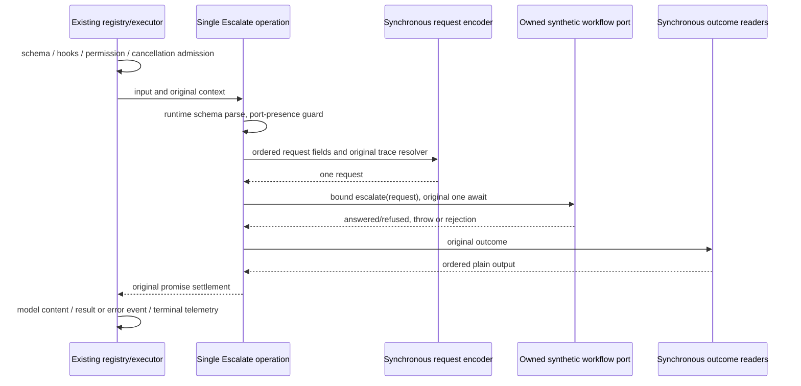

# Escalate request and outcome orchestration

Baseline `d6214b9059bd7e7bf95e26f19d2c47170e640a4e`, fixed branch
`parallel/cli-tools-fast-20261001`. Scope is `escalate.ts`, one narrowly named
private operation helper and named synthetic tests/receipt. All prior handlers,
runtime workflow ownership, permission, executor and public contracts remain
unchanged. This is a behavior-preserving orchestration replacement, not an
escalation-budget, approval, termination or retry-policy redesign.

## Selection and source facts

The current ledger marks the handler upstream-modified with no accepted review.
It has only snapshot `7619e41b950bd52073ebf36754146cf25659d9fa` in local history;
7066 bytes, blob `dd0ed773f94065120c3220dd4167183f179bf487`, SHA256
`c8615b59f041967785d1151c59e19c01706a12c28f0d02a1f2d36426f891c658`.
Existing upstream manifest facts record ZCode
`872ad960de7ec172591f7e1952f7849229f94521`, publisher path
`apps/zcode-cli/packages/core/src/tool/handlers/escalate.ts`, blob
`fe6c11fd9052c511c80ce6b33d9f102b5095f76d`, 7064 bytes, normalized SHA256
`548d1ad0e88467f42e7eb612bf049018b14cbfbfa42db46db1d16076266cc71e`.
These are manifest facts; no new local exact publisher-byte verification is claimed.
The source has been read. Attribution, inherited prose/declarations and historical
lane licensing inputs remain. No clean-room or whole-file MIT claim is made.

Write/Edit and Glob/Grep already delegate to replacement boundaries described in
their specs and accepted production checkpoints, so they are excluded. Existing
workflow runtime/port implementation is also excluded. No handler-specific accepted
Escalate replacement or dedicated contract test was found in this checkout.

## Single owner and compatibility structure

One directly bound asynchronous operation parses/admit/invokes/projects. A private
ordered request encoder controls optional context insertion and trace resolution;
ordered outcome readers select answered versus fallback-refused projection. They
are synchronous lower functions and own no state or effects. Do not wrap this
handler with another async forwarding promise. Retain exactly its original single
port await, receiver and completion/abort settlement boundary.

The injected workflow port owns recipient identity, question lifecycle, per-ask
budget and answer/refusal. Registry/runtime own availability; executor owns
permission, signal, terminal events, telemetry, budget and interruption. The handler
does not persist, retry, send a second notification or stop the actor turn.

## Frozen invariants

- Schema validation precedes any context/port read. Strict question/context schema
  and whitespace behavior stay unchanged. Missing port is a nonrecoverable
  ConfigurationError with exact existing message/context. Presence is the gate;
  runtimeScope does not replace it. There is no method-shape prevalidation.
- Preserve the two port reads: guard first, then method lookup on the second port
  value before argument construction. Receiver is that second object. Request own
  keys are toolCallId, question, optional context, trace. Undefined context is
  absent; an empty string is present. Trace uses exact context.traceContext when
  non-nullish, otherwise traceId/spanId/parentSpanId/sessionId/turnId in that order.
  No signal/options parameter is added to the port.
- Await exactly one original port effect. Synchronous values, promises, thenables,
  thrown/rejected values and getter failures retain normal JavaScript behavior.
  Do not catch, repair or reclassify malformed ports or outcomes in this slice.
- Only kind === answered selects answered output: status, message from answer, qid.
  Every other kind selects the original refused output: status, message, reason.
  Preserve own undefined fields, property/read order, identity, prototype and flags.
  Both valid outcomes are ordinary successful results; refusal does not become an
  error or terminal turn-stop. Output validation/model formatter stays unchanged.
- Retain all preamble comments, description, metadata, permission, schemas, budget,
  timeout kind none, cancellation prose, trace policy, exports and public d.ts.
  The formatter returns message for valid output, exact invalid-result prose otherwise.
- Registration requires includeEscalate === true and keeps allowed/disallowed-tool
  filtering and dynamic-workflow gate behavior. Runtime derives inclusion from port
  presence; existing allowlist/context consumers remain unchanged.
- No handler cache/state/history. Repeat/concurrent calls share only the existing
  port owner; each call invokes once. External abort may settle the executor before
  an uncooperative synthetic port, whose late completion must not publish another
  result/event/telemetry or terminate another turn.

## Freeze and acceptance

Before production edits archive exact baseline source plus deterministic compiler
output, byte-compared with actual baseline emission, and capture direct and actual
registry/executor observations in source and strict emitted modes. Remap only
archive imports, never write a new reference algorithm. Missing selected emitted
files fail; no source fallback. Inherited archive/prose/outputs are retained test
material, distinct from newly structured fixture expression.

Use owned synchronous/fake thenable/delayed workflow, approval, event and telemetry
ports, synthetic trace/input/outcome text, fake clock and no live recipient or user
data. No real agents, providers, HTTP/DNS, output files, credentials or settings.
Freeze getter order, port swapping, schema errors, malformed outcomes, output keys,
metadata and formatter behavior. Cover actual deadline and full-call-runner with
external abort queued at port acceptance and output completion, early controls,
delayed cancellation, late completion, repeated and concurrent calls. Observation
wrappers must return the original handler promise synchronously.
Incidental stack locations and generated executor span/permission IDs alone are
normalized after presence, propagation and per-call identity checks. Error prose,
outcomes, field presence and effect order are not normalized. In-process fetch/DNS
guards fail closed; every authorized test effect goes through owned synthetic ports.
Pre-freeze unchanged-source checks exposed two harness assumptions: JSON omits an
undefined aliases field, and an already-aborted full invocation records Cancelled
telemetry without publishing a terminal event because it was never started. The
freeze asserts those original facts, with no executor/handler policy change.

Only a demonstrated in-scope regression can change behavior, with spec and red
proof. Run final focused source/emitted, related regressions, CLI builds/types,
root types, configured/owned lint, formatting, full/changed architecture and full
suite. Receipt binds exact source/emitted/protected hashes, original versus any
appended runs and native gaps. Root independently reviews/integrates/licenses;
root's material26 and this older lane register27 remain separate.
