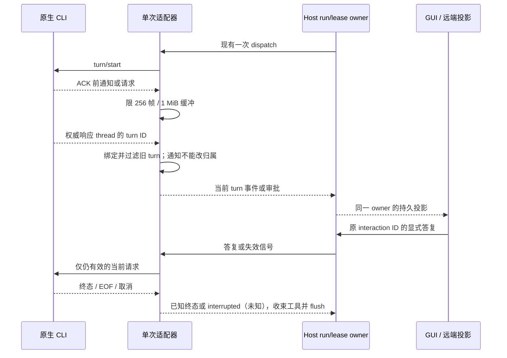

# 外部代理信息与状态修正（独立重做）

2026-10-08。本次从公开 main `34078257b5d9d1e78c40308b34dab8ff45565156` 独立实现，分支 `codex/external-state-rebuild-20261008`。允许修改、验证、中文提交、推送和公开草稿 PR；不合并 main、不打 tag、不发布。不读取、移植或发布旧研究任务的未提交补丁，也不重试其公开交接评论。

## 边界与现有实现证据

开工 freshness 与 changed architecture 通过，工作区干净。Node/pnpm 按 mise.toml 对齐为 24.14.0/10.33.2。已读取 PR #50 公开集成分支 spec，开工观察到 head `4aba055374b7939fd5a8314fd04f98b571628459`，收尾复读时远端为 `1b3ff0b3dbc93e0eff5d9d130ce3e5c50427bec9`，该 spec 内容未变化；实际集成由原集成 owner 负责。

只修改外部适配器信息/状态、既有 Host 投影、远端转发及原 GUI 展示。不修改图片输入、图片审阅、工作台、CLI 权限能力表或原生子代理审批。共享文件精确切片：`kernelTypes.ts` 的 question/interaction/tool event；`types.ts` 的 tool message；`codexProtocol.ts` 的通知/请求/终态/归属。B 的图片 input 与 turn 字段、C 的 workspace 类型保留。`StudioTimeline.tsx` 与 B/C 的图片呈现切片集成时同时保留。来源生成文件从最终树重生。

源码确认的问题：选项对象被压成 label；审批的 command 优先分支丢弃 reason/cwd；ACP 每次稀疏更新填空覆盖旧字段；Host 把 output/input 折叠为 text；远端把未知状态改为 running；Codex 只验证 thread，且 turn/started 可以改当前 turn；Claude 没有在 EOF/取消/终态收束未完成工具。下述失败用例必须在本次旧基线实际运行，不借用其他任务计数。

## 所有者与合同

| 状态                              | 唯一所有者                               | 变化                                                               |
| --------------------------------- | ---------------------------------------- | ------------------------------------------------------------------ |
| 原生 turn ID / 启动前事件         | Codex 单次 KernelRun 的适配器            | 仅 turn/start 响应绑定；有界缓冲后按归属重放                       |
| 原生工具快照                      | 单次 KernelRun；ACP 适配器合并稀疏快照   | 缺失保留，显式空值覆盖；未知状态为 unknown                         |
| 接纳、run/attempt/lease、审批答复 | 既有 StudioRuntimeService / SQLite       | 不新增队列/owner，原审批失效路径保持                               |
| 消息持久投影                      | saveTurnEvent                            | 可选 input/output/content/statusDetail 独立保存，text 兼容旧客户端 |
| 远端投影                          | remoteKernelBridge                       | 只转发对应 run 的完整字段，字段变化参与去重                        |
| 展示与未提交选择                  | 既有 StudioTimeline / StudioInteractions | label 用于答复，description 只作说明；旧 string 选项可用           |

`StudioQuestion.options` 增量支持 string 或 `{label, description?}`。工具事件增量状态 `unknown/cancelled/interrupted`，保留原生 `statusDetail`；`content` 单独保存带 type 的原生内容 JSON 展示，不能冒充 raw output。审批 detail 保留原生 command、cwd、reason、kind、context 的结构；现有脱敏继续，截断必须有明确标记。旧数据库无需迁移，旧 tool text 仍可查看，不把旧 text 猜作 output；远端旧消息通过工具事件的可选 `legacyText` 写回原 `StudioMessage.text`，不增加持久副本。GUI 即使另外收到 statusDetail，也保留未区分输入/输出的历史详情。

根 thread fence 保持；其他线程和旧 turn 请求明确拒绝，不能消耗当前答案。ACK 前缓存溢出/启动 ID 缺失失败关闭，已提交结果未知。合法无 turn 的线程级消息保留，允许线程用量先于用户输入到达；旧兼容协议无 turn 的当前 item/request 保留，但不能在启动前无界接受。严格 ACK 归属适用于普通 `turn/start`。`/status` 保持线程只读生命周期；既有 `/compact` RPC 的响应不含 turn ID，因此仍沿用其独立首次 started 生命周期，不能宣称它获得了普通 turn/start 的权威绑定保证。请求撤回即使早于 await flush 也不能留下新审批；重复请求 ID 不得替换当前 controller。ACK 与真实终态同批到达时，不因生命周期关闭而再发送 turn/interrupt。

Desktop continuous 和 mobile replayable 继续使用原 Host owner/序列；本次不增手机功能或改变恢复协议。workspaceIdentity、remoteSessionId、run/attempt/lease 原安全边界保持。Claude 工具提议与实际 tool_result 区分；整轮成功不推断缺失结果的工具成功。EOF 最后一个完整 JSON 帧仍应处理；不完整帧/断线是未知，等待已接纳的本地事件落库，不伪造取消确认。

## 验收

1. 独立合成 stdio：Codex/Grok/Claude 选项 label+description 与旧 string；审批完整字段、脱敏和截断；ACP/Grok 稀疏 input/output/content/status 更新。
2. 工具状态：未知原生状态不会成功；input/output/content/statusDetail 经 Host 存储、重读、远端转发、GUI 分区后仍各自保留；旧 text-only 历史可读。
3. Claude：完整无换行 EOF、异常 EOF、取消确认、撤回提议、整轮成功但缺失工具结果、慢 sink flush；所有终态与真实结果一致。
4. Codex：同 thread 旧 turn 的 delta/tool/terminal/approval；ACK 前当前与旧帧；冲突 turn/started；缓存溢出；当前审批撤回与旧审批同 ID；合法线程级 usage；未知 child 拒绝；`/status`、`/compact`。
5. 浏览器：真实既有交互/时间线组件，描述可读、提交只含 label、多选/自定义/旧 string、工具分区、未知状态；窄屏与深浅主题。仅离线合成服务和临时配置，不读取真实 profile/凭据，不发付费模型请求。
6. 质量：fmt、lint、typecheck（含 i18n）、provenance 生成及 --check、full/changed architecture、verify:pre-push；CLI 构建后全量 test:studio。记录 pass/fail/skip、实际命令、未测项与集成边界。

## 本次执行证据

逐项用例、命令、日志 SHA-256、被测文件指纹和截图见 [verification.json](evidence/external-state-20261008/verification.json)。独立 detached 公开旧基线只加本次测试，生产源码不变：38 项中 36 fail、2 pass、0 skip，exit 1；两个原本通过项是旧无 turn 事件兼容和根线程 fence。修复后含既有相关回归 104 pass、0 fail/skip，exit 0。

浏览器真实链路为合成原生子进程 stdio → StudioRuntimeService/SQLite → 公共服务传输 → 原交互与时间线 React 组件；验证描述、旧 string、多选/自定义答复只回 label、完整审批/脱敏/仅一次接纳、工具字段分区与未知状态、远端旧 text 不冒充 output。360px 深色与 1200px 浅色均断言实际主题背景色、无横向溢出、无 pageerror，并人工查看截图；四组结果通过，exit 0。

CLI 构建实际 17/17 成功后运行全量 Studio。首轮 835 文件、8463 项：8454 pass、1 fail、8 skip、0 cancel，exit 1；唯一失败是既有 Codex 线程用量测试，确认新 gate 误挡无 turn 的线程通知，已修复并由上述 104 项及真实 stdio 覆盖。冻结实现的第二轮全量正在运行；最终结果待收尾追加，不能将首轮写为通过。

未运行 Windows、完整 Electron GUI/安装包、已登录真实厂商 CLI、付费模型或物理 SSH 主机。浏览器为真实 Chromium 与产品 React 组件，远端为真实适配器对合成公共服务端口，不声称完整桌面或跨机器验收。依赖安装曾因 Electron 下载/重建不可用而失败，最终 frozen-lockfile + ignore-scripts 安装成功；未改 lockfile、根 Apache-2.0 或第三方声明。图片输入、图片审阅与 GUI-only 工作台仍由原路线交付。
