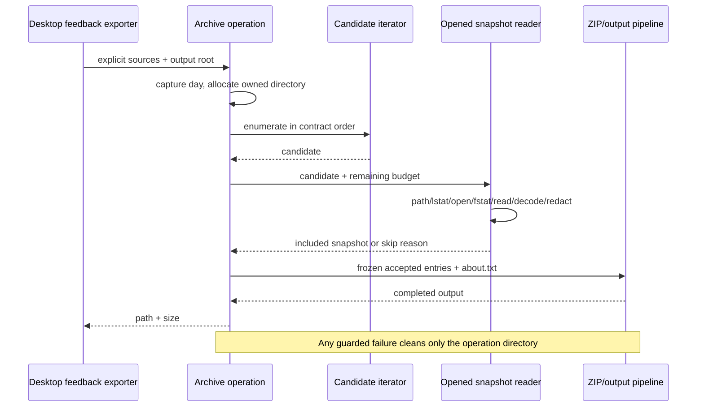

# Feedback diagnostic archive — fixed service lane

Continuation after immutable watcher checkpoint `2530b5c00b5dbaeaeecba8e31e8b6e7af6dfb487`.
The source archive file has not changed on the fetched recovery head
`0d80f9ca37b1daef162ecc69bd18f6e8fc30a146`; its Git blob is
`403f16d380611e032e49379c6c8e771ce4a69381`. The inventory reports
`upstream-modified`, no accepted review, upstream blob
`1d90a00ab73550b493d041453ae6235e84bb9bf4`, current SHA-256
`c181175769c2e809bdb0988a3ce20b745db44af1a417f40089cc67bfc8f808ba`.
This author has read the implementation and callers. No clean-room or whole-file MIT
claim follows. Shared provenance, LICENSE/NOTICE, preview identity and 27 unresolved
material obligations remain root-owned and unchanged.

## Contract to freeze before replacement

The public `createFeedbackDiagnosticArchive` signature and its services/node re-export
remain. The production caller is desktop `createFeedbackLogArchiveFromExportLogs`, which
supplies explicit app logs, CLI logs, and direct computer-use `*.exit.log` sources. The
archive does not discover additional sources, collect accounts, upload data, or modify
shared redaction policies. Tests supply only synthetic roots and synthetic log content.

- Capture `now` once. Selection uses a local-calendar midnight-to-next-midnight window,
  inclusive start/exclusive end, including daylight-saving 23/25-hour days.
- Ensure output root, create one `archive-*` directory, output
  `knorvia-diagnostic-logs.zip`. ZIP file creation retains mode `0600`; tests do not change
  real permission settings to manufacture failures.
- Preserve source-array order, locale-sorted sibling order and depth-first traversal.
  Archive names use `posix.join(prefix, filename)`. Root aliases are canonicalized through
  `realpath`, but root symlinks, child symlinks and hard-linked files are not admitted.
  Missing/unreadable roots/directories are tolerated. Scan at most 2,000 entries globally,
  including ignored entries; descend through depth 4, never read depth 5 directories.
- Normal sources accept case-insensitive `.log`, `.log.<digits>`, `.jsonl`, `.ndjson`.
  Exit-only sources accept case-sensitive `.exit.log` and do not recurse. Ignore other
  file kinds/extensions without manufacturing skip-reason entries.
- Require exact file realpath, regular file, one link, current-day mtime and at most 8 MiB.
  Total admitted cost is bounded by `min(maxTotalBytes ?? 32 MiB, 32 MiB)`; retain existing
  semantics for zero, negative, NaN, Infinity and fractional budget inputs.
- Open read-only with `O_NOFOLLOW` where available. Recheck opened inode, device, regular
  status, one link, current-day mtime, size and remaining budget. Do not add an unsupported
  realpath-prefix heuristic or weaken existing no-follow/identity checks.
- Read exactly the opened length with positional reads; appends after opening are excluded.
  Partial positive reads continue, zero/short reads skip. Read/stat errors propagate;
  close occurs in `finally`, retaining close-error precedence.
- Decode UTF-8 or BOM-identified UTF-16LE/BE strictly. Reject invalid encoding and controls
  below U+0020 except tab/LF/CR. No raw-byte fallback. Apply the existing public
  `redactFeedbackText(text, { diagnostic: true })` once to accepted text; encode UTF-8.
  Recheck per-file/total output sizes; accepted cost is `max(originalBytes, redactedBytes)`.
- Retain skip-reason names and insertion order: unsafe-path, metadata-policy, open-failed,
  opened-file-policy, short-read, unsupported-text, redacted-size-limit. About metadata
  fields, order, exact descriptions and final newline behavior remain unchanged. It
  reports only bounded counts and platform/build facts, never rejected source contents.
- Progress has initial `{0,0}` and final `{zipSize,zipSize}` notifications only. Initial
  or final callback failures, ZIP/output/final-stat errors clean this operation's output
  directory and reject; root-mkdir/mkdtemp failures retain native errors. Cleanup failure
  retains its existing error precedence. No retries, ignored failures or timeout changes.

One explicit reliability correction is allowed: if ZIP construction throws before
`zip.end()`, cancel and settle the already-started pipeline before removing its directory.
Preserve the original ZIP error (or existing cleanup-error precedence), while ensuring no
unowned writer remains after rejection. Freeze this failure first with synthetic streams;
it does not expand collection or privacy scope.

## New construction and ownership

Replace the inline recursive collector with an async depth-first candidate iterator using
explicit frames. The iterator alone owns traversal order and the global scan counter.
An opened-file snapshot reader owns a handle only during one admission/read/redaction
attempt and returns an included entry with its accounting cost or one explicit skip reason.
A pure policy helper owns text decoding and metadata/date rules. The archive operation
owns cumulative cost, accepted ordered entries, skip counts and its temporary directory.
ZIP/pipeline IO consumes that frozen projection; no source is reread while writing.
These responsibilities remain local to the legacy `services` module and use public shared
redaction. No new package export, alternate uploader, shared state or retained old fallback.

## Acceptance and limits

Run frozen contracts against the inherited entrypoint before switching it. Use owned native
fixtures for ZIP contents, ordering, encodings, privacy and limits; synthetic filesystem/
stream ports for errors, races, exact read accounting and cleanup. Record real baseline
failures rather than assuming a red result. Keep contracts unchanged for source and emitted
runs; exercise the actual desktop wrapper with every data path isolated in an owned root.
Run root typecheck/lint, formatting, changed/full architecture, relevant CLI/desktop builds,
and offline regression where available. Disclose unavailable native platform acceptance
and any network or tool blockers. Do not collect or upload real logs or credentials.
