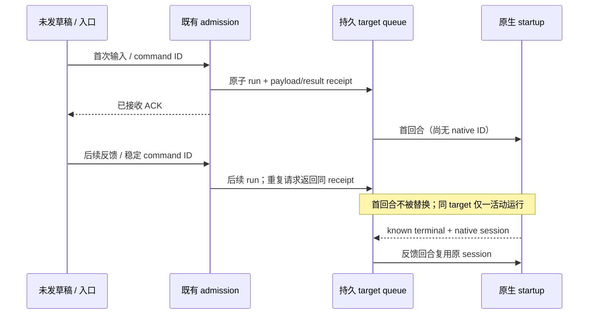

# 行内反馈与跨内核待办的独立验收

2026-10-07。审查基线 main `a8f83c98baacefe18208ebfde136b3d0d3a1fdfd`，v0.9.0。本通道只做验收、定向测试与可证修正；不重复 workspace / handoff owner 的功能实现，不改额度、终端、手机、账号、合并或发布。

Workspace 通道实现行内 diff 批注持久草稿及向原 Agent 反馈。Handoff 通道实现跨内核待审批、失败、完成未读入口。Integrator 拥有最终集成、合并与发布。

先行核对整合 [PR #46](https://github.com/accomplish07zrh-eng/knorvia-studio/pull/46) 的 `specs/knorvia-review-inbox-integration-20261007.md`（head `cf6d1641`）。本矩阵细化其归属/版本核验、原生未读 owner、阅读与审批分离及异步失效规则；不改变两个功能的接口。当前 `IStudioRuntimeService` 已达到 12 个公共方法的架构上限，新增能力由实现 owner 按共同契约协调，不能在审查分支额外添加 RPC 方法。

## 既有所有者与保留边界

- `StudioClient.execute` 将同一 payload 的并发请求合并；失败重试复用原 command ID。Host `commandAdmission` 用同一事务保存 payload / result receipt。草稿不是已接收队列，不得另建 Renderer 发件引擎。
- `StudioRuntimeService.tick` 在启动 adapter 前占有 target 的 active 状态；后续发送按已提交队列串行执行。native session / turn ID 未到不等于没有活动任务。旧 attempt、未知结果、取消与 lease 防护继续有效。
- 原 Agent 身份从持久化 run / step / member / kernel / workspace generation 等既有事实取得；当前导航选择和 Renderer 自选路径不能替代它。持久批注与接收回执的唯一所有者由 workspace 实现规格明确，UI 只保留未发编辑及请求投影。
- 未读及阅读游标的唯一所有者由 handoff 实现规格明确；不以已加载 timeline 的临时缓存代替全局事实。阅读命令与 `answer` 审批命令独立，不能互相转换。
- `StudioClient` 缓存按连接与 target 隔离，旧 revision 不覆盖新页面；导航 reducer 更新完整目的地。跨内核跳转的异步回调需要同样的请求/连接/目标失效边界。

## 提供给实现 owner 的小型验收矩阵

| ID  | 操作及控制时序                                                                                                            | 必须观察到的结果                                                                                                                  |
| --- | ------------------------------------------------------------------------------------------------------------------------- | --------------------------------------------------------------------------------------------------------------------------------- |
| F1  | 在成员 A 的 `src/a.ts` 新侧第 3 行保存批注，关闭并重载；保留相同项目、run/step、内容和锚点。                              | 草稿文本与原锚点完整恢复；没有发送、原生调用或源项目修改。                                                                        |
| F2  | 保存 F1 后改变该锚点内容，或让新 diff 将该行映射到另一段内容；同路径不等于同锚点。                                        | 明示锚点已失效并阻止使用旧锚点发送；保留草稿供用户处理；不静默重绑行号。无关文件的草稿仍可使用。                                  |
| F3  | 两个隔离成员/任务都修改 `src/a.ts`；当前界面切到另一 kernel / 会话，再发送成员 A 的批注。                                 | Host 固定派发到原成员及其既有项目/会话边界；不得投到成员 B、当前选择、其他同路径项目或新的原生会话。                              |
| F4  | 发送草稿版本 1 后保留 ACK，编辑出版本 2；版本 1 ACK 在切换页面、重载实例后才返回。包括删掉再重新建立同文草稿的 ABA 情形。 | 仅确认已发版本；版本 2 和新实例的草稿不被清空。错误及 busy 状态不进入新目标。                                                     |
| F5  | Enter 与按钮同一 tick 触发两次；再模拟 Host 已提交但响应丢失，以及确定未接收的拒绝。                                      | 同一次发送只提交一个稳定 command ID / 一份反馈；丢 ACK 后重试不重复执行。失败保留草稿与可解释状态；不同新草稿使用新的发送身份。   |
| F6  | 初始原生回合停在 startup，尚无 native session/turn ID；此时已收到 Studio admission ACK，再接收一条反馈。                  | 原输入不被取消或替换；反馈保持已接受串行语义。首回合失败/结果未知时，后续反馈保持等待或明确拒绝，不能自行重试外部副作用。         |
| A1  | 未打开任何 timeline 时，为至少两个 kernel 产生待审批、失败、完成；其中一个项目已有相同显示路径，另有 SSH 身份。           | 聚合入口覆盖后台与未加载目标，kernel / connection / task 身份不混淆。切换 kernel 不消失、不因缓存淘汰改变统计。                   |
| A2  | 给待审批任务调用 mark-read 或打开其目的地；同时给另一个 kernel 的完成项 mark-read。                                       | 阅读只影响选中通知的阅读事实；审批仍 pending，未发 `answer` / `resume` / `send`，其他 kernel 未读不变。审批按钮仍须真实用户操作。 |
| A3  | mark-read 请求使用事件/游标版本 1，等待响应时产生新 attempt / 新完成或新待审批事件，再让旧 ACK 返回。                     | 新事件保持未读；旧 attempt 不能消除新 attempt 的待办；审批失效和阅读确认分别判定。                                                |
| A4  | 保留 A 的导航读取响应，先完成到 B 的跳转；随后 A 的旧读取/确认/失败回调返回。另测换 Host 后同 target ID。                 | 当前 kernel、session、workspace 与视图仍是 B；旧错误、权限 UI 和任务状态不覆盖 B，也不从旧 Host 复活。                            |
| A5  | 待办位于近期历史窗口及 12 个非活跃缓存之外；退出并重开，页面处于后台或目标尚未加载。                                      | 未读/待审批仍可发现，读取完整且有明确加载/失败状态；不把预取或后台订阅当作用户已读。                                              |
| X1  | 统计、mark-read、导航和草稿重载期间，让 adapter / credential reader / 原生启动 spy 一旦被调用即失败。                     | 新入口依赖已保存的事实，不额外读取账号凭据、探测登录或启动 provider。只有明确反馈发送走既有 admission 执行路径。                  |

批注锚点的具体字段、阅读游标及发送回执形状以两个实现 owner 的规格/contract 为准；上述矩阵检验可观察行为，不预设第二套数据模型。

## Startup 反例与独立回归

公开问题 [Paseo #6186](https://github.com/getpaseo/paseo/issues/6186) 和修复说明 [#6192](https://github.com/getpaseo/paseo/pull/6192) 描述：第二条 steer 在第一条原生回合启动、ID 尚未取得时到达，会替换并丢失第一条输入。本通道只读取问题/PR 的公开行为说明，没有读取或复制实现 patch。

Knorvia 继续采用已有 admission / target queue 语义，不引入 Paseo 的 steer 实现。独立测试保留一个未发 native session 的 adapter startup，提交后续输入及重复同 command ID；在释放首回合前验证原输入、未取消信号、队列与持久回执，然后观察第二回合复用首回合实际 native session。还需验证首回合结果未知不会自动释放后续输入；该边界已有 `studio-runtime-sequencing.test.ts` 用例，按需重跑，不复制测试。

## 证据边界

先运行现有小型基线：发送排序、客户端 command retry、草稿旧 ACK、diff 投影、run-history actions 及导航。实现分支可用后逐一记录基线与 head、文件差异、独立断言、执行结果及未覆盖项；增加测试前先更新此规格或对应实现规格，并与 owner 避免文件重叠。

Node/SQLite fake adapter 测试验证 admission、持久状态和调用顺序，不等于真实 GUI 或 provider 验收。UI 行为若只做源代码/SSR/状态控制器检查，明确说明未完成实际点击、进程重开或真实账号执行。原生模型调用、额外凭据读取、手机、签名、部署、版本和发布均不属于本审查。
