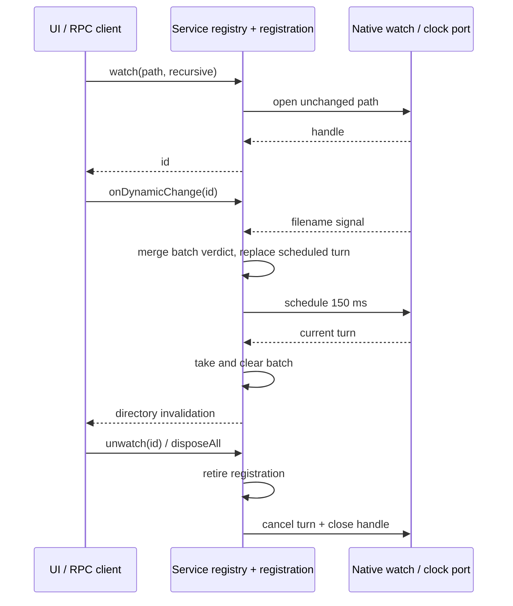

# File watcher service boundary — Lane C

Baseline: `0d80f9ca37b1daef162ecc69bd18f6e8fc30a146`. Owned production paths are
`packages/services/src/fileWatcher/fileWatcher.ts`, `fileWatcherService.ts`, and narrowly
named local helpers. This spec precedes replacement code. The public descriptor remains
`ServiceChannels.FileWatcher`; existing imports, RPC dynamic events, and UI callers remain.

## Preserved contract

- Each `watch` attempt consumes the next service-local decimal ID, starting at `0`.
  Every successful call owns its own native handle, even for duplicate directory paths.
  Different service instances have separate ownership. Paths are passed unchanged to
  native watch and returned unchanged as `dirPath`; there is no workspace identity
  parameter to infer, normalize, or invent at this boundary.
- `recursive` defaults to false and explicit values pass through. Native registration
  failures reject with `无法监视目录 '<path>': <message>` and leave no admitted owner.
- Both native rename and change signals invalidate a directory. The trailing debounce
  stays 150 ms; every signal restarts it. A batch reports `changedPath` only when every
  signal identifies the same resolved path. Null, blank, or multiple paths produce only
  `dirPath`. Filename string/Buffer conversion, trimming and platform-native `resolve`
  semantics are compatibility rules, including nested/absolute names and dot segments.
- A flush clears the batch before publishing, so a reentrant signal starts a new batch.
  Delivery follows the RPC emitter's subscription order and disposal semantics.
- Unwatch cancels pending work, closes the handle once and releases subscriptions.
  Repeated/unknown unwatch is harmless. Native errors warn, publish one final directory
  invalidation and release the owner and pending work. Stale IDs warn and return
  `Event.None`, including the race between successful watch and subscription.
- `disposeAll` removes diagnostics and all current handles/timers/listeners. It is
  idempotent. Existing factory reuse after disposal remains possible; IDs do not reset.
  Diagnostics report current admitted handles under `fileWatcher.open` before disposal.

## Independent construction boundary

The service registry owns admitted registrations and IDs. Each registration owns one
native subscription, one pending scheduled flush and one batch verdict. A small IO port
opens/closes native watches and schedules/cancels work; the default Node adapter preserves
the existing native API and delay. Synthetic tests can provide that port without OS access.
An algebraic batch verdict (`empty`, one exact path, `ambiguous`) replaces the path Set:
once ambiguity is established, further paths cannot restore precision. Space per batch
is constant. The service retains registration identity and scheduled-turn identity to
ignore callbacks delivered after cancellation or retirement. No runtime fallback to the
inherited service is allowed.

This is a live invalidation stream with no replay history. Host-scoped service instances
and existing remote service routing provide identity isolation; this lane does not alter
desktop continuous/mobile replay transport or workspace ownership.

## Failure-first acceptance

Before switching entrypoints, run a frozen black-box suite against inherited source using
a mocked native watch and virtual clock. Cover IDs, failed admission, duplicate paths,
recursive options, string/Buffer/null names, coalescing, exact debounce boundaries,
reentrancy, unknown/stale subscriptions, native error final events, diagnostics, cleanup
and per-service isolation. Record actual baseline failures, including zero if observed.
Then test the new IO port and stale scheduled-turn guards before implementation; record
their missing-port failures separately from baseline product regressions.

Run the same contracts against source and TypeScript-emitted JS. Exercise dynamic events
through real RPC server/client proxy consumers and native Linux watch only on owned
temporary fixtures. Run root typecheck/lint, relevant CLI/UI builds, formatting and changed
and full architecture checks. Disclose unavailable Windows/macOS/native GUI acceptance.
No test relaxation, timeout changes, actual permission changes or user-file access.

## Provenance limits

Both baseline files are `upstream-modified`, `review: null`, with default Apache-2.0 scope.
The author has read baseline implementation, interface, callers and tests to extract
contracts. This is source-exposed development, not clean-room evidence. Compatibility
declarations and public descriptor are retained and do not need rewriting merely because
the file is unreviewed. New structure and algorithm require digest-bound root review;
this lane does not grant MIT, rewrite shared provenance, clear third-party obligations,
change LICENSE/NOTICE or preview identity. All 27 unresolved material obligations remain.
