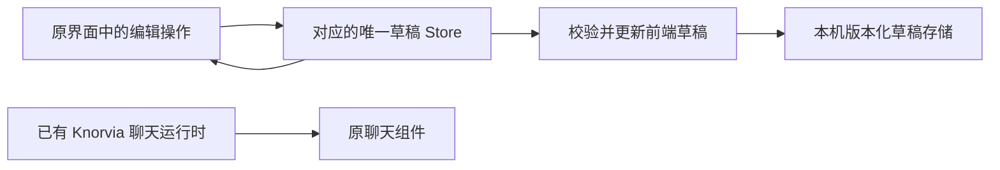

# Knorvia Studio 前端壳完善

> 后续阶段：2026-09-22 用户授权全面补齐后端，当前执行规格为 `specs/knorvia-backend.md`。下文保留前端交付历史；“仅草稿／发送不可用”不再限制当前后端接入。

2026-09-22，用户在干净上游 GUI 基础上授权本轮前端增量。该范围取代 clean-base 中不新增群聊／工作流的阶段限制，保留全部身份隔离、去登录、白色默认主题与透明图标约束。

## 产品规则

- 复用原窗口、侧栏、聊天输入框、组件、语义颜色和设置页，不创建第二套 UI 壳。
- 主侧栏：顶部搜索图标（复用命令搜索）；新建任务、自动化、工作流；单聊／群聊切换；底部原品牌与设置。自动化按用户明确答复留在主侧栏；其原面包屑顶栏复用桌面帮助和窗口按钮，折叠侧栏时不遮挡导航。
- 四个内核的单聊统一复用原 Knorvia 聊天的窗口标题栏、问候语、项目选择、Lexical 输入框和输入卡布局，不另写外部内核聊天页。内核选择包含 Knorvia、Codex、Claude Code、Grok Build；外部内核本轮只保存项目与草稿，未连接时工具与发送不可用并说明原因。不能伪报已安装、已登录或已连接。切换内核新建独立会话，不携带旧对话。单聊列表只按项目整理，不保留分组整理入口；既有会话和项目数据不删除。
- Agent 管理放在设置左侧，可查看内核、编辑连接路径与权限偏好；安装、更新、卸载是后续连接管理服务的边界，未实现时显示明确原因，不执行系统命令。
- 按用户最新要求，取消独立插件市场页及所有浏览市场入口。设置只保留一个“插件”入口，复用已有插件的配置、启停、更新和卸载界面；旧市场导航意图迁移到该管理页。技能、MCP、模型等现有管理仍在设置中。
- 管理页标题使用 text-ui-lg（默认 16px），新增页面空态标题最多 text-ui-xl（默认 18px），不使用 24–30px 以上大标题；收紧标题间距，正文和控件沿用原字号体系。
- 模型供应商模板使用统一列表；智谱与 Z.ai 按普通供应商处理，不置顶推荐、不另设“智谱 / 其他”分区。保留真实供应商名称、模型能力与用户已有配置。
- 群聊前端可新建、重命名、编辑成员／主持人／目标与共享说明、保存消息草稿、删除群聊。平时 @ 指定，任务模式由主持人调度；本轮不提交给 Agent，不生成假回复。只能访问群摘要与显式共享内容，不读取其他成员私聊。
- 工作流前端提供列表和节点画布：新增、重命名、复制、删除、连接节点、节点属性、串并行／条件／人工确认／失败重试配置与图校验，持久保存。运行服务尚未接入，不展示虚构进度和结果。
- 本轮不新增角色与记忆、成果页面。不删除上游无关能力与现有用户数据。
- 中英文、亮暗主题、键盘操作、窄窗口都使用已有组件和语义样式；新文案不得泄露调试字段或内部实现细节。

## 状态与接口

本轮所有新增内容是本机前端草稿，不属于已被运行时接受的任务。分别由 `store/studioAgentStore.ts`、`store/studioGroupStore.ts`、`store/studioWorkflowStore.ts` 中唯一 Zustand store 持有，并以版本化 `knorvia-studio:*` localStorage 键持久化。无后端缓存或第二条 accepted queue。存储失败要向用户提示，损坏数据降级为空但不隐式覆盖原数据。

UI 所属 architecture 模块为现有 unmanaged `ui`，不新增跨包服务、RPC、协议或运行时。各页面公共组件经 `studio/` 导入；Agent 目录公共类型位于 `studio/types.ts`。系统文件选择等能力必须经既有平台 hook，不直接操作 Electron。前端草稿明确限制为当前应用数据目录／浏览器配置，不承诺跨设备同步或服务端恢复。

外部内核没有已连接状态，选择只创建新草稿。群聊／流程不自动启动、无恢复进程、无网络与命令副作用。原 Knorvia 单聊、自动化和插件已有服务保持原有单写路径。

统一聊天仅共享呈现组件，不共享运行时：外部草稿仍由 studioAgentStore 以 sessionId + kernelId 校验归属；可选 workspacePath 与文字一起持久化，旧 v1 草稿缺少路径视为未选择项目。项目选择只修改草稿，不切换或启动 Knorvia 会话。外部输入框关闭原生 slash / mention 目录，所有提交路径均拒绝并保留草稿，不触发原 Knorvia 的发送、预热或配置写入。项目选择异步返回只写请求时的草稿 ID，不写切换后的其他内核。

## 验收

1. 主界面布局保持原 GUI；搜索大导航消失、顶部图标打开原搜索；自动化仍可达；工作流取代插件市场位置；单聊／群聊切换可用。
2. 设置有 Agent 管理与单一插件管理页；无独立插件市场、浏览市场入口、新增角色／记忆组合页或成果页；旧市场意图进入插件管理。管理页标题紧凑，模型模板没有智谱专区。
3. 群聊创建／修改／成员与主持人一致性／删除／重开持久化可验证；消息仅为未发送草稿，不伪报对话。
4. 工作流画布节点和连线可编辑，条件分支／并行／确认／重试参数可保存；非法图有具体定位；保存后离开重进不丢失。
5. 四内核切换时窗口、问候语、项目菜单、输入卡位置和尺寸保持一致；外部草稿可输入、选择项目、离开恢复，Enter 不清空或发送。切换内核不复用旧聊天上下文，不出现 Knorvia 的 slash / mention 目录；外部 CLI 的连接／安装状态无伪造。
6. 原 Knorvia 聊天、模型设置、白色默认主题、透明图标、去登录与数据隔离不退化。
7. 执行根 typecheck、renderer 类型检查、lint、architecture 检查；新增草稿状态与图校验的实质测试；实际桌面 GUI 验证导航、表单和持久化。生产构建后更新便携目录，保留 data。

## 交付与后续

更新现有 Knorvia Studio 便携版，桌面说明中明确本轮完成的是可编辑可保存的前端壳，外部 CLI、群聊调度、工作流执行由后续后端完成。不得把上一轮废弃多内核目标作为本轮完成标准。
