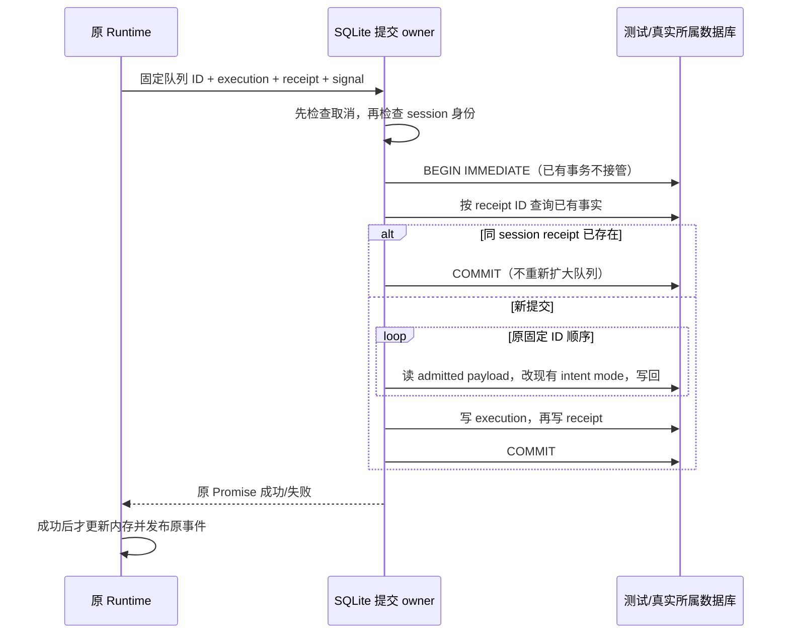

<!-- SPDX-License-Identifier: MIT; Copyright (c) 2026 Knorvia Studio contributors -->

# 完全访问授权的持久提交

基线 `fd4bc58`，接续项目规则原子保存与审批先登记规格。只替换 adapters 中的 `permission-full-access` 持久提交实现；Runtime 的待授权状态、固定队列选择、执行状态、幂等 receipt 与事件发布仍各由原 owner 管理。公共接口、表结构、迁移、权限选项和 UI 不变，不把相邻 Runtime、SQL 编解码、SessionStore 大 facade 或 schema 一并宣称独立。

## 已确认的问题

真实新建内存 SQLite 中，session_input 的 UPDATE 触发器执行 RAISE(ROLLBACK,'original queue failure')，SQLite 已自动回滚。当前实现随后再次 ROLLBACK，外抛“没有活动事务”，原始队列错误丢失。本批先保存该失败回归；自动回滚后应传播原始失败。如果本方法仍拥有活动事务但回滚又失败，应保留两个原因。不能捕获错误后冒充授权成功。

## 所有权与实现选择

用一个同步存储提交程序表达 receipt 检查、固定队列改写与 entry 写入的阶段；数据库适配负责执行其有限操作，独占 BEGIN/COMMIT/ROLLBACK。程序不保存第二份权限、队列或重试缓存，只在本次提交期间存活。队列按原输入顺序逐项读取和写入，不能预读取全部队列而改变失败与写入次序；execution 和 receipt 仍依次交给同一个既有 saveSessionEntry 路径。

## 保留的合同

- 入口取消检查先于 execution/receipt 与 session 匹配检查；不增加取消与提交之间的 await。同连接已有事务明确拒绝，不能回滚/提交相邻 fork/import owner。
- 已有事务的显式准入守卫有意改为应用 Error，不再依赖 SQLite 的嵌套 BEGIN 错误文本和 errcode；事务保护不变，不把此诊断字段变化混入旧接口完全等价结论。
- 已存在的 receipt 仍只按 ID 与 session 检查。同 session 重试直接成功，不重抓或重写新队列，不在本批加强既有 receipt 内容校验；Runtime 的恢复校验保持。
- 仅改固定 ID 集合中属于同 session 且状态 admitted 的记录。缺行、跨 session 或其他状态报原 unavailable 类错误，已写过的其他记录也回滚。重复 ID 保留原逐次处理。
- 只把现有非 null、非数组对象型 intent/conversationInputIntent 的 mode 改为 yolo，不新增缺席 intent，不改 text、顺序、其他模式字段或未知成员。原 JSON 解析/序列化行为保持，坏 JSON 不能变成空对象后继续。
- 按执行顺序读取 live input 引用，保留 entry 的 touchSession 行为及时间戳；receipt 与 execution 的数据都经原 saveSessionEntry，不创造并行写入口。
- BEGIN 失败不执行程序、不回滚；程序、SQL 或 COMMIT 失败后，仅仍活动的自有事务需要回滚。已由 SQLite 自动终止的事务直接保留首因；回滚失败使用包含两因的错误。
- Desktop continuous 和移动端 replay 的原事件流程继续由 Runtime 拥有。提交失败不能先发布成功，提交后的传输失败仍由原 receipt 恢复，不在 adapter 发新事件。

## 先行验收与来源边界

先在旧实现运行真实 SQLite 的成功原子提交、固定队列、重复 receipt、跨 session、队列状态/缺失/坏 JSON、第二条队列及 entry 写失败、已有事务和入口取消。自动回滚首因与回滚双失败先红后修复。核对原时序与载荷结果，另验公开 facade 编译产物以及既有审批重试组合。

按原仓库流程实际运行根/CLI 类型及 lint、定向严格检查、架构、构建、全量离线、来源与密钥扫描。旧版固定对照只说明有限行为，不证明来源；独立来源必须依据新存储程序与事务所有权设计分别审查，不以抽取或改名替代。根 Apache-2.0、0.8.0-preview.3 与全部历史发行继续保留，最终稳定发布仍等待全量迁移。

只读来源复核确认：动作程序与事务 owner 为本次新设计，但旧 JSON 解析、两字段遍历及 mode 覆写仍属于继承表达。本批将其明确保留在 `permission-full-access-payload.ts` 并标注 Apache-2.0，不把提取、常量化或通过测试当作独立替换证据；这部分后续仍需审查和处理。因此本批完成提交协调边界，不能声称整个授权链已全部独立。
