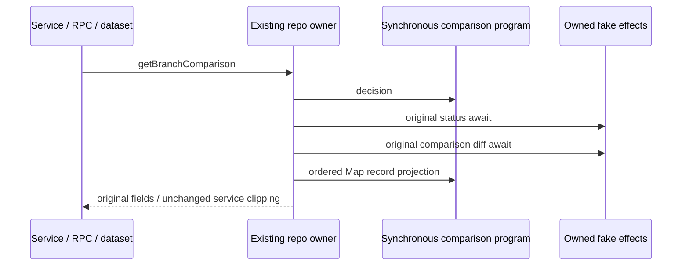

# Repository branch comparison query

Second sequential scope: only getBranchComparison in gitCliRepo.ts, one private
synchronous query/projection helper, narrow tests/oracle/evidence. Verify exact
publisher872ad960 and import/integrated lineage first. This is the still-inherited
repo query, not the already accepted service workspace read projector; retain that
projector, parseNumstat/inferKindFromNumstat/status parsers and all public declarations.
First checkpoint af419c9 and all earlier receipts remain immutable.

Actual callers: gitService.getBranchComparison and refresh(includeBranchComparison),
real RPC and useGitRepository's private buildRepositoryDatasets branch dataset,
extracted from actual owned source/emitted artifacts for testing.
Preserve field shapes/workspace clipping/output paths/stats/order through these
unchanged consumers. No changes to UI state or refresh request ownership.

Original method awaits this.getStatus(workspacePath), with original receiver.
If Git/repo unavailable or trackingBranchName falsy, return resolution, baseRef,
headRef=branchName??HEAD, comparisonLabel=null and empty changes in original getter
order. Otherwise command cwd is status.resolution.repoRoot; argv exactly diff,
--numstat,-z,--find-renames,`${trackingBranchName}...HEAD`,--; timeout15000/output524288.
Do not trim refs, add options, escape through shell, substitute revision policies,
retry or infer a remote. Command effects remain in the existing provider owner.

On fulfillment, ensureGitCommandSucceeded with exact label
"git diff --numstat upstream...HEAD" before stdout projection or output fields.
Preserve timeout/truncation/failure prose/priority, sync/rejected/getter error identity
and original2 awaited effect boundaries; no extra awaited orchestration result.
Projection uses the unchanged actual numstat parser/Map semantics: repeated path
replaces its value at its first insertion position, exact normalized/rename paths,
binary/default/partial numeric behavior, null originalPath and retained kind inference.
Return resolution/base/head/label fields in original order after changes computed;
label uses truthy branchName or HEAD, head uses nullish branchName or HEAD, preserving
empty-string distinctions and repeated getter reads. Do not sort/filter/deduplicate
again or mutate snapshot inputs. Delimiters UTF8/NUL/tab/CRLF/record separators stay
as retained lower parser interprets them, including malformed records and rename tails.

A synchronous operation program owns ephemeral status admission/query plan/ordered
record projection. The original method owns its2 awaits. All maps/reuse/invalidate,
status fallback/untracked policy, command/env/config/credentials, mutations/checkpoint
restore and prior accepted query boundaries remain exact. Freeze source and strict
emitted contracts and exact copied baseline comparison before code: queued/reentrant,
rejection cleanup, invalidation, different workspace keys and late status/diff outcomes
through actual unchanged owners, counts and visible outcome order. No policy fix is
currently proposed; only supported reproduced regressions could justify corrections.

Owned synthetic ports/records/status snapshots only; no live Git/user repository,
process/fs/clock/provider/remote/security/settings access. Source/emitted actual
service/RPC/dataset acceptance, not native/React/remote Host acceptance. Original
method oracle is copied source-exposed test material, not new production/originality.
Retained strings/types/compatibility expressions remain explicit; no clean-room,
whole-file MIT, licence grant or new cache owner. Shared records/deps/CI and older
lane27 obligations stay intact; parent's26 remains separately reported.

User cadence supersedes old per-checkpoint full builds/regression: run scoped
source/strict emitted, directly affected consumers, relevant types/configured+owned
lint/format/architecture and exact evidence. Do not rebuild CLI/desktop or run the
full project for this small boundary; root owns aggregate integration/publication
gates. Normal-push a clean appended checkpoint with exact run/not-run notes.
