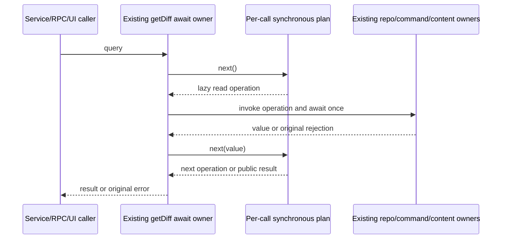

# Read-only diff query program

Baseline:a115bbe2b247551136591568f658fa4dbb70e193. Owned production scope is only
gitCliRepo.getDiff and new private gitDiffReadPlan.ts. The getDiff body SHA256
87352f5eb23e043b64cafca2947b999427f414112e5c149ed0e524ccd3411f79 is exact
publisher872ad960, import7619e41 and integrated0d80f9c text. Public declarations,
accepted parsers/classifier/projections/query plans and all content-reader bodies
remain exact, including prior preview-content safeguards. Exposed original method
and private reader functions are copied only into a labelled frozen test oracle.
This is not clean-room or a whole-file MIT/originality/licence claim.

The new synchronous program owns query selection, path projection and fallback
admission; the existing getDiff entrypoint owns each awaited effect. Yielded lazy
operations defer receiver/argument reads until their original execution position.
There is no extra async orchestration promise, new cache/state owner or policy.
One source-selection value drives incremental argv assembly and one common diff
command/classification point. The result then admits one selected content reader
or the ordered existence/text/no-index fallback. Fixed protocol tokens, APIs,
error prose and compatibility predicates remain attributed, while the selection,
assembly and shared control program are new expressions subject to root review
under docs/knorvia-mit-review-acceptance-criteria-20260930.md. Source exposure is a
disclosure rather than an automatic permanent bar; no unaudited licence grant.

Freeze before production implementation:

- Resolution is first; absolute path reads occur after its await even if Git or
  repository is unavailable. Preserve repeated params getters, native path APIs,
  normalizeInputPath realpath/fail-open/scope rejection and original error prose.
- Branch source wins over staged override. Preserve tracking falsiness guard,
  branch argv/-- separation/timeout/byte limit, classifier option prose and
  unconditional merge-base/blob content reads even for nonpatch results.
- Otherwise staged is params.staged ?? (sourceId === staged). Preserve exact
  staged/unstaged diff args and unconditional content attempt for staged or any
  non-unavailable outcome. A missing content side never becomes an empty string.
- Only unavailable unstaged results admit fileExists, stable synthetic-text patch
  builder and then no-index fallback. Preserve access/read fail-open rules,
  platform null device, allowed exit codes [0,1], stdout/summary/raw content,
  ordering and all thrown/rejected identities. No new Git command or retries.
- One query creates no diff cache. Resolution/status maps, in-flight reuse,
  invalidation and cleanup stay in the existing owner. Queued/reentrant same and
  different workspace calls, resolution/status/diff rejection, invalidation at
  settlement and late resolution/rejection must match exact baseline effect
  counts, trace and visible promise order. No added awaited effect boundary.
- Actual service and in-process RPC entrypoints exercise branch, staged,
  unstaged/untracked, content-preview failures and rejected ports. The unchanged
  real GitPane callback and generation caller suites are immediate regressions.
- One requested future staged-only selected-rename service consumer uses exclusively
  fake mutation and temporary-index ports to assert original-path cleanup, scope
  and order. No mutation implementation changes or actual Git/fs mutation occur.

All process/fs/clock inputs are owned fakes or literal outputs. No real Git
product commands/mutations, user repositories/data, network/provider effects,
credentials, OS/settings/security changes. CLI/Creation/shared licensing/
dependencies/CI are excluded. Older27 lane registers and root26 obligations
remain separate. Linux synthetic source/strict emitted acceptance is not native
Git, Windows/macOS, mounted GUI, shipped or remote Host acceptance.

Run focused source/strict emitted and affected consumers, root types/configured
and owned lint, owned formatting and architecture. Full regression and full
CLI/desktop builds are deliberately deferred to root's aggregate publication
under the user's reduced cadence. Report exact files/cases/current hashes and
any actual failed fixture/regression separately; preserve earlier evidence.
