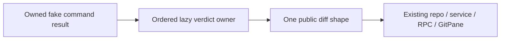

# Ordered diff response classification

Scope starts at78df1ba: only toDiffResult body in gitCliHelpers.ts and narrow
tests/oracle/evidence. Exact lineage first: publisher872ad960/tree d185a9 and local
import/integrated bodies. Private isBinaryDiff/toResultMessage remain unchanged,
as do accepted porcelain/numstat parsers and all public signatures/declarations.
The file remains upstream-modified/unreviewed in the old ledger; no whole-file
review or automatic MIT conclusion. Preserve earlier receipts and failure proofs.

Actual consumers are repo.getDiff's staged, unstaged, branch and no-index paths,
gitService.getDiff, real RPC and GitPane's cancellable diff-loading callback. Commit
generation also calls repo.getDiff; test through owned fake service/model ports
where directly supported, without provider/model/network effects. Existing query,
command, path, content-pair helpers, status/cache/in-flight/await and permission/
environment owners remain exact. This pure classifier introduces no async promise,
cache or second projection owner; preserve all caller effects even for non-patches.

Freeze exact priority and short-circuit evaluation:

1. Truthy timedOut wins, unavailable with exact timeout prose; no later reads.
2. Truthy outputTruncated wins, truncated with exact preview-limit prose.
3. options.allowedExitCodes nullish-defaults to[0]; preserve includes receiver,
   exitCode??NaN and failure message's stderr.trim||stdout.trim||exitCode fallback,
   getter/error identity and read order. The retained message helper stays exact.
4. Blank stdout.trim yields unavailable; emptySummary??default preserves empty
   string and nullish distinctions. Read options only when that outcome is chosen.
5. Retained literal substring binary-marker predicate; no anchored-line detection,
   case folding, trimming or new parser policy. binarySummary??default as before.
6. Otherwise return raw latest stdout as patch. Preserve repeated stdout reads,
   result/option getter and throwable evaluation order; do not snapshot inputs.

Every outcome preserves path, availability, patch, beforeContent, afterContent,
summary property order, nulls and exact prose. Fresh output, unchanged input and
types; no exceptions caught or wrapped. Public function entry and result owner are
unchanged. Replace the meaningful decision/materialization structure in-place with
ordered lazy verdict stages, stopping at the first verdict and constructing one
public result. Retain strings/defaults/predicate leaves honestly; moving the old
if/return loop to a helper alone is insufficient.

Before production: concise source/strict-emitted golden and exact copied-baseline
contracts, priority collisions, marker/path/Unicode/empty cases, getter/throwing/
changing values, and actual repo/service/RPC consumers with owned fake process/fs
ports. Freeze GitPane callback result/error/loading/cancellation with actual source/
emitted extraction, including late completion and cleanup; no React/native claim.
All real process/fs/access/open/stat/read/settings ports forbidden or synthetic.
Do not run actual Git mutation, provider/network/model, user files or credentials.
Root CLI, all Creation paths, shared licensing/deps/CI/settings/security excluded.

Final gates: focused source/strict emitted, directly affected consumers, types,
configured/owned lint, owned format, architecture and exact digest/scope checks.
Do not run full regression or full CLI/desktop builds; user cadence leaves root's
aggregate publication batch responsible. Preserve copied/source-exposed fixture
material and precise retained syntax; no clean-room, licence grant, whole-file MIT
or native/Windows/macOS/mounted React/separate Host acceptance. Older lane27 and
parent-reported26 obligations stay separate. Normal-push only the fixed branch.
