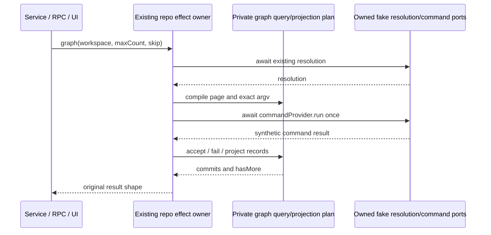

# Read-only Git graph query and record projection — fixed services lane

## Lineage before implementation

Start at immutable `57bb3ddd82b3d1ca77c9881e98e19dcb72c68e75` on
`parallel/file-watcher-fast-20261001`. The target repo file is still the imported
implementation at `7619e41b950bd52073ebf36754146cf25659d9fa` and integrated
`0d80f9ca37b1daef162ecc69bd18f6e8fc30a146`: blob
`6ce5993b5f036690742b15925d839e57185717ae`, 59,042 bytes, SHA-256
`11b1e8550c8aaca02f5dca0c5f7e0ab55141f308483bfe0db25b0ec6b93ed58c`.
Pinned ZCode `872ad960de7ec172591f7e1952f7849229f94521`, tree
`d185a9a893c00d51fc3fe51fe7371b9eea7de143`, repo blob
`ffe734dd7fcccc15c1128f7be818ea8b41c4fd90`, 58,787 bytes, SHA-256
`474a377eaf9b4420e671b67ed0d9d509b66fef22151b2085b9f5d8847bec92ba`
is byte-verified from separate temporary publisher storage. Both implementations
were exposed. Inventory is upstream-modified/unreviewed, NOASSERTION. No earlier
independent replacement or focused tests for this slice were found.

Only getCommitGraph, its pagination/decorations/record helpers and narrowly named
private helpers/tests are production scope. Unrelated repo functions and methods,
public declarations, resolution/caches, command/environment/security policy,
status, mutations/checkpoints, service/read projector and generator are protected.
Earlier Git test/evidence remain immutable; root owns the Windows assertion
correction at `80d053a`. This lane's 27 material obligations remain unchanged;
root-reported published Keyv closure leaves its root count26, not a local grant.

## Owner and structural replacement

The existing repo/commandProvider remains the only effect owner. The repo awaits
its existing this.resolveRepository, admits available repositories, normalizes the
page, invokes commandProvider.run once, then projects the response. No graph cache,
resolution path, retry, configuration, environment or accepted state is added.



Introduce one private query/projection helper. Compile the page and exact argument
array, interpret response outcomes in order, expand decoration tokens with ordered
first-match rules, and derive record properties through an ordered field projection.
One local ref accumulator preserves first occurrence per kind/name; it is not a
repository cache. Retain precise compatibility leaves rather than counting moved
normalizers, prompt/protocol syntax, comments or formatting as new contributions.

## Frozen contracts

- Resolve using this receiver and exact supplied workspacePath before normalization
  or run. Resolution rejection/throw is unchanged. Read isGitAvailable first,
  short-circuit isRepository. Unavailable returns the same resolution reference,
  commits empty and hasMore false; no command or pagination coercion.
- Max count: non-number/nonfinite defaults100; finite floor clamps1..200. Skip:
  non-number/nonfinite defaults0; finite floor clamps at0, with no upper bound.
  No coercion of strings, boxed numbers, booleans, null or undefined.
- Run retains its provider receiver. Command key order is cwd,args,timeoutMs,
  maxOutputBytes. Cwd is resolution.repoRoot. Exact arguments in order are log,
  HEAD,--branches,--tags,--remotes,--date-order,--topo-order,--skip=N,
  --max-count=(limit+1),--format=%H%x00%P%x00%an%x00%at%x00%s%x00%D%x1e.
  No user path becomes argv, no --all, extra -- separator, shell/config/env or
  command/security option is added. Retain 15,000ms and 512KiB existing budgets.
- Read exitCode before stderr/stdout. For nonzero (including null), lower-case
  stderr and test the four legacy unborn phrases in order: does not have any
  commits yet; your current branch; bad default revision; ambiguous argument 'head'.
  Matching errors return empty before the existing success checker, even if
  synthetic timedOut/truncated flags are set. Other failures retain checker
  label git log visible refs and timeout/truncation/message precedence. Successful
  exit0 still bypasses that checker. These old flag-edge semantics are not silently
  broadened into a correction. Rejected/thrown run errors propagate unchanged.
- Split stdout on U+001E, trim every record before projection, remove only empty
  trimmed records, then split each record on NUL. Only the first six fields matter.
  Empty hash drops the record; missing fields are tolerated. Preserve nonhex hashes,
  duplicate commits, original order, Unicode, embedded newline and raw spaces within
  fields. Delimiters are protocol delimiters even in adversarial synthetic text;
  no escaping/repair or UTF-8 byte decoding policy is introduced after string IO.
- Precompute timestamp before parent/ref projection: truthy seconds parseInt base10,
  NaN gives null, otherwise multiply1000 (including signed/overflow values). Author
  uses authorName||null; subject uses subject??empty. Parents split literal space
  and filter falsy; no parent validation/deduplication or whitespace normalization.
  Commit key order is hash,parents,refs,subject,authorName,authoredAtMs.
- Decorations split comma and trim tokens. HEAD -> prefix emits HEAD then pointed
  ref; literal HEAD is head. tag: trims payload and optionally removes refs/tags/.
  refs/heads/, refs/remotes/, refs/tags/ prefixes select branch/remote/tag, including
  empty-prefix suppression without fallback. Unknown slash names are remote,
  otherwise branch. Match order and first occurrence per identical kind/name remain.
  Ref key order is name,kind. Trimming quirks around empty pointers/prefixes remain.
- Parse all records before slicing limit; hasMore uses valid parsed count, not raw
  record count. No sort or commit dedup. Return resolution,commits,hasMore in order.
  Inputs/ports/results are not mutated; each invocation produces independent output.

## Callers and acceptance

Trace unchanged createGitService.getCommitGraph (workspace,maxCount,skip forwarding,
returned commits/hasMore), Git descriptor/binary RPC, node service construction,
GitGraphDialog initial/refresh/load-more callbacks and GitGraphPane layout use.
Freeze source and strict emitted behavior before production edits. Cover boundary
pagination, unavailable/unborn/errors, receivers/await/getter order, adversarial
NUL/record/comma separators, malformed/date/ref records and independent invocations.
Exercise actual service/RPC, exported graph layout, and private UI callbacks using
read-only AST extraction with owned closures; no mounted GUI/native acceptance.

All command, repository resolution, filesystem, logger and time ports are fake or
owned literal values. Only source/emitted workspace artifacts are read by test
harnesses. No live Git repo, mutation, remote/provider/network, user files/profile,
credential, process launch or host/settings/security change is permitted.

After replacement run focused source/strict emitted and related Git consumers,
types/lint/format, changed/full architecture, CLI/desktop builds and full regression
with unchanged budgets. Bind exact final commits/hashes/test counts and report
unrun native/Windows/macOS/GUI/remote scopes. Keep all old records/notices/dependency
inputs unchanged. No clean-room, whole-file MIT or native acceptance assertion.

## Legacy freeze completed before production edits

Three files passed 147 individual cases in source and strict emitted modes, zero
failures/skips/cancellations, against the unchanged repo bytes. The first launch
failed before cases because the fake filesystem module omitted transitive access,
open and realpath exports; those were added as forbidden ports. The next run had
135 cases, 134 pass and one fixture expectation mismatch (command-result then read
once, not twice). Corrected to the observed legacy order before implementation;
six query and six consumer cases were then added. This is fixture correction,
not a product defect/red proof or an altered compatibility policy.

Root types and lint passed before replacement. Public repo declaration SHA-256 is
`a6a19273740e97f89c1b0cdc88b160570d45749e6d70edbb2c39850f3f95870b`.
The existing strict Git loader is reused without changes and rejects source fallback.

```sh
TSX_TSCONFIG_PATH=packages/ui/tsconfig.json node --experimental-test-module-mocks --import tsx --test --test-concurrency=2 packages/services/test/git-graph-*-fast-20261001.test.ts
KNORVIA_GIT_GRAPH_TARGET=dist node --experimental-test-module-mocks --import tsx --import ./packages/services/test/git-read-projection-emitted-register-fast-20261001.mjs --test --test-concurrency=2 packages/services/test/git-graph-*-fast-20261001.test.ts
```
