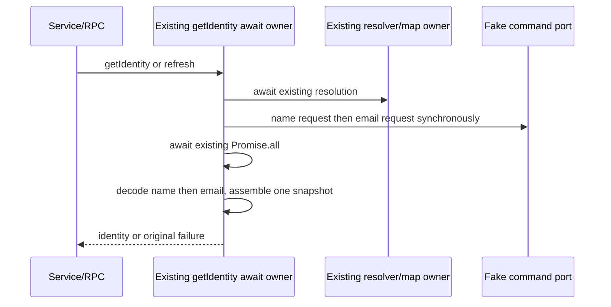

# Git identity read snapshot

Baseline69e4fc140b10d1429f1541b2d1fac8cf6991a124. Scope is getIdentity in
gitCliRepo.ts, parseGitConfigValue in gitCliHelpers.ts and one private
gitIdentityRead.ts. Both old bodies match pinned872ad960, import7619e41 and
integrated0d80f9c. Source exposure and retained expression are disclosed; root
reviews actual contributions under the existing MIT acceptance criteria.

Replace the raw scoped-config field decoder and ordered identity query/result
assembly, not existing status/diff parsers/plans, public declarations, cache/
in-flight owners or permission/provider/environment policy. The same entrypoint
awaits resolution once and Promise.all once; synchronous request construction
must add no awaited orchestration promise, state owner, retry or command.
The decoder locates the first two tabs and retains the remaining suffix directly,
instead of splitting/rejoining all fields. A synchronous setting table constructs
the two requests; a fixed binding table assembles the snapshot after both values
are decoded in name/email order. These substantive new expressions are separate
from retained APIs, protocol strings, error guards and newline compatibility.

Contracts frozen before production:

- Unavailable Git or non-repository returns five explicit null fields, with the
  same short-circuit resolution getter order and no config commands.
- Valid resolution invokes user.name then user.email before observing either
  returned thenable. Preserve run receiver/getter before cwd getter, exact argv
  [config,--show-scope,--show-origin,--get,key], repo cwd and15000ms timeout;
  no new maxOutputBytes, env, signal or file access. Preserve thrown/rejected
  identity and Promise.all settlement order, even if the other read remains live.
- Config exit1 means missing before any timeout/truncation/stdout inspection.
  Other codes pass unchanged ensureGitCommandSucceeded with label git config;
  preserve timeout/truncation/exit error prose, cause and repeated getter order.
- Preserve one legacy terminal-newline regex removal, including its JS anchor
  edge cases, all whitespace/Unicode/NUL/embedded newline bytes, fewer-than-three
  tab fields as opaque text, empty scope/source and complete tab-containing value
  suffix. No trimming/normalization or origin/path resolution.
- Decode name before email. Preserve nullable value/source, empty scope winning
  nullish precedence, fresh outputs and fixed property order/return shapes.
- Actual service/RPC getIdentity and refresh includeIdentity=true/false use fake
  ports. Queued/reentrant requests, rejected cleanup, invalidation and late
  outcomes through the actual resolver owner must retain effect/settlement traces.
  No identity cache or cancellation policy exists to add.

All command/fs/clock inputs are owned synthetic fixtures; never read actual Git
config, profiles, repositories, user identity/credentials or providers. No Git
mutation, network, settings/security, UI/CLI/Creation/shared-licensing edits.
Focused source/strict emitted and immediate consumers plus relevant types/lint/
format/architecture only. Full suites/builds are root's aggregate responsibility;
native Git/platform, mounted GUI and remote Host acceptance remain unclaimed.
Keep previous checkpoints and receipts immutable; provide one concise receipt.
