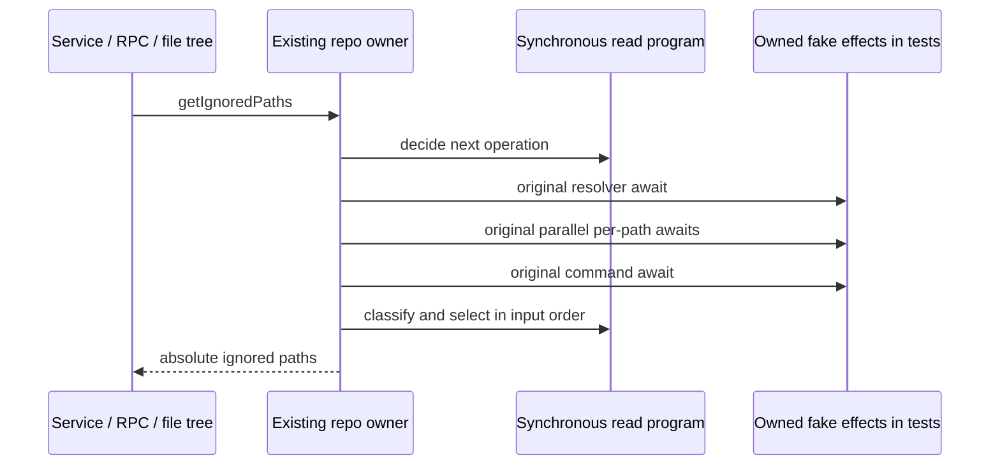

# Git ignored-path read boundary

Scope: only `getIgnoredPaths` in `gitCliRepo.ts`, one private synchronous read
program, narrowly named tests and evidence. The current ledger marks the repo
upstream-modified/unreviewed, NOASSERTION. Verify the method's exact body against
the initial import, integrated baseline and publisher 872ad960 before replacement.
Source exposure and the copied test-only method oracle are disclosed. No clean-room,
whole-file originality or licence grant; shared notices/inventory and the lane's
older 27 obligations stay untouched (root independently reports 26).

Actual callers: Git service `getIgnoredPaths`, its public RPC proxy, and the
workspace file-tree directory loader. The latter submits entry paths, independently
checks request versions on completion, then consumes the exported ignored-path set
and lookup functions. Preserve this consumer and its stale-result owner unchanged.

## Frozen behavior

- Empty input returns an empty array without reading the resolver. Otherwise call
  `this.resolveRepository(workspacePath)` with its original receiver and await.
  Unavailable/non-repository results return empty before path effects.
- Run the existing input map concurrently in input order. Each callback computes
  the original absolute display path before awaiting the unchanged
  `normalizeInputPath`. That helper's realpath fallback, repository scope check,
  error wording and filesystem policy remain unchanged. Suppress only each item's
  absolute-path/normalization failure; do not suppress array-map/iterator or resolver
  failures. Invalid inputs are omitted; no valid pairs means no command.
- Execute exactly `check-ignore`, `--`, followed by every valid repository-relative
  path in input order, retaining duplicates and option-looking paths. Cwd is
  resolution.repoRoot, timeout 15000, output limit 524288.
  No stdin, NUL flag, shell, new retry or provider policy.
- Exit code 1 returns empty before checking timeout/truncation. All other results
  use the existing `ensureGitCommandSucceeded("git check-ignore", result)` and its
  exact messages/priority. Rejections and synchronous throws propagate unchanged.
- Split stdout on CRLF/LF, remove empty records and normalize backslashes only.
  Do not trim, unquote Git quoting, reinterpret NUL, deduplicate submitted paths,
  sort or return command-output order. Select matching valid pairs in original
  input order and return their originally computed absolute paths.
- Preserve getter/evaluation order, immutable input behavior, sparse input handling,
  adversarial delimiters, actual normalizer receiver/ports and failure identity.

## Ownership and settlement

The existing repository factory owns all in-flight maps, reuse, invalidation and
command effects. `getIgnoredPaths` has no cache; concurrent calls can share only
the existing resolver owner, then independently normalize/query. The new private
program owns ephemeral decisions and ordered selection only, without promises,
IO, state cache or retries. The original entrypoint owns the same awaited effect
boundaries: resolver, Promise.all of the original per-item async normalizations,
and command, only when admitted. No extra awaited orchestration result.

Before production edits freeze source and strict emitted output/failure/getter
contracts plus baseline settlement comparisons through the actual resolver/maps.
Use a disclosed digest-bound copied method oracle only in tests. Compare queued
microtask depths, synchronous reentrancy, rejection cleanup, invalidation, different
keys, and late old completion/rejection: effect counts, reuse versus new admission,
and visible outcome order. Preserve legacy behavior unless a supported defect is
proved with intended policy and red evidence; no such change is currently requested.

All commands, realpath/stat/read/process/settings inputs are fake owned ports;
read only owned source/emitted artifacts for test callback extraction. Exercise
actual service/RPC, model exports and supported extracted file-tree callback with
synthetic entries, including stale delivery. No React GUI/native/live Git acceptance.
Run source/strict emitted, prior Git consumer regressions, root types, configured
and owned lint, format, architecture, CLI/desktop builds and full final suite.
Keep all earlier checkpoints and receipts immutable; append separate final hashes.
