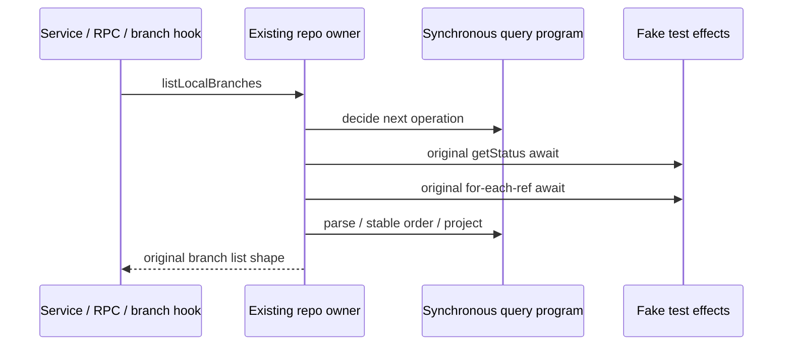

# Local branch read query and records

Scope: `listLocalBranches` and `parseBranchRefRecords` in gitCliRepo.ts, one private
synchronous query/record helper and narrowly named tests/evidence. Check exact
publisher/import/integrated body lineage before edits; ledger remains source-exposed,
upstream-modified/unreviewed NOASSERTION. Accepted read/profiles/terminal/graph/
generation/resolution/ignored-path work, public declarations and all unrelated
methods stay exact. No whole-file MIT, clean-room or licence decision.

Actual callers: gitService.getLocalBranches, its RPC descriptor/proxy, and the
useGitBranchSwitcher loadBranches callback. Preserve its loading/result/error/toast
behavior; do not change UI snapshot ownership or mutation callbacks.

Frozen query: await `this.getStatus(workspacePath)` with original receiver. If Git
or repository unavailable, return headRefType/currentBranchName from summary and
empty branches in that field/getter order. Otherwise run at status.resolution.repoRoot
with exact argv `[for-each-ref, refs/heads, --format=%(refname:short)%00%(upstream:short)%00%(objectname)%00%(committerdate:unix)]`,
timeout15000/output524288; no extra -- or path policy. Await directly inside the
entrypoint, then use original `ensureGitCommandSucceeded("git for-each-ref refs/heads")`
before reading projection fields/stdout. Preserve throw/rejection identity and
checker timeout/truncation/failure priority/prose. No retry/new cache.

Records: replace CRLF with LF, split LF, drop only empty lines, split NUL and take
first4 fields. Missing name drops a record; do not trim names/fields, infer refs,
validate hashes, normalize slashes, remove quotes or deduplicate. Missing upstream/
hash becomes null. Timestamp uses truthy-field parseInt base10, NaN-to-null and
seconds\*1000, including partial numeric/negative/overflow values. Current matching
applies only when headRefType is exactly branch. Stable sorting is current first,
descending timestamp with null→negativeInfinity, then name.localeCompare using the
existing runtime locale. Retain comparator expressions honestly; preserve duplicate
stable order, malformed/UTF8/NUL/bareCR/record-separator content and field/getter order.

The existing repo factory owns resolution/status maps, reuse/invalidate and command
effects. A synchronous decision program may yield status/command operations and
project records, while the original method owns its original2 awaits. No async
orchestration promise, copied production parser move, new cache or effect owner.
Freeze source/strict emitted outputs/failures/getters and baseline timing before
replacement. Compile disclosed digest-bound old method/parser in test memory only.
Compare queued/reentrant, rejected cleanup, invalidation, different keys and late
outcomes through the actual current status/resolution owners and fake effects.

Only owned fake process/fs/clock/settings ports and literal fixtures; no actual Git,
mutation/remote/provider/user repository/data/security policy. Actual service/RPC and
extracted supported UI callback acceptance, not React/native/remote Host acceptance.
Run focused source/strict emitted and prior Git regressions, types, configured/owned
lint, format, architecture, CLI/desktop builds and full suite on final source. Append
new digest receipt; keep older27 lane records and parent26 reported facts separate,
all shared licensing/dependencies/CI/settings untouched. Push first checkpoint and
report before selecting a second authorized slice.
