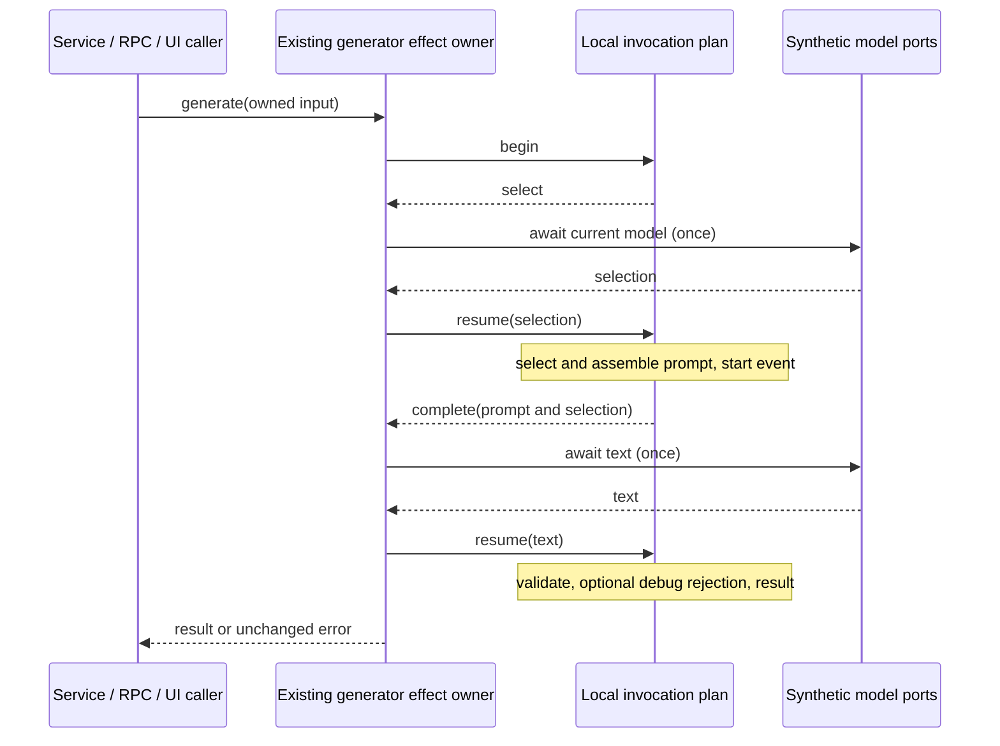

# Git commit-message invocation — fixed services lane

## Before implementation: lineage and boundary

Start at immutable `28d5e79a217f8476e051a8380b8a668221e4c5f0` on the existing
`parallel/file-watcher-fast-20261001` branch. The generator is still the imported
`7619e41b950bd52073ebf36754146cf25659d9fa` implementation, also at integrated
`0d80f9ca37b1daef162ecc69bd18f6e8fc30a146`: blob
`9ff9abf802d4f582a3f05a9ceb5baabbc5fd7490`, SHA-256
`f14b38f83fa037d5f5c09dcf08e8cbe21c9d694230ba2f1893db78624e59c487`.
Pinned ZCode publisher commit `872ad960de7ec172591f7e1952f7849229f94521`, tree
`d185a9a893c00d51fc3fe51fe7371b9eea7de143`, generator blob
`3cb83eb47f3b0ae7d9589195bfdc70af662d79f3`, SHA-256
`41c715e5b7d9a9e52fa88124abfaca1aaf52ba28a819a579aaf8f593f11402c7`
is available and byte-verified in separate temporary bare storage. Both sources
were read. Inventory says upstream-modified, unreviewed, NOASSERTION; no previous
independent replacement or focused generator tests were found.

Only `gitCommitMessageGenerator.ts`, private helpers and narrowly named tests/spec
are writable production scope. Retain all public declarations/exports, the exact
lookup/request private method bodies, options/receiver behavior and error class.
Keep Git service/projector, session file filtering, CLI repo, mutations, provider
policy, shared types, permissions, retry policy, caps and prompt prose unchanged.
No shared provenance/inventory, dependencies, CI or deployment changes.

## Owner and design

The existing generator remains the only model-effect owner. Each invocation has
one local protocol yielding only `select` then `complete`; synchronous prompt,
start event, validation and final result occur between/after those two await
boundaries. The generator drives those effects through its retained private
methods with their original receivers. No shared queue/cache, new model policy,
retry, additional await, timer or background request is introduced.



Replace nested prompt-selection loops with one lazy excerpt-window compiler:
preflight a selected row, skip empty rows, then inspect remaining budget, render
and charge that row. Diff and conversation supply distinct rendering/charging
rules. This preserves legacy post-exhaustion getter/error order and uncharged
prefix/separator behavior. Assemble ordered named prompt blocks, retaining every
literal. Replace validation with ordered decoration/normalization transforms and
rejection decisions, without changing accepted grammar or previews.

## Frozen contracts

- Await lookup before any prompt work/logging/effect. Lookup receives own
  workspacePath/workspaceIdentity keys, including undefined. Trim modelId first,
  providerId second, read options third, reject unavailable IDs, then truthy options
  shallow-copy. Returned text-port selection is ignored. Do not add eligibility,
  normalization, fallbacks, retries or options inference.
- Lookup errors/throwing getters are unwrapped. Text invocation and response-text
  normalization share the existing catch boundary. Existing generation errors pass
  through by identity; other errors become name `GitCommitMessageGenerationError`,
  message `模型请求失败。`, reason request-failed, detail Error.message or String(error).
  No cause is added. Unavailable is `未读取到当前模型。` / model-unavailable. Invalid is
  `模型没有返回可用的 Conventional Commit 提交消息。` / invalid-output / preview.
- Text request has workspacePath, truthy optional identity, selection, prompt,
  querySource `git_commit_message`, in that order. Preserve method receiver and
  thenable/await behavior. Logger methods also retain receiver, are not awaited,
  and can throw: start failure blocks the request; debug failure wins over the
  invalid-output error. No success logger is invented.
- Start info occurs after full prompt assembly and before text. Retain exact Chinese
  events, undefined trace, fields/order and counts, including all original input
  files/diffs/conversation messages and supplied omitted count. Invalid debug
  retains reason/preview, including an own undefined preview for empty output.
- Branch trim/fallback precedes locale. Locale uses explicit nullish fallback to
  runtime Intl, zh prefix means Chinese, everything else English; failed Intl is
  English. Explicit empty locale does not read runtime. All Intl values in tests
  are fake. File summary uses first 20, original order/sparse map behavior and raw
  kind/path/line values; omitted count uses original length.
- Diffs select first eight, in order. Header and patch/summary trim fallback are
  evaluated before exhausted-budget break. Body clips at min(2000, remaining12000),
  retaining truncation marker. Header counts toward used budget; joining blank lines
  do not. Last header can make output exceed nominal cap: preserve this behavior.
- Conversation selects last 12, preserving order. Omitted count is supplied count
  plus excess messages, shown only positive and only when input nonempty. CR/CRLF,
  trailing horizontal whitespace, >=3 newlines and trim normalization remain exact.
  Empty messages skip before budget check. Roles assistant/User remain exact;
  per-message600, total4000, markers, newline charges and uncharged omitted prefix
  remain. Normalize/role/per-message clipping occurs before exhausted-budget break.
- Preserve every prompt instruction, heading, fallback, punctuation, spacing and
  output newline. Empty-string-only filtering removes all blank template lines.
- Text must be nonblank string before validation, else request-failed with detail
  `模型响应缺少文本内容。`. Outer fence, prefix then balanced quote decoration order
  stays exact, including imperfect inline fences/quoted prefixes.
- Trim, slice1000 UTF-16 units, trim; first CRLF/LF line trimmed for regex. Preserve
  eleven Conventional Commit types, optional nonempty scope, optional bang,
  colon-space and 1–100 non-newline UTF-16 subject units. Prompt under72 is not a
  validation cap. Bodies do not change subject grammar. Unicode surrogate splitting
  and long invalid preview remain existing behavior. Empty/invalid reasons and
  own undefined detail/preview fields stay exact.
- Return message/providerId/model keys and initial trimmed IDs, never text-port
  returned IDs. Concurrent invocations remain independent; no request duplication.

## Callers and synthetic acceptance

Trace node factory's current-model view and generateWorkspaceText adapter, unchanged
Git service generation/filtering/diff selection, descriptor/binary RPC, and
GitActionMenu callback. Freeze source and strict emitted generator behavior before
production changes. Use owned model/response/diff/conversation/logger/Intl ports,
including malformed/throwing/rejected/delayed/thenable ports and logger failures.
Freeze prompt bytes/digests with owned fixture golden content, not user data.

Actual service/RPC and read-only UI generation callback acceptance uses synthetic
input. A test-only AST harness can execute the actual private callback/function
from source or emitted UI, injecting owned closure data; this is callback acceptance,
not mounted GUI/Electron/native/remote/model-provider acceptance. No model, network,
billing, repo contents, user conversation/profile, credential or native process.

After replacement run same source/emitted contracts, related Git consumers, root
types/lint/format, changed/full architecture, CLI/desktop builds, full unchanged
regression. Keep earlier receipts and all 27 obligations unchanged. Prompt prose,
protocol record syntax, compatibility transforms, declarations, fixture scaffolding
and formatting remain retained/source-exposed content; new structure is only a
candidate contribution. No clean-room, whole-file MIT or licence grant.

## Frozen execution before production edits

Four files passed **161 individual cases** against both legacy source and strict
emitted services/RPC/UI callbacks, with zero failures/skips/cancellations. Breakdown:
51 prompt snapshots, 55 response grammar/normalization cases, 50 control/port/error
cases and five actual caller cases. Root typecheck passed (5,422 locale keys).
The first 159-case source run also passed; two exact sparse-input errors were then
added and verified before implementation. No production file had changed.

```sh
TSX_TSCONFIG_PATH=packages/ui/tsconfig.json node --experimental-test-module-mocks --import tsx --test --test-concurrency=2 packages/services/test/git-message-generator-*.test.ts
KNORVIA_GIT_READ_PROJECTION_TARGET=dist node --experimental-test-module-mocks --import tsx --import ./packages/services/test/git-read-projection-emitted-register-fast-20261001.mjs --test --test-concurrency=2 packages/services/test/git-message-generator-*.test.ts
```

The owned prompt golden records bind to pre-edit `28d5e79` and its generator hash.
They are historical observations, not a claim that old passing bytes are current.
The declaration SHA-256 before editing is
`f8a49d883a5c0564028f5a5ad7c165de2f7117cf744cc28a3a0ad41c6d0ae272`.

## Host-path expectation clarification after production acceptance

The immutable prompt golden retains the actual Linux capture, including its
workspacePath in start fields. That absolute fixture path depends on checkout and
host; the current prompt test asserts exact workspacePath forwarding against its
owned input while retaining every other frozen start field and prompt byte digest.
No normalization is applied to production output or other fields. This is a test
expectation portability correction; all historical golden bytes remain intact.

Parent reports CI222 `0dc764e` Linux 6914/6906 pass/8 skip and Windows
6914/6912 pass/1 fail/1 skip. The failure is the earlier Git tree assertion's
backslash expected key versus unchanged UI model's slash normalization. Root owns
its subsequent correction and extra host-independent model case (127 source/strict
emitted Git cases); this lane does not edit that earlier test or receipt. Earlier
Linux-only evidence cannot establish Windows acceptance. Parent-reported Keyv
publisher/notice evidence at `d109b32` plus `08614d4` closes its root obligation
count 27→26, preserving all 928 old notice blocks. Local licensing inputs/count27
remain unchanged; no licence/native acceptance grant is inferred.
