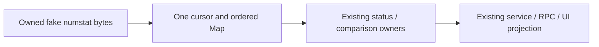

# Ordered numstat record decoding

Second related slice begins at immutable14f7f5a. Scope only parseNumstat body in
gitCliHelpers.ts, owned tests/oracle/spec/evidence. Private parseNumstatValue and
inferKindFromNumstat remain exact compatibility leaves. No change to completed
porcelain/graph/branch/resolution/service/generator/planning implementations,
public declarations, status caches/awaits, provider/environment/permission policy,
filesystem rules, Git mutations or checkpoint restore. The separate checkpoint
parser in gitCheckpointHelpers.ts is out of scope; do not duplicate or redirect it.

First verify selected bodies against publisher872ad960/tree d185a9 and local
import/integrated ancestry. Actual consumers are getStatus's staged/unstaged Map
construction and private branch-comparison record projection, then service/RPC/
refresh and existing UI dataset functions. Existing callers own all effects,
validation, errors, awaits and state; this invocation owns only a cursor and result
Map. No extra async promise, parsing/projection/cache owner or retry policy.

Freeze the exact legacy typed-string grammar before code:

- NUL partitions raw records, retaining positional empty fields for rename tails.
  Empty outer records and records without two tabs are skipped. Do not filter the
  whole record stream as porcelain does. No newline splitting or whitespace trim.
- First two tabs delimit numbers; remaining text is path, including tabs, Unicode,
  CRLF, line separators, leading/trailing spaces and backslashes. Keep the existing
  normalizeGitPath policy. Numeric dash/parseInt base10/NaN-to0/negative/overflow
  compatibility belongs to the retained private value helper.
- Empty path consumes exactly two subsequent raw records as original/new path,
  even if malformed or empty; missing values use empty string. Empty new path
  creates no stat, while empty original path remains empty string. Nonempty rename
  emits added,removed,kind renamed,originalPath in original property order.
- Map duplicate/normalized collisions replace the value at the first insertion
  position. Preserve plain/rename property presence/defaults, fresh Map/records,
  output order, downstream kind inference and immutable input strings.

Replace meaningful delimiter/record-consumption structure using a local NUL cursor,
first/second-tab boundaries and ordered Map admission. Do not move/rename the old
split loop, introduce a shared cache or silently broaden malformed grammar. Retain
numeric/path/Map/property expressions honestly. Exact old parser/value text is
copied inherited test-only oracle material; fake-port harness/audit conventions
reuse earlier exposed lane work. No clean-room, whole-file MIT or licence claim.

Before production: source/strict emitted differential and golden cases for numeric,
rename tails, delimiters, paths, collisions and malformed output, plus actual
status/comparison/service/RPC/refresh ports with owned synthetic results. All
filesystem/process ports stay fake; no user repository/files, real Git mutations,
remote/provider/billing/credentials or security/settings changes. Preserve exact
repo bodies and await/state owners, and run existing queued/reentrant/invalidation/
late-outcome tests. After code: grouped related parser/consumer source and strict
emitted, types, configured/owned lint, owned format, architecture and exact digest
scope checks. Root owns aggregate full regression and CLI/desktop builds by user
cadence. No timeout/runner/CI/dependency changes.

Source-exposed mixed syntax/declarations/fixtures remain explicit; unreviewed whole
file NOASSERTION and retained notices/licensing/inventory stay untouched. Older
lane27 and parent's26 obligations remain separate. Linux synthetic source/emitted
acceptance is not native Git, Windows/macOS, React or remote Host acceptance.
Normal-push the existing lane, keep first receipt historical and stop after this
second bounded checkpoint.
