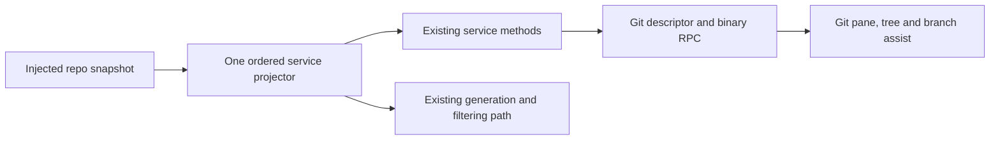

# Git read projection boundary — fixed services lane

## Scope and lineage (before implementation)

Baseline: `9ef73347bd15d999cb02d2b5358556f2ea4c5478` on
`parallel/file-watcher-fast-20261001`. `git/gitService.ts` is still the imported
`7619e41` implementation, also present at integrated `0d80f9c`; Git blob
`373f6569025ff41b7224dcb47b71252dad7c9c84`, raw SHA-256
`13d01d313a65d8ee3676c6cbbc9cb8e4ccbee9f27e3d2d558321e3c9849a5927`.
The locally available publisher object at ZCode commit
`872ad960de7ec172591f7e1952f7849229f94521`, tree
`d185a9a893c00d51fc3fe51fe7371b9eea7de143`, has blob
`df3426c8a398f797730c90dcfbd85cce3c7a0259`, SHA-256
`08f0e94e23cd3ea75ff9983f82ab140fc3a2d6280b11fe4eb0a0aba724b3e617`.
These bytes were read from separate temporary bare storage, without changing
production ancestry. Current inventory says upstream-modified, unreviewed,
NOASSERTION. No earlier replacement or focused service test was found.

Replace only status/branch snapshot selection and record projection. Retain public
`git.ts`/shared declarations, `repo/gitCliRepo.ts` and its parsers/commands, config,
credentials, permissions, generation/filtering, mutation methods and service
request scheduling. No policy corrections are authorized or intended here.

## One owner and consumers

The repo owns status/diff inputs. One private, stateless service projector owns
ordered admission and output records; it has no cache, IO or new accepted state.
The existing service methods remain the sole request path. In particular the
unchanged commit-message body continues using the same status projector; leaving
an old projector for that consumer would create conflicting selection owners.



Actual consumers traced: node service factory/registration; server connection
registration; desktop remote service collection; `useGitRepository.refresh`
(one status snapshot, optional identity/branch); workspace-tree `gitStatus.ts`
(refresh); branch-switch `switchAssist.ts` (two source reads and identity); action
menu refresh; commit-message generator. Tests exercise the real descriptor,
binary RPC and exported read-only tree/assist consumers with synthetic ports.
No GUI, network host or real Git repository acceptance is implied.

## Frozen contracts

- Preserve entry order and duplicates; sparse array holes are skipped through
  existing map/filter semantics. Projection is eager and has no sorting or IO.
- Scope uses current path first, then truthy original rename path. Status uses
  **summary** workspace scope; branch uses **resolution** scope. Renames leaving
  a workspace remain admitted; output names the current path, never originalPath.
- Staged rejects untracked, conflicted, falsy x and dot x in that order. Otherwise
  staged stats apply. Unstaged picks conflict first (0/0, no stats), untracked
  second, then truthy/non-dot y. A selected zero-line untracked file is suppressed
  without falling through to ordinary unstaged. Unknown runtime source retains
  the existing unstaged fallback; no new public source declaration is introduced.
- Stat lookup uses the exact entry path and the selected map. Missing/nullish stat
  defaults to 0/0. Preserve values including unusual numeric values and property
  evaluation/failure order; do not normalize or infer kind from stats.
- Untracked paths ending `/` survive zero lines. Otherwise positive added or
  removed is necessary. Backslash is normalized for path resolution/scope, while
  this slash fallback and raw repoRelativePath use the original spelling.
- Absolute paths use host `resolve(repoRoot, ...normalizeGitPath(path).split('/'))`;
  workspace relative paths use the existing config functions. No new traversal,
  permission or path policy. Spaces, Unicode, separators and dot roots survive.
- Preserve property order and shapes, own x/y keys (undefined when nullish) on
  status records, absent x/y on branch records, all section flags, metadata and
  nullable comparison refs. No identity or workspace fields are invented.
- Preserve exact repo and projection errors. Out-of-scope entries must not read
  status flags/stats; conflict must not read stats. Selected maps fail before record
  construction, and record fields keep legacy evaluation order.
- refresh starts status, optional identity, optional branch in that order, awaits
  Promise.all, projects branch before unstaged before staged, and returns summary
  and identity by reference. A missing optional branch is null. Rejections retain
  existing ordering and are never swallowed. Single reads retain await behavior.
- Generator/diff-query/filter code stays byte-identical; freeze its synthetic
  selection, source order, first-eight limit, session scope, allSettled behavior,
  optional metadata and exact unavailable/empty errors as regression controls.

## Implementation design

Use ordered decision rows for source admission, selected section, stat source and
optional visibility. Stop on the first match even if visibility later suppresses
that record. Conflict has literal zero stats and cannot acquire a map. Staged and
unstaged have separate rule lists. A shared ordered projection traversal retains
array semantics. Branch selection uses the same scope/traversal owner and its own
public record shape. Remove legacy private selection functions after frozen tests
pass against source and existing emitted output; do not move them unchanged.

Existing field construction, path expressions, status predicates/defaults and
declarations necessarily remain mixed expressions. The new decision structure is
a contribution candidate, not a claim that its compatibility expressions are
original. Upstream source has been read. No clean-room, whole-file MIT or licence
grant; LICENSE/NOTICE/shared records and all 27 unresolved obligations remain.

## Acceptance and exclusions

Write synthetic fixture/cases first, verify legacy source and strict emitted
consumers before production changes. Freeze precedence combinations, rename/scope,
zero-line fallback, defaults, order/shape, thrown getter/map/repo failures, refresh
scheduling and supported consumers. All repo methods are fake; mutation methods,
default repo construction, process/fs/permission effects fail if invoked.

After replacement run the same source/emitted cases, prior terminal planning,
profile/lifecycle regressions, root types/lint/format, changed and full architecture,
CLI and desktop builds, then the unchanged full regression runner. Report individual
cases separately from files and all blocked/skipped/native gaps. No real staging,
reset/discard/commit/push, processes or user repository fixtures in acceptance.
Lane branch publication is separately authorized and is not a test input.

## Frozen execution receipt (before production changes)

The two new case files passed **126 individual cases / 2 files** against both
legacy source and strict emitted services/RPC/UI. Root typecheck passed (5,422
locale keys). No production file had changed. The initial source run was 125 pass,
1 failed expectation: actual branch assist includes both the projected absolute
stagePath and relative issue path. The expectation was corrected to freeze that
existing consumer behavior, without a production or policy change.

```sh
TSX_TSCONFIG_PATH=packages/ui/tsconfig.json node --experimental-test-module-mocks --import tsx --test --test-concurrency=2 packages/services/test/git-read-projection-*.test.ts
KNORVIA_GIT_READ_PROJECTION_TARGET=dist node --experimental-test-module-mocks --import tsx --import ./packages/services/test/git-read-projection-emitted-register-fast-20261001.mjs --test --test-concurrency=2 packages/services/test/git-read-projection-*.test.ts
```

All native/command/repository ports remained synthetic; no GUI or real repository
was used. This passing freeze is a behavior baseline, not evidence of originality.

## Root CI222 portability correction

CI222 Linux passed; Windows exposed a new consumer-test expectation error: the file-tree model deliberately normalizes backslashes to forward slashes, while the assertion used host-native `path.resolve` unchanged. Preserve the existing model, service, RPC and projection behavior. Correct only the expected canonical key and add host-independent literal Windows/POSIX separator coverage with exact expected values and unchanged untracked priority. This is not a product path-policy change or a relaxed assertion. Retain CI222 failure evidence and re-run source/strict emitted plus both-platform CI.
