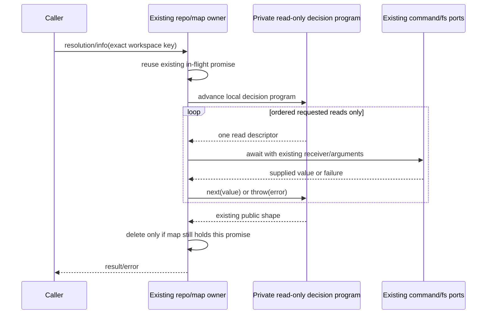

# Read-only repository resolution and worktree information

## Scope and exposed baseline

Fixed services lane, baseline `13186d472b9d88242e807c3a90db542bab719f84`.
Only resolveRepository/getWorkspaceRepositoryInfo and their private watch-path
projection are replaced. Their bodies are still inherited, not part of the accepted
graph replacement. Both local and pinned ZCode 872ad960 sources are exposed.
No clean-room, whole-file MIT, licence closure or native acceptance claim follows.
Historical watcher/archive/profile/planning/lifecycle/Git receipts remain immutable.

## Single owner and implementation boundary

The existing repo owns commandProvider and executes the effects. Private synchronous
decision programs yield discovery, rev-parse, stat and read requests and project
their supplied responses. They cannot execute a command, touch a file, retry, cache
or invalidate. Existing repositoryResolutionRequests, workspaceRepositoryInfoRequests,
statusRequests, reuseInFlightRequest, invalidate and collapsedUntrackedRepoRoots are
retained byte-for-byte. No public interface/export or provider/environment policy changes.

Invalidation deletes exact keys without cancelling existing reads. A late old
completion must not evict a newer request. Completed results are not cached.
Different strings, including trailing separators/whitespace, remain different keys.
Status/identity/info callers share only the existing resolution in flight; info
retains its separate existing in-flight map. Legitimate sequential reuse remains.

## Frozen resolution contract

Discovery is awaited first with commandProvider as receiver. Falsy binary returns
workspacePath/repoRoot equal to the original input, prefix '.', no watches and
isGitAvailable=false/isRepository=false. Otherwise exactly one run uses original
cwd, args `[rev-parse,--show-toplevel,--show-prefix,--absolute-git-dir,--git-common-dir]`,
timeoutMs=15000 and no added env/output/option/path argument. Awaited discovery/run
throws/rejections retain identity; no retry, stat or normalization before discovery.

Nonzero/null exit reads missing-working-directory classification before nonrepo
classification, then existing ensureGitCommandSucceeded('git rev-parse'). Existing
predicates/prose and timeout/truncation/detail order are retained. Missing-directory
and nonrepo classifications precede checker failures even with flags. Exit zero
bypasses the checker as before, including timedOut/outputTruncated flags.

Replace CRLF only, split LF, trim first root and throw exact
'Failed to resolve Git repository root' if absent. Prefix uses unchanged config
normalizer. Ignore additional lines, preserve malformed/NUL/Unicode values rather
than inventing validation. Output keys and evaluation/access order stay unchanged.
Git metadata watch paths alone: absolute git directory first, then common directory
resolved relative to original command cwd when necessary; common empty falls back
to absolute directory. Trim and remove trailing slash/backslash except '/' and
drive-root patterns. Deduplicate exact normalized spelling, keep first occurrence,
recursive=true, no filesystem/case/canonicalization policy or workspace watch added.
Native path APIs retain host-specific behavior; literal Windows/POSIX fixtures and
host-derived relative-path expectations must not invent cross-host equivalence.

## Frozen metadata contract

Await this.resolveRepository first with original receiver/key. Unavailable/nonrepo
short circuit returns workspacePath, kind='not-repository', original Git availability.
Resolve repoRoot/'.git' outside the metadata catch. Resolution/admission/path getter
errors reject; they are not metadata fallback. Inside catch, await stat first,
check isDirectory before isFile. A directory is main-tree without read. A file reads
exact path/'utf-8', considers only CRLF-normalized first line trimmed, requires
case-sensitive 'gitdir:', trims remainder and resolves relative to repoRoot.
Normalize backslashes and identify linked-worktree only by '/.git/worktrees/'.
Submodules/separate git dirs, empty pointers, special stat types and all failures
within metadata inspection fail open to main-tree. No extra existence checks,
fallback reads, canonicalization or stronger policy. Output keys and read/error order
are retained, including getter/method exceptions. Comments describe migration
filter intent, but no actual current filter/UI caller was found: actual supported
caller is service forwarding/RPC. Status/identity consumers use resolution; UI
useGitRepository refresh and switchAssist identity read that supported service path.

## Acceptance before implementation

Freeze source and strict emitted contracts with exclusively fake command, discovery,
stat/read/process/settings/log/time ports and owned literal outputs. Cover exact
commands/shapes/order, unavailable/classification/error flags, CRLF/root/prefix,
metadata/watches, throwing/getter/rejected/thenable responses, concurrent same/different
keys, rejected-request cleanup, invalidation and late completion, repeated calls,
actual service/RPC summary/identity/refresh/info and supported UI assist consumer.
Do not use a real Git command/repository, user file/profile/credential or network.
No timers/budget changes, relaxed assertions or policy correction is planned.

After replacement rerun frozen source/strict emitted and prior graph/Git/generator
regressions; root types/lint/format/architecture, CLI/desktop builds and full studio
suite. Audit unrelated bodies, cache owner, declarations, accepted graph/generator,
command/environment security and shared licensing inputs byte-for-byte. Report
individual-case and file counts, exact commands/hashes, initial harness failures,
retained syntax/prose, new structure and Linux synthetic/native/Windows/macOS gaps.
Root's subsequent Windows old Git-consumer assertion and CI launcher fixes are not
present or changed in this lane; older lane obligations remain 27, parent material
count 26 does not authorise shared record edits.
