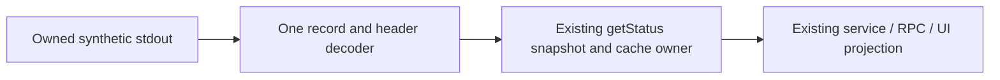

# Porcelain status record decoding

Scope: only parseStatusPorcelain in gitCliHelpers.ts and narrowly named private
record/field decoders, tests, copied oracle and evidence. Begin at47d2ae1. Verify
the actual publisher872ad960/tree d185a9, import7619e41 and integrated0d80f9c bodies
before code. The ledger labels the enclosing file upstream-modified/unreviewed;
that does not establish that every declaration needs rewriting. Keep all other
helper bodies, public function signature, public shared/types declarations and
completed production slices exact.

Actual ownership: getStatus parses the fake command's porcelain-v2 stdout, then
builds untracked stats and the status snapshot. gitService summary/staged/unstaged/
refresh and actual RPC consume it; existing read projector/UI dataset functions
own workspace filtering, change precedence and display order. The parser owns
only ephemeral decoding. No async effect, promise, cache, invalidation policy or
second status/projection owner is introduced. Repo/query bodies including exact
argv/cwd/timeout, provider/environment/permission policy and all mutation bodies
remain byte-identical. Test queued/reentrant calls, invalidation and late outcomes
through existing owner regressions; preserve all original awaited boundaries.

The frozen typed-string contract is the legacy grammar, including malformed inputs:

- NUL partitions records; empty records are removed before rename consumption.
  Header state and entries preserve record order and duplicates. No CRLF splitting,
  trimming, sorting, deduplication or new validation policy.
- Exact branch.head/upstream/ab prefixes only. Last recognized header wins;
  '(detached)' is exact, empty/Unicode/newline values stay literal. Keep original
  ahead/behind regex and numeric conversion helper; absent counters are0 and its
  first matching sign/digits, including overflow, remains unchanged.
- '? ' admits even an empty path; normalizeGitPath remains the one path policy.
  Tracked1/2/u records require exactly two non-space UTF16 units in XY, exact single
  ASCII-space boundaries and nonempty metadata fields (6/7/8 respectively). Metadata
  accepts every non-space unit; path capture retains legacy JavaScript dot/anchor
  line-terminator behavior, including final terminators. Do not broaden grammar.
- A valid2 record consumes the next nonempty record as originalPath, even if it
  looks like a header/another status. Missing originalPath is null; an invalid2
  record consumes nothing. Unmerged records remain kind modified/conflicted;
  ordinary kind inference remains the existing compatibility helper.
- Preserve result and entry property order, x/y/defaults, normalization, return
  types and fresh independent outputs. No mutation of supplied strings.

Implement a meaningful synchronous grammar/state boundary: streaming nonempty
record cursor, positional fixed-field decoding and one ordered entry/header owner.
Retain numeric/kind/path compatibility leaves honestly; moving the old function or
copying regex loops into another file does not count as independent implementation.
Freeze exact copied old parser and dependencies in test-only owned memory; they
remain inherited/source-exposed fixtures, not new production or originality proof.

Before production: focused source and strict emitted contracts, malformed/Unicode/
delimiter/rename/header fixtures and differential cases against exact baseline,
plus actual repo/service/RPC consumers using fake binary/command/filesystem ports.
Do not read user files, run live Git/model/provider/network effects or mutate OS/
credentials/security/settings. Exercise no actual Git mutations, even for tests.
After implementation: these focused tests, directly affected read consumers,
existing settlement regressions, types, configured/owned lint, owned formatting,
changed/full architecture and digest/scope evidence. User cadence defers full
project regression and CLI/desktop builds to root's aggregate integration batch.

Source exposure remains explicit; exact retained syntax, types, prose/formatting and
copied fixture content are mixed compatibility material. No clean-room, whole-file
MIT, licence grant or native Git/Windows/macOS/React/remote Host acceptance claim.
Shared licensing/inventory/notices/deps/CI and older lane27 registers stay unchanged;
parent's reported26 obligations remain separate. Normal-push only the existing lane.
