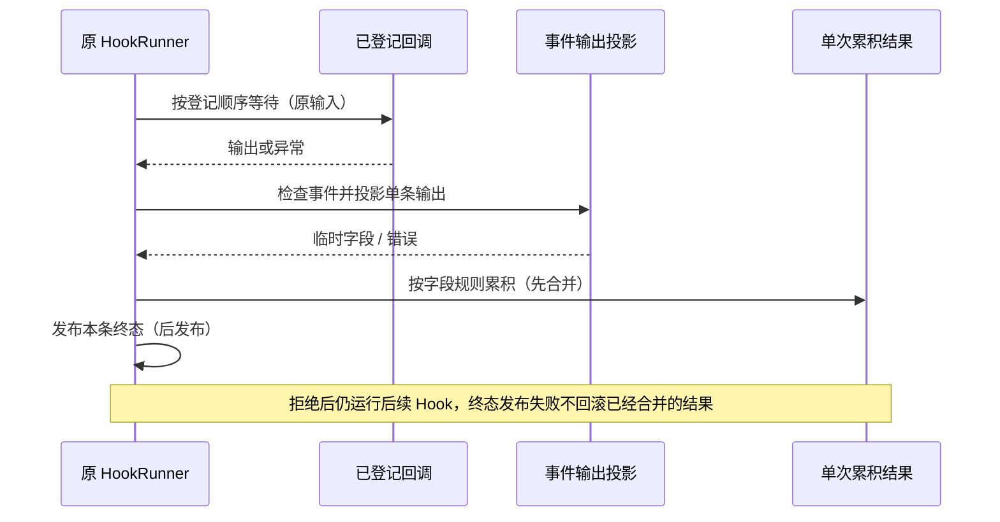

<!-- SPDX-License-Identifier: MIT; Copyright (c) 2026 Knorvia Studio contributors -->

# Hook 输出投影与累积

## 范围与所有者

从固定 `c8ac97a` 迁移 `core/hooks/output.ts` 的单条 JSON 输出投影、同次运行结果合并和 matcher。公共类型、schema、Runner 执行/超时/准入/生命周期及工具 adapter 暂不迁移，继续保留适用许可。已接触旧实现，不作无接触声明；固定字段、顺序与标准集合/正则规则是兼容约束，不将改名、拆分或测试通过当作独立来源证据。

新的设计以事件能力记录解释输出字段，以明确的字段累积规则更新 Runner 唯一拥有的临时结果；权限行为与理由作为同一获胜决定处理。没有新的 Hook 队列、持久状态、缓存或第二套 adapter 仲裁。

桌面连续事件与移动端持久重放仍由既有事件链拥有，本批不改传输、持久化或重放合同。每个 run 的结果隔离；后台 Hook 输出不解析、不累积。前条 updatedInput 不变成后条 callback 的输入。

## 兼容约束

- 支持七种公开事件；顶层继续/决定按原顺序解释，仅下述 Pre 矛盾决定在末尾归一。Stop 的 continue:true/block 是继续处理反馈，continue:false 本身不设停止标志。
- 上下文按 systemMessage、reason（仅 Stop block）、camel、snake、specific 的相应顺序追加，保留重复与空白，不裁剪；普通空串不追加。
- 错事件名抛出可恢复 ToolExecutionFailed，原 Runner 记录失败后继续；该条已投影的临时字段不部分合并。异常原值及事件行为不另行包装。
- blockRequested/preventContinuation 只累积为真；后条 preventContinuation 的 stopReason 可覆盖为自有 undefined。stopShouldContinue 的显式 false 仍有效。
- 输入采用最后非 undefined 值，null 有效，保留原引用。结构化 PermissionRequest 决定也保留原对象及更新数组引用。同级 deny 仍由后条整个对象替代，缺 message 不继承前条；message 空串有效。
- matcher 缺失、空串或 `*` 匹配全部；其余缺匹配值为 false。仅 ASCII 字母、数字、下划线和 `|` 的表达式采用精确候选集合；其余按 JS 正则，非法正则返回 false。大小写不归一，无缓存。

## 本批有意改进

1. **拒绝不可被较弱结构化决定覆盖。** 任一前台 PermissionRequest Hook 返回 structured deny 后，后续 structured allow（包括 updatedInput / permissionUpdates）不能放行；后续 Hook、上下文和事件仍继续。同级 deny 最后一条获胜，allow→allow 仍最后一条获胜。
2. **Pre 的理由属于获胜决定。** deny > ask > allow。较弱决定不能改写较强决定的理由；更强决定没有理由时清掉较弱旧理由；同级没有理由保留原同级理由，同级显式空串是有效更新。legacy stop/block 的理由可成为拒绝理由；单条 Pre stop/block 与 specific allow/ask 冲突时，投影为 deny 并舍弃较弱理由，沿用 stopReason。没有 specific、但顶层 continue:false 与 decision:approve 自相矛盾时，同样将公开行为字段归一为 deny；原来已由 preventContinuation 拒绝执行，并非新增执行阻断。specific deny 的理由仍有效。不得把允许/询问理由展示成拒绝原因。

真实 PermissionRequest legacy deny 来自 continue:false/block，会同时设置 preventContinuation；与 structured allow 混用仍拒绝。自定义 HookRunner 直接构造 legacy deny + structured allow、但不带 preventContinuation 的组合，已有 adapter 约定 structured 优先；本批不改此扩展接口，不把它描述为正常 JSON 解析可达的新绕过。

## 先行验收

先写合同测试并在旧版执行，分别记录结构化拒绝覆盖、弱理由污染、强决定缺理由、单条冲突、空理由失败。保留七事件控制矩阵、上下文/引用/own undefined、matcher、错误事件名、顺序等待、原输入、后台忽略、并发隔离、回调及终态发布失败等兼容测试。

之后运行根/CLI 类型与 lint、变更文件严格检查、架构、构建、完整离线、来源、格式和提交前扫描。对固定基线作有限 source/dist 对照，单列有意差异；公开 Runner 和工具执行入口验证实际接线。测试只用内存回调/假 handler，不执行真实 Hook 命令、模型或设备。未覆盖的任意 Proxy/原型篡改、真实客户端与系统时序不作等价承诺。

根 Apache-2.0、0.8.0-preview.3、既有发布及 UI/数据不变。项目授权并发持久化仍待存储 owner 原子更新；全量迁移、整仓 MIT 与最终稳定发行仍未完成。
