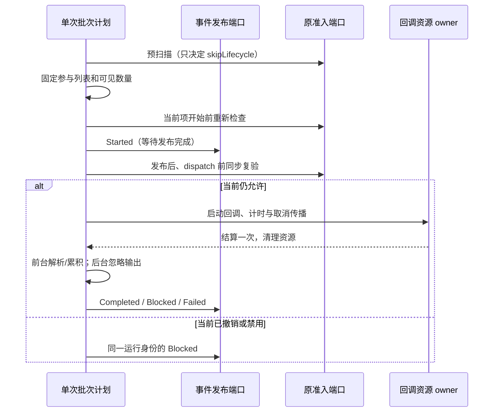

<!-- SPDX-License-Identifier: MIT; Copyright (c) 2026 Knorvia Studio contributors -->

# Hook Runner 批次与回调生命周期

## 迁移边界

以 `d7f56db` 为固定基线，独立替换 `hooks/runner.ts` 和 `runner-helpers.ts`。保留公开 InMemoryHookRunner、createInMemoryHookRunner、HookRunner 接口和登记/调用对象合同；配置解析、进程执行、workspace 信任存储、display-metadata 与刚完成的输出累积不在本批替换范围。已接触旧源码，不作无接触声明；接口、文案、平台 API 和必需时序不是发明，机械拆分不能作为来源依据。

每次 run 的同步批次计划独占参与列表、可见计数、索引和累积结果；顺序驱动只执行计划交给它的发布/回调动作，返回原值或将原异常送回计划。后台计划独立驱动，只报告生命周期、不处理输出。每次 callback 的资源 owner 独占子取消信号、计时器和结算清理。没有跨 run 队列、去重表、结果缓存或第二套权限状态。

桌面连续事件与移动端持久回放仍由原 emitEvent 链路承载；不改传输、序列号、存储或重放所有者。

## 准入缺口与有意修复

内存真实 Runner 已复现：预扫描及 Started 前准入通过，在 Started 发布等待期间撤销，前台与后台 callback 仍各调用一次且观察到已撤销。生产配置路径确实把 evaluateDispatch 接到该 admission；未执行真实配置命令或真实客户端撤销，不把有限夹具当作实机证据。

保留原两次检查，在 Started 返回后再同步复验；检查到实际 callback 之间不引入等待。新检查拒绝时沿用原 hookRunId、描述符、索引、hookCount，发布一次 Blocked，继续后条。等待期间变为 skipLifecycle 也须关闭已经发出的 Started，不静默跳过、不重算数量。admission 只控制该 Hook，不向工具权限结果注入 deny。

若同阶段既取消又撤销，准入拒绝优先，发布 Blocked 且不调用 callback；仍获准但已取消沿用 Failed/cancelled。这个新增复验不取消已实际启动的后台任务，也不声称能立即打断尚未返回的 Started 发布。

## 保留合同

- 构造时仅复制登记数组，保留登记对象引用；register 的新项只影响后续 run。匹配、skipLifecycle 预筛、可见描述符数量、每条描述符和准入按原阶段读取。
- callback 使用 runtime index；事件可能使用 client-visible index。两种索引不能合并。初始拒绝不发 Started，预先 skipLifecycle 无任何事件；总可见数不随后续撤销变化。
- emitEvent 保留原 Runner 接收对象；admission/callback/descriptor 保留登记对象接收对象；logger 保留原对象。输入、错误和决定对象引用不无故复制。
- 前台顺序等待、输出先合并后发布终态；拒绝不终止后续 Hook，改写不作为后条输入。后台启动后独立收尾，不解析 JSON 输出、不修改已返回结果。
- callback 的 timeout 仅从 dispatch 起算，不含 Started 等待；durationMs 从 Started 前起算。父取消先于 callback 时不得调用；运行中取消/超时/同步抛错与迟到结果只结算一次，计时器和父监听清理。
- Started 发布失败直接拒绝整个 run；callback/输出解析/终态发布失败走 Failed。Failed 发布或失败日志再次抛错可向上冒泡；不能把计划自身错误重复注入或吞掉。
- 原 descriptor/identity/trace、脱敏、截断、blocked-only 诊断字段保持；原始诊断不得进入模型上下文。后台生命周期报告失败仍按原日志路径报告。
- helper 的多候选 matcher、失败关闭准入、错误类型、取消理由传播和描述符默认值保持，不改公共 schema。

## 验收

先写前台/后台发布等待撤销及禁用的失败测试，再补准入计数、索引、引用、登记时点、父取消、超时、同步异常、迟到结果、接收对象、事件失败及后台独立的合同。保留上一批真实 Runner 的八项回归。先行规格允许修复已确认准入缺口，不以保持旧放行行为为目标。

执行根/CLI 类型、lint、变更文件严格检查、架构、构建、完整离线、来源、格式与暂存密钥扫描；以固定基线做有限时序/字段/引用对照并单列新增复验。编译公开入口和 CLI 模块接线验证另行完成。只用受控内存回调与假发布器，不调用真实命令、模型、设备或用户数据库。

根 Apache-2.0、0.8.0-preview.3、UI、数据和历史发行不变。相邻配置执行与存储仍保留适用许可；项目授权并发持久化和全量独立/根 MIT/稳定发行继续待完成。
