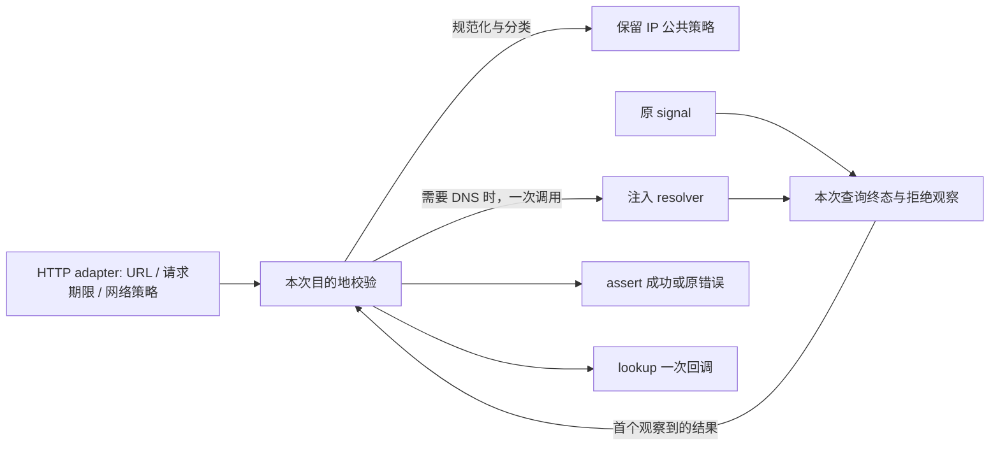

<!-- SPDX-License-Identifier: MIT; Copyright (c) 2026 Knorvia Studio contributors -->

# HTTP 公网目的地与 DNS 回调合同

2026-09-29。按公开行为独立实现公网目的地校验和Node lookup适配，保留现有IP策略、错误工厂、网络权限与外层请求期限。本批只修已经取得的DNS Promise在特定取消顺序下无人观察拒绝的问题，不拓展公网放行规则。

## 边界和所有者

三个运行导出：`defaultPublicDnsLookup()`、`assertPublicEgressDestination(url, dnsLookup, options?)`、`createPublicEgressLookup(url, dnsLookup, options?)`。保留DnsLookupAddress、DnsLookup公开类型与Node lookup函数类型；options仅有signal。默认函数直接返回Node `dns/promises.lookup` 的实际身份，调用该工厂不查询DNS。assert返回Promise<void>；lookup工厂返回函数，不在创建时解析URL或查询。

每次解析独立拥有一次resolver调用、所返回Promise的观察和本次signal监听；没有跨请求缓存、写路径、重试或定时器。保留公共contracts包的normalizeIpAddressLiteral、getIpAddressVersion、getPublicEgressIpBlockReason和createHttpClientError，不复制它们的实现或修改策略。

外层HTTP adapter继续拥有请求、DNS使用时机、代理、证书、timeout分类和egress开关。实现不得新建网络请求、配置、环境变量、运行依赖或公开测试端口。验收使用注入的自有合成resolver，不调用默认DNS，不连接服务器。

## hostname 与策略

- assert使用URL.hostname；返回的lookup使用它每次调用的第一个hostname参数。创建lookup时的URL仅用于错误上下文，两者可以不同，不增加相等约束。resolver接收规范化后的实际hostname，不使用创建URL的hostname替代它。
- 仅调用保留的normalize函数；其行为包括小写、去除一个末尾点和边缘IPv6方括号，不另加trim或新解析器。
- 规范化后为空：`egress_blocked` / `HTTP public egress requires a hostname`。
- localhost、.localhost或.local后缀：`HTTP public egress blocked local hostname <normalized>`。非IP单段host：`HTTP public egress requires a public hostname`。
- IP literal不调用resolver，使用normalized address与保留getIpAddressVersion给出的family形成一项，再进行IP策略检查。非IP则调用注入resolver，参数固定`{ all: true, verbatim: true }`，只调用一次。
- 空结果：`HTTP public egress DNS lookup returned no addresses for <normalized>`。按原顺序对每项address调用保留IP策略，只要一项有block reason就全拒绝：`HTTP public egress blocked <normalized> because it resolved to a non-public address`。
- 不筛选部分地址、不排序、不去重、不更换family、不新增结果副本；保留结果数组和条目引用。对返回值使用已有类型约束，不新加schema或改变不合类型输入的原生失败传播。
- 上述自制错误均来自原工厂，code为egress_blocked，URL为本次URL对象的toString，无status/cause。literal-IP和直接host拒绝分支继续不参与signal竞速，不能将已取消提升为全局最高优先级。

## DNS 取消及错误优先级

1. 真正调用resolver前，若signal已取消就拒绝，不调用resolver。reason为Error则保留同一对象；否则新建Error(`HTTP request was cancelled`)。
2. resolver同步throw原样作为异步assert/解析的拒绝值；即使它先同步触发abort再throw，也保留该throw。没有取得Promise时不产生落败Promise观察责任。
3. resolver正常返回Promise后再次检查signal；若已取消，取消仍优先，即使返回Promise已经履约或拒绝。**本次修复**：返回的Promise必须立即有拒绝观察者，第二次取消检查不能把它遗落；不先await或改变此处优先级。
4. 之后等待DNS结果与signal第一个被实际处理的结果。取消获胜立即完成，不等待落败resolver；落败拒绝必须被观察。正常解析/失败/取消后移除本次监听。DNS胜出后不新增signal检查，后续策略校验仍按原顺序执行。无signal时保留普通等待及原失败身份。

普通pending DNS被取消后的监听原本就因once规则正确移除，不能宣称本次修复了并不存在的泄漏。主代理原生观察仅发现“resolver同步取消再返回拒绝Promise”产生未处理拒绝；观测脚本随后自行catch清理，并非旧产品自动观察。

## lookup 的交付边界

返回函数接受hostname、lookupOptions、callback。options若是函数，以其作done，否则取第三参数；没有done时同步返回undefined，不解析URL、不查询。存在done后才构造创建参数URL，因此无效URL在这次lookup调用中同步throw。工厂创建本身不throw该URL错误。

策略失败或resolver同步throw仍沿Promise交给done，不从lookup同步逃出，回调不发生在发起调用的同一栈。lookupOptions为非null对象且all严格等于true时，成功done(null, 原结果数组)；其他情形done(null, first.address, first.family)。返回函数自身返回undefined。

保留交付前first缺失时的最后一道边界：done接收`egress_blocked` / `HTTP public egress DNS lookup returned no addresses`，错误URL用工厂的原url字符串。此边界不替代前面的空DNS结果错误；数组引用在交付前变化仍按旧行为处理，不扩大本批成结果不可变性变更。

失败是Error则lookup保留身份；否则转成new Error(String(value))，不新增code。assert不做这个投影，保持原失败值。每次lookup最多一次done；用户done自身抛错不能回流为第二次done或被吞掉。该用户回调异常继续按既有Promise continuation的失败交付，不将“不得遗落resolver拒绝”扩大为任意用户callback抛错都必须消失。

## 验收及限制

先冻结旧公开模块并运行兼容与修复用例，再验独立候选、源码和实际编译入口。通过合成resolver记录实际host、选项、调用次数、结果/错误身份；覆盖本地host、单段host、literal IP、混合地址、空结果、lookup两种回调形态、无回调与坏URL、原生和非Error失败、取消前后顺序及两个并发调用隔离。

未处理拒绝的反例使用独立测试子进程，只观察本次任务创建的Promise；不得把测试框架吞掉错误说成产品已修复。用可控Promise而非任意产品超时验证取消完成与落败观察。默认DNS只核对函数身份，不执行查询。根/CLI类型与lint、架构、CLI构建、离线回归、来源和格式均按真实结果记录。

不声称验证真实DNS服务器、OS resolver取消或所有调度交错；现有错误工厂/IP策略仍保留原许可。保留当前UI、数据、预览身份和根Apache-2.0；本模块完成不等于整仓独立或最终稳定版发行完成。

## 交付兼容补充

在旧入口和首候选上新增五项先旧后新检查：旧版5/5，候选1/5，暴露四项既有兼容退步，不能将此前61项通过当作完整验收。以下补足原合同的时点和分支定义，不新增产品功能：

- all回调格式由发起lookup时的选项决定；普通options对象在等待DNS时从true改false或反向修改，不能改变本次交付格式。两种方向均保留原先的数组/单地址返回形式。
- assert和lookup工厂第三个options可省略，公开运行函数length仍为2。
- all模式直接交付已经通过策略校验的同一数组，不再额外要求交付时first仍存在。前述最后一道first缺失错误仅适用于单地址模式。使用结构化数组访问器可复现校验后首项变化：all模式仍返回原数组，单地址模式保留原url字符串的空结果错误。

根提供给作者的首份合同和候选均冻结，上述纯行为补充另作新输入；实际运行差异、修订和验证均需留存。
