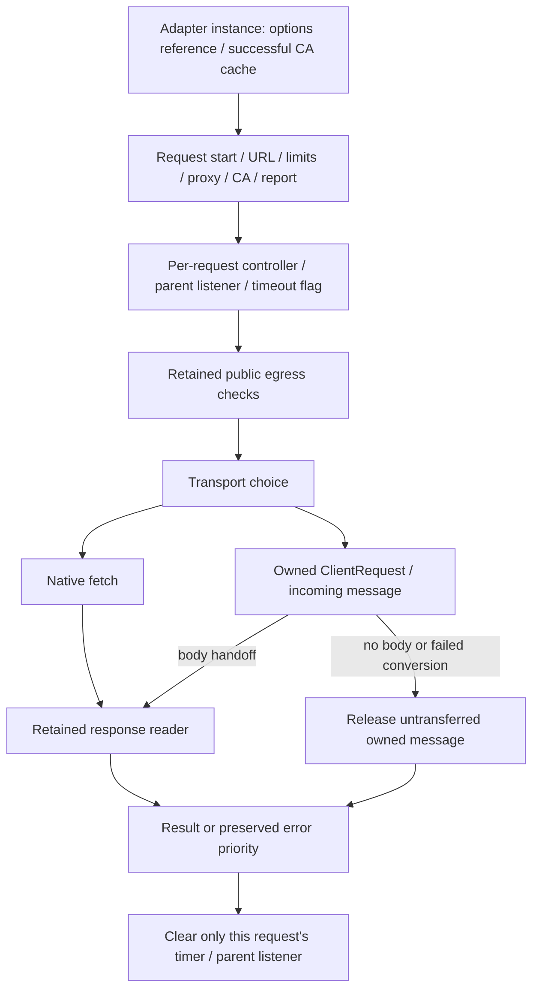

<!-- SPDX-License-Identifier: MIT; Copyright (c) 2026 Knorvia Studio contributors -->

# HTTP request adapter contract

This is a behavior-only specification for independent implementation, not inherited source. The root has read the old adapter and public declarations; the isolated implementer must not read them, existing tests, probes, bundles or history. Existing author context is retained and is not a whole-process clean-room claim. This finalized contract authorizes implementation only from the approved input bundle and the root scope message. Only three runtime exports and one public option type belong to this boundary.

## Product scope

Preserve NodeHttpClientAdapter, createNodeHttpClientAdapter and createNodeWebFetchHttpClientAdapter with their existing public types and default-argument arities. No UI, model, dependency, environment variable, public injection point or network permission change. Fixed declarations, standard protocol literals and public error messages are compatibility constraints. Root validates with owned loopback HTTP/proxy servers and injected synthetic DNS, never external services or user data.

The instance owns its options reference and one successful CA-load cache, including successful absence. Failed CA load is retried on the next request. The regular constructor/factory retains the input options object reference. The WebFetch factory shallow-copies its input once and forces capturedUserProxyEnvFallback true. The options.env reference remains shared. Every request owns its linked abort controller, timeout and response consumption. No shared request controller or cross-request body/cache state.

## Request preparation

Record wall-clock start before parsing URL. Construct an ordinary URL; bad URL rejects through retained createHttpClientError with invalid_url, original input URL, message `Invalid URL: <input>` and original cause. Non-http/https rejects unsupported_protocol, original input URL and `Unsupported URL protocol for HTTP request: <protocol>`. These happen before proxy, CA or transport work.

Timeout and body-byte limit use request ?? adapter ?? defaults, respectively 180000 and 10485760. Preserve nullish/NaN/infinity behavior; do not add value validation. Only positive timeout schedules a timer. Resolve proxy with retained resolveProxyForRequest, or resolveWebFetchProxyForRequest when adapter capturedUserProxyEnvFallback is truthy; forward URL plus env, httpProxy from proxyUrl, noProxy. Request egressPolicy public selects injected dnsLookup or the exact defaultPublicDnsLookup result. Other policies skip this selection. Load CA once via retained loadTlsCaCertificates, forwarding caCertFile/env; these preparation failures remain outside request error normalization. Retain the existing helper's IO and rights; do not reimplement proxy rules, CA loading, IP policy, public error factory or response reader in this batch.

Build egress report with proxied = proxyUrl !== undefined, customCa = certificateBuffer !== undefined, noProxyMatched = result.noProxyMatched || undefined, proxySource as returned, and proxyHost from a parsed proxy URL's hostname plus `:<port>` only when its parsed port is nonempty. Never include credentials/path/query in proxyHost. Invalid proxy URL means proxyHost undefined. All five report fields remain present, even when undefined.

Link the caller signal to a new request controller, preserving reason. Already aborted parents abort immediately without registering a listener. A timeout sets timedOut true and aborts with Error(`HTTP request timed out after <ms>ms`). Cleanup removes this request's caller listener and timer on success or failure. Timeout and caller state stay request-local. Preserve existing priority when a timer fires after a caller abort but work has not settled.

## Public egress

Inside the request-owned try/finally, a public request with any resolved proxy rejects egress_blocked with normalized target URL and `HTTP public egress cannot use a proxy because proxy-side DNS resolution cannot be verified`. Do this before preflight DNS. Public direct requests call the retained assertPublicEgressDestination once with URL, chosen DNS resolver and the request controller signal. Node connection lookup uses retained createPublicEgressLookup with normalized URL, that resolver and the same signal. Do not weaken the two boundaries, proxy exclusion, host/IP rules or cancellation behavior.

## Transport choice and headers

Use ordinary global fetch when there is no proxy, no public DNS policy, and no defined custom CA for an https URL. An http URL with a loaded CA but no proxy/public policy still uses fetch and reports customCa true. Fetch receives normalized URL string, method request.method ?? GET, a Headers instance constructed from request.headers, optional Buffer.from(request.body) when body is truthy, redirect request.redirect ?? manual, and the request signal.

Headers use native Headers behavior. If request.trace.traceId is truthy and `x-knorvia-trace-id` is absent case-insensitively, set that header; never override an explicit empty header. runOptions.context does not independently supply a header. Preserve when headers/body/trace/method are read: transport reads them after async public preflight; URL, limits and chosen DNS were prepared earlier. Do not silently add an immutable request snapshot.

Otherwise use node:https for https, node:http for http. Node request options preserve hostname = URL.hostname, protocol, optional port = URL.port || undefined, path = pathname + search without hash, method ?? GET, signal and outgoing headers obtained by Headers.forEach into an ordinary object. Do not add URL userinfo auth. If proxy exists, construct ProxyAgent with ca = loaded certificate buffer, getProxyForUrl returning that selected proxy, and httpsAgent = a new https.Agent({ca}) only when certificate buffer is truthy. For direct https with a truthy certificate buffer, use a new https.Agent({ca}); otherwise no custom agent. Public lookup is supplied only without a proxy. End the request with the optional copied Buffer body. Request emission/error/stream behavior stays native; do not implement retries or a new transport dependency.

The Node path continues the existing manual response behavior even if request.redirect is follow. Do not add redirects in this replacement or forward credentials to additional destinations. Native fetch retains its own redirect behavior.

## Node response bridge and approved repair

Map message headers into a native Headers instance; string arrays append each item in order, undefined values are omitted, other values String-convert. Effective status is statusCode ?? 502, status text comes from statusMessage. A normal body uses Readable.toWeb(message), and downstream body reading is exclusively the retained readResponseBody helper. The constructed Response has no redirected URL, so final URL falls back to normalized request URL.

Root's real owned loopback-proxy experiment: status 200 completed; status 204/205/304 each threw `Response constructor: Invalid response status code ...` outside the request Promise and left it pending at the probe boundary. Approved repair: valid no-body statuses 204, 205 and 304 create a Response with null body, release/drain their owned incoming stream, and complete with empty bytes while retaining status/headers and byte-header limit behavior. HEAD responses should likewise use a null body without inventing payload data. Unexpected errors converting the asynchronous incoming message (e.g. invalid Response metadata) must reject the owned request Promise and clean up the owned incoming message instead of escaping as an uncaught exception/hang. The original error is then normalized by the established outer error rules. Do not expand this into status acceptance beyond native Response constraints.

Do not pretend native request errors are success or swallow response-reader failures. Do not change the already independently reviewed byte reader and DNS modules. Resource cleanup belongs to the code which acquires it, but this draft does not introduce cross-request pooling, broad agent lifecycle changes or new background resources.

## Result and error rules

Final responseUrl is Response.url when nonempty else normalized request URL. Call retained readResponseBody(response, selectedMaxBytes, requestController.signal, responseUrl). Return the same resulting Uint8Array as body, its byteLength as bytes, response status/statusText, ordinary lowercase header record made by native Headers.forEach, duration = max(0, Date.now() - start), and the prepared egress report. HTTP error status alone does not reject. Byte-limit errors retain their port error identity/status/url.

Inside the request boundary, an existing HttpClientPortError wins unchanged even after abort/timeout. Otherwise classify in order: timedOut -> timeout; controller aborted without timedOut -> cancelled; DOMException named AbortError -> cancelled; selected proxy -> proxy_error; otherwise network_error. For the first two, Error.message is preserved; non-Error uses respectively `HTTP request timed out` / `HTTP request was cancelled`. DOM AbortError always gets `HTTP request was cancelled`. Network/proxy errors use Error.message or `HTTP request failed`. All newly created errors use normalized URL, original cause, and no added status. A non-DOM Error merely named AbortError follows ordinary network/proxy classification when controller is not aborted. Preserve undefined and other non-Error causes.

## Independent design boundary

Propose one coherent owner model and two or three modules only if cohesion warrants it, each normal-format source <=400 lines. Explain how asynchronous response conversion cannot escape the Promise, how no-body stream ownership is discharged, and how existing preparation/error priorities and request mutation timing stay compatible. Do not reconstruct old private helpers from this contract; organize the independent design around owners and ports. The root resolves the reviewed ambiguities below. Product execution, network, probes, tests and main-workspace edits remain outside the isolated author role.

## Final owner and timing decisions (2026-09-29)

- Constructor and both factories have native Function.length 0; request has length 1. Keep the named class and exactly three public runtime exports. Private modules may export their own implementation functions, but the public entry does not re-export them.
- The retained CA helper is synchronous. Call it before setting the success flag; an exception leaves the flag unset. Successful undefined and a Buffer are both cached for the instance even if options later change. No concurrent Promise/singleflight or cache invalidation is introduced. Regular options remain by reference; WebFetch's one shallow copy does not clone env.
- Start time includes preparation. Parent linkage and timeout are established only after proxy/CA/egress preparation, before public preflight. A CA or proxy preparation exception therefore has no request timer or parent listener. Do not subtract preparation time from timeout. If parent abort occurs then the timer fires before pending work rejects, the timeout flag has priority unless the actual error is already a HttpClientPortError.
- No-body Node bridge ownership is explicit: after constructing valid Response metadata, use null body for 204/205/304 or the actual sent HEAD method. Release the owned IncomingMessage immediately via native destroy without an error argument rather than leaving an unbounded drain running after request cleanup. Do not await body/end. Observe errors of this owned message while releasing it so asynchronous message events cannot escape. This is limited to a message not handed to the body reader; preserve status, headers and subsequent Content-Length/maxBytes checks.
- HEAD decision uses the method selected when issuing Node request, with native case-insensitive HEAD semantics, not a later read of caller's mutable request object. Other request fields preserve the transport-time reads described above. Do not introduce a full early immutable request snapshot.
- Async conversion failure selects its original cause, safely releases that owned IncomingMessage without forwarding that cause into an unobserved error event, then rejects the transport Promise. Cleanup must not replace the selected cause. Do not destroy shared/global agents or introduce pooling, retries or unrelated agent lifecycle changes. A normal body is handed to Readable.toWeb/Response and the retained byte reader; never acquire another reader in this adapter.
- Native ClientRequest error events remain observed even after a conversion settles. No-body cleanup-related late events do not settle a second time or become global exceptions. Genuine ordinary-body stream failures continue through the body reader and established error classification. An untyped user-mutated builtin/global object is outside broad compatibility guarantees; explicit structured boundary faults will still check the selected conversion cause.

The root will test the frozen old entry before running the candidate; preserve failures and candidate revisions. Source, built entry, CLI reachability, root/CLI quality checks and full offline regressions are separate evidence. No claim of real external TLS/proxy/server coverage, complete license migration or stable product release follows from these finite cases. Current root Apache-2.0 and preview identity remain.
