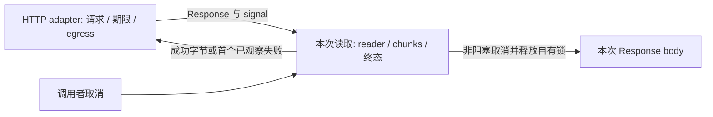

<!-- SPDX-License-Identifier: MIT; Copyright (c) 2026 Knorvia Studio contributors -->

# HTTP 响应字节读取合同

2026-09-29。在当前公开接口上独立实现已取得 Response 的字节聚合，修复等待中的取消、超限清理挂起与自有 reader 锁遗留。主代理先阅读旧 helper、HTTP 端口和 adapter 调用边界，并完成三个原生反例及十八个优先级观察；实现作者只接收本合同、公共声明和设计限制。旧实现、历史、测试与探针不作为作者输入。根许可及保留依赖的来源不因本次实现而改变。

## 公开边界与唯一所有者

唯一公开函数维持 `readResponseBody(response: Response, maxResponseBytes: number, signal: AbortSignal, url: string): Promise<Uint8Array>`。不新增导出或运行依赖。由同一次调用拥有所取得的 reader、积累字节、取消监听及结算；不同调用不共享状态。保留公开 contracts 包的 `createHttpClientError` 及其错误身份，不复制工厂或改写公共声明。

外层 adapter 继续拥有 DNS、代理、证书、网络请求、timeout 与取消分类、计时器及关联信号。本函数不发请求，不使用磁盘、模型或真实凭据。不得用新增超时、重试、环境开关、通用调度器或测试注入口掩盖同步问题。

## 必须保持的行为

以下优先顺序保留；输入是普通 Response / AbortSignal。对定向测试所需的原生边界故障保留拒绝值身份，不承诺恶意全局原型或任意 getter 的全部重入行为。

1. `maxResponseBytes < 0` 优先拒绝，随后才检查 header；code 为 `too_large`，message 为 `HTTP response size limit must not be negative`。包括负无穷；不把 NaN、正无穷或负零另判非法。
2. 读取 `content-length`；truthy 值按十进制 `parseInt`，仅当结果有限且大于上限时拒绝 `too_large`：`HTTP response is too large: content-length=<parsed>, max=<max>`。保留数值前缀、空白、尾随文本、负值及无效值的原比较行为。大小预检错误优先于已取消信号及已被其他消费者锁定的 body。
3. body 为 null 时调用 `response.arrayBuffer()`，包装为 Uint8Array，实际长度超过上限时拒绝 `too_large`：`HTTP response is too large: bytes=<length>, max=<max>`。该 fallback 继续不新增取消竞速，原生拒绝值原样传播。正常无 body 的 Response 仍返回空数组。
4. 存在 body 时先取得默认 reader，之后才处理已取消状态。因此他人已锁定 body 的 `getReader` 原生失败仍优先于取消。本次未取得 reader 时不得释放或取消他人的 reader。
5. 读取结果 `done` 为 true 时结束；否则没有 value 则跳过。按每块 Uint8Array 的 byteLength 累积，允许零长块；总数大于上限时拒绝 `too_large`：`HTTP response is too large: bytes><max>`。最终返回精确长度的新 Uint8Array，按块顺序拼接。保留在完成前暂存块引用的行为，不新增中间块复制或解码。
6. present-body 取消使用 code `cancelled`、message `HTTP request was cancelled while reading response body`；不把 signal.reason 当作返回错误。函数制造的错误保留调用传入 URL、response.status，不传 cause。原生 getReader / arrayBuffer / read 错误原样返回，包括 undefined、null 或非 Error 拒绝值。

## 本次明确批准的可靠性修复

- present-body 从取得 reader 到结算持续观察取消。等待中的 read 不需要下一块、producer.error 或 producer.cancel 完成即可响应 abort。取得 reader 后已取消同样结算并清理。注册监听后再次检查取消状态；settle 时移除本次监听。
- 负上限、声明超限、实际超限或取消时，先选定主错误，再请求取消。已有 reader 时只取消本次 reader；大小预检尚未取得 reader 时，仅对存在且未锁定的 body 尝试取消。null body 不取消，他人锁定的 body 不抢占。
- 取消调用不传参数。同步 throw、异步 reject 或永不完成的 cleanup 都不得改写主错误或拖住返回 Promise；每次至多一次。立即观察取消 Promise 的拒绝，不使用延时或取消重试。原生 read 失败本身只需释放锁，不额外请求 producer 取消。
- 正常完成、原生 read 失败、超限或取消都尝试一次 releaseLock，只释放本次实际取得的 reader。取消请求之后立即释放，不等待 producer 清理；不能取得另一 reader 来清理。主错误存在时释放失败不能覆盖它；无主错误的成功路径若 releaseLock 抛错，则该原生错误作为失败返回。即使释放出错也要移除本次监听。
- 本调用最先观察并选定的终态获胜；选择后不再发起新 read、累积落败块或被重入 abort 改写。每个待决 read 的拒绝都有观察者，释放产生的落败拒绝亦不会成为未处理拒绝。已处理的原生失败后再取消保留原值，已处理的取消后再失败保留取消错误。不能用 producer 内部物理发生顺序替代实际回调/await 的交付顺序。

成功合并时发生的原生分配/拷贝失败也应完成自有清理再原样传播，不把失败值为 undefined 当作没有错误。普通关闭流上的 cancel 可能不会调用 producer hook，不以钩子次数虚构未发生的运行时效果。

## 验收

先在冻结旧公开入口运行兼容与修复测试，记录真实差异；再运行独立候选、整合源码和实际编译入口。使用自有内存原生 Response / ReadableStream 验证字节拼接、header 数值规则、边界上限、错误优先级、外部锁和取消挂起；仅在难以由原生 API 制造的清理 throw、缺省 chunk value 等边界使用明确标识的结构化替身。

取消和 producer cleanup 使用可控 Promise / 事件屏障；测试结束自行释放自己的资源。断言公开结果在 cleanup 未完成时已结算，测试不以任意产品超时证明正确性。使用原生 signal 监听观察验证 settle 后解绑；检查落败拒绝没有引入 unhandled rejection。有限调度案例不声称证明所有可能的线程交错。

根与 CLI 类型/lint、改动架构、CLI 构建、完整离线回归、来源与格式检查按实际执行结果记录。保持界面、调用者、协议、用户数据、根 Apache-2.0、第三方声明及当前预览发行；整仓独立和最终稳定版交付尚未由本模块完成。
