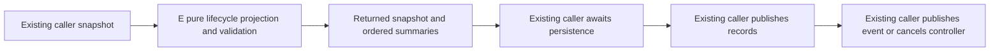

# Complete E lifecycle and definition owners

E replaces the complete run-state lifecycle projection owner and the two small definition construction/indexing functions using a new functional/API-only author. Exact public declaration/configuration/prose/schema boundaries remain retained. No scheduler graph/A expert owner, persistence caller, runtime controller or other-lane implementation is imported or merged.

lifecycle.ts exclusively derives immutable candidate snapshots and ordered change summaries for resume, cancel, reopen, graph seeding and prompt updates. Pure private helpers may split this same owner below400 readable lines per file. They add no mutable accepted state or persistence path. Definition construction delegates normalization to the public schema; its constants, phase data and prose are retained functional material, not newly authored configuration.

Preserve all exported APIs, persisted formats/own-key/reference rules, no-op snapshot identity, source immutability, scope/status/nullish rules, schema error identity and validation precedence. Resume repairs only selected active work; cancellation preserves terminal child metadata; reopening respects attempts/status budget; seed and prompt-update errors do not return partially applied candidates. Caller event/record ordering remains untouched.

Freeze inputs before author invocation and complete outputs/receipt before curator body review. Separately bind installed descendants and retain any original failed draft/clarification. Validate declarations/imports/bytes and bounded body review. Ordinary tests/builds/typechecks/lint remain deferred under the current cadence; a minimal synthetic persistence-safety probe is justified only by a concrete identified risk. Report unavailable architecture tooling honestly without repeating the same missing dependency failure. No global licence/inventory/release conclusion follows.
