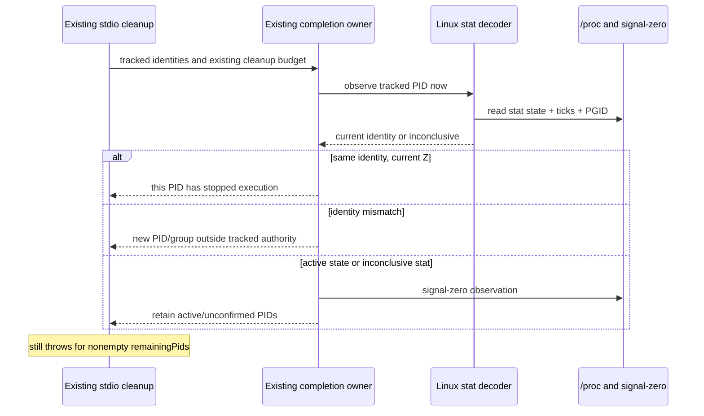

# Linux process-tree cleanup completion

Continue the same services task, branch and draft PR20. Merge checkpoint
`a42727feb6cb41205eb49dd88dc20de4c86593c8` includes integration checkpoint
`e23ea3328716cbb3e5109e3f2d0082aca46de200` and the preceding services source.
PR22 source `e229f601267a5a41b37d0e25391a186215cf2c46` records Host exit 1
with an esbuild descendant still present in `/proc`, state Z, after SIGTERM.
Its actual handoff is
`docs/evidence/backlog-ui-20261003/gui-acceptance/cross-module-handoff.md`.
Do not attribute that cleanup failure only to unavailable Agent artifacts.

## Behavior and ownership

Linux `kill(pid, 0)` reports PID existence/permission, not whether that PID can
still execute work. An unreaped zombie has completed execution. The kernel's
[proc documentation](https://docs.kernel.org/filesystems/proc.html#process-specific-subdirectories)
defines the stat state, parent PID, process group and start-time fields.
Only a successfully parsed current state Z changes cleanup completion here.
Running, sleeping, uninterruptible, stopped/traced, idle and unknown states must
remain active observations; no general remaining-PID suppression is allowed.

The snapshot module owns Linux stat decoding and retains optional `linuxState`
metadata alongside the existing ticks identity. The waiter reads that same
decoder for every observation of each tracked PID. Cached snapshot state alone
does not establish completion. The current ticks and optional expected PGID
must match a tracked identity before treating it as that owned process. A reused
PID or changed group is outside that identity's cleanup authority, not proof
that the new process died. Reparenting to PPid 1 alone does not retire a working
process or reject a matching zombie; the same ticks/PGID boundary still applies.
No extra process-table discovery or signal target is
introduced by the waiter.

Unreadable/malformed stat is inconclusive. Fall back to signal-zero observation;
only ESRCH establishes absence on Linux. EPERM, other failure values and hostile
error-code getters stay conservative. Preserve the existing Darwin/Windows
probe and deadline semantics, force/retry timing, root-exit event handling and
resource ownership. The optional metadata is service-local and changes no shared
protocol, runtime, UI or user data schema.

No native/transport catch or error downgrade is requested. Keep
`agent/stdioTransport.ts` unchanged, including its nonempty-remaining rejection.
Root/descendant start-time and PGID checks in the existing terminator/ownership
path remain. No reaping policy, PID1 action, user process or system configuration
change is allowed.

## Bounded acceptance

Before the fix, freeze synthetic contracts covering current versus cached state,
Z-only and mixed active trees, transition to Z during force completion, PID/PGID
reuse, unknown/unreadable/malformed stat, ESRCH versus EPERM, unverified roots and
Darwin/Windows unchanged observation. Preserve existing narrow snapshot,
ownership, waiter, terminator and stdio tests.

Construct a detached test-owned Python supervisor with one unreaped exited child
and one sleeping child. Confirm actual kernel Z and successful signal-zero,
capture real identities, then exercise actual waiter observation with injected
termination scheduling only. It may observe these owned children; it must never
send cleanup signals to any other PID/group. Supervisor finally reaps both
children and exits; no zombie is orphaned to PID1. This is isolated process
acceptance, not a full Host/native GUI shutdown replay.

Run only these targeted contracts using pinned Node 24.14.0. Root typecheck/lint,
build, architecture checker, full regression/audit and native-platform/GUI
acceptance remain deferred. Record exact source/fixture/log bindings, genuine
pre-fix failures and post-fix results. Apache notices and historical receipts
remain; the integrator owns global source registration and GUI reacceptance.
