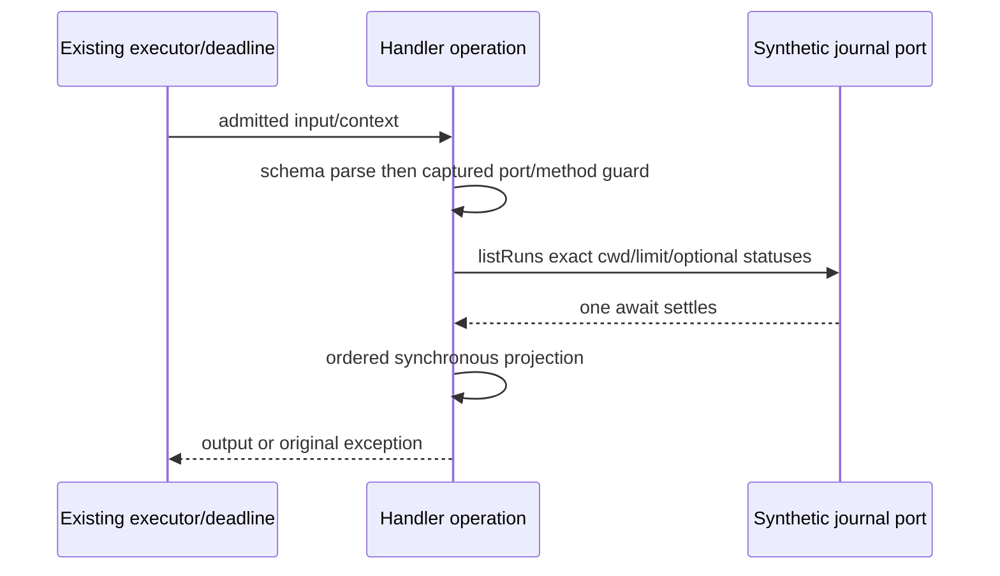

# ListWorkflowRuns admission and row projection

Baseline: `dfcce76627cd71e5fe7ff31194fb079d24114a1d`. Scope is the handler and one private operation helper, with owned synthetic contract fixtures and evidence. No journal, runtime, permissions, lower introspection formatter, public contracts or shared provenance changes.

## Ownership and behavior

The existing journal service owns runs, ordering, labels, status, session attribution and timestamps. The handler owns one schema admission, one captured port, one list invocation and one projection. The executor remains the owner of permission admission, trace, deadline, terminal events and telemetry. No cache, retries, new state or alternate effect path.

Schema validation precedes port reads. Missing port or nonfunction method returns the inherited unavailable failure; null and throwing getters keep native exceptions. The captured port method is read for the guard and again for invocation, with the port receiver. Request cwd is the exact session spelling, not normalized; input cannot supply cwd. Schema owns limit default/clamping and status validation. There is no signal/trace argument at the journal boundary.

Rows remain in adapter order, including repeats and sparse-array behavior. Mandatory row fields are read in their existing order. Optional stopReason/resumedFrom/supersededBy are tested for undefined and read again when present. possiblyInterrupted and truncated read once and project literal true only when truthy. Result.runs.map retains its receiver and callback behavior; no sorting, filtering, validation repair or catches. Malformed results preserve existing errors. The operation has exactly the original one await, with no asynchronous forwarding helper.

Public schemas, declarations, model formatter, inherited prose, permissions, budgets and metadata stay byte-identical. The deadline stays 10000ms; cancellation metadata remains supported:false. Actual generic deadline/call-runner cancellation is compared to the frozen baseline, including completion-edge queued aborts. No new cancellation policy is inferred from that declaration.

## Acceptance and evidence

Freeze exact source and byte-identical actual project emission before replacement. Exercise registered tool and real executor/deadline owners with synthetic journal ports, input/output getters, synchronous throws, rejection, hostile and queued thenables, malformed results, repeat/concurrent/stale completion, early abort and completion-edge abort. Capture exact error/output/model text, own keys, getter order, request receiver/count, metadata, events and terminal telemetry. Strict emitted mode must fail closed if emitted files are absent. No HTTP/DNS, real journals/files, providers, notifications, accounts or settings.

Existing history is the imported snapshot plus formatting commit88001f027b04324f816176ff5f08b5d1a236f27f (only wraps cancellation prose). Current ledger says upstream-modified and has no accepted review. Publisher manifest facts do not establish a new local publisher-byte verification. Source is exposed; retained admission/compatibility expressions, declarations and prose remain attributable. Tests containing archived source or old model text are retained evidence, not new expression. No clean-room or whole-file MIT claim.

Final checks: focused source/emitted, related regressions, types, configured and owned lint, formatting, architecture, CLI build and full suite. Report existing failures and native gaps. Root owns licence decisions and shared inventories. Earlier production and evidence, Read fixtures and CI are immutable in this slice.
