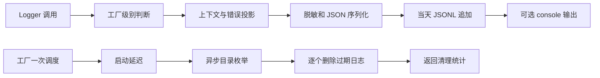

<!-- SPDX-License-Identifier: MIT; Copyright (c) 2026 Knorvia Studio contributors -->

# 日志适配器行为合同与重实现

2026-09-30。接续认证替换后的 `bd0bb014c0974334557fa51814709d0b78f35f1d`，替换 `adapters/logging` 的内部实现，保持公开 Logger、JSONL 格式、文件名、目录解析、脱敏、错误、清理和工厂行为。历史记录提到的仓外 v2 候选和 44 案例不在本环境；本批不使用它们，也不继承其通过结论。

## 所有者与调用顺序

工厂是最小级别和一次启动清理标记的唯一所有者；所有子 logger 读取同一个级别函数。每个 logger 只持有默认上下文和输出端口，没有队列、后台重试或第二份已接受日志状态。序列化是纯投影，文件 sink 是适配器。清理请求拥有本次结果，逐个处理目录枚举，不触及会话库、配置或其他工作区。

Logger 的 void 合同和现有即时落盘行为保持同步；异步化需要另一份明确的 flush/close 合同，本批不引入。清理继续使用异步 IO。低于级别的调用不读取上下文或创建目录；通过过滤的调用先合并上下文、投影、脱敏并 JSON 序列化，再尽力创建目录和追加。仅文件 IO 错误被隔离；投影、redactor、JSON 和 console 错误按原位置传播。文件失败仍尝试 console。文件故障注入保留原有 mkdir/appendFile 操作和路径。

## 兼容合同

- 每次调用默认上下文、child 上下文、调用上下文按后者覆盖前者；child 创建时浅复制，原 logger 的默认上下文引用仍可观察。级别变化立即影响已有 logger/child。category 是 module 的 fallback；withContext 的 category 为 root。
- 时间戳使用 ISO；level 使用小写名称。顶层保留 event、module、message、traceId、spanId、parentSpanId、sessionId、turnId、toolCallId、durationMs、status、context、error 的现有字段顺序。仅 undefined 字段被剔除，null/false/0/空字符串仍保留。字符串身份字段和 durationMs/status 类型过滤保持；traceId 沿用直接投影。
- 十个保留 context 键从嵌套 context 中移除，无剩余键时为 undefined。普通字符串属性按枚举顺序保留；原对象不被修改。没有新增隐式 JSON 安全转换，BigInt、getter 和自定义 redactor 的异常继续传播。
- 默认 redactor 匹配 api-key、authorization、cookie、credential、password、secret、token 等现有键模式，命中值成为 `[Redacted]`。字符串通过现有 `redactDiagnosticText` 公共依赖处理。对象/数组采用一次遍历共享的身份集合，重复引用和环成为 `[Redacted:Circular]`，深度超过 8 时连原始值也成为 `[Redacted:DepthLimit]`。保留稀疏数组和自有可枚举字符串属性；symbol、不枚举属性和原型不复制。每次 redact 调用重新建立身份集合。
- 错误投影保留 name/message、非空字符串 code/type、可选字符串 stack 和普通/null 原型 context；不采集数组或类实例 context。未知值以 String 转换。cause 非 undefined 时继续投影，环与超过 8 层的终止标记保持。错误投影本身不脱敏，JSONL 投影阶段统一调用 redactor。
- Console 为小写级别、`[module]`、可选 trace 前八个 UTF-16 单元、event 和默认文本脱敏后的 message。它沿用默认文本脱敏，不把自定义 redactor 的 JSONL 结果用作 console 内容。
- 文件名继续是本地日历日期的 `knorvia-YYYY-MM-DD.jsonl`。追加 UTF-8 加换行；已有文件、其他日期和其他文件内容不被覆盖。默认目录由现有数据根端口加 cli/log 解析。options.logDir、显式 env.KNORVIA_LOG_DIR、默认路径按 nullish 优先级；不把显式空 env 与进程 env 合并。
- 默认级别由显式 env 或进程 env 的既有运行环境解析决定：development 为 debug，production/test 为 info；其他值继续以 CLI 的 TypeScript 启动路径推断。显式 minLevel 优先。console 对象优先；console=true 或显式 env 的 `KNORVIA_LOG_CONSOLE=1` 使用 stderr，包括原有 false 加 env=1 的行为。
- retention 默认 7 天，有限值截断并至少一天，undefined/NaN/Infinity 回默认。截止日期为本地午夜向前 retentionDays-1 个日历日，不按 24 小时毫秒相减。只扫描普通文件且名称日期为合法本地日期，严格早于截止才删除；截止、未来、非法日期、其他扩展名、目录、符号链接均保留。
- readdir 的 Error/ENOENT 返回空 completed 结果且不记完成日志；其他异常返回 failed 并记 warn。逐个 unlink 的 Error/ENOENT 视作已消失，不计 deleted/failed；其他错误记 failed 并继续剩余文件。错误 code 判断只接受 Error 实例。统计和日志字段、事件名保持，logger 异常按当时位置传播。
- 调度先记录 info，再注册一次 timer，最后调用可选 unref；默认延迟 60000ms，显式零保持。now 函数在回调执行时读取。工厂在进入调度前消耗一次标记，即使调度异常也不自动重试。直接 schedule 函数不限制调用次数。

## 兼容、数据保护与来源门槛

先冻结同一套行为测试，分别跑当前旧 source 和实际旧 dist；之后在新 source、重新构建的真实 dist 上运行。永久回归必须加载真实目标，dist 缺失直接失败。所有文件、故障和环境夹具使用临时根，不读真实用户目录或密钥。升级/回滚夹具保留同一个既有 JSONL 字节前缀和哨兵文件，旧格式读者能解析新追加记录；无需数据库 migration，回滚为切回原提交并保留数据目录。

实现作者已读旧源码以提取本合同，没有隔离作者角色，故不宣称 clean-room。新实现按投影/输出端口/工厂所有者拆分，序列化采用显式遍历工作表、错误原因链采用迭代投影；不以逐行改名作为替换。来源记录绑定本批源摘要、测试冻结摘要和旧/新结果。因缺少独立来源复核，本批生产源码保持 Apache-2.0 及修改说明，不提前在 reviews 中授予 MIT；新编写的测试与合同可单列 MIT。根 LICENSE、NOTICE、第三方声明和历史发行保持。测试等价和清单新鲜度只证明对应门槛，不证明版权独立或整个应用可 MIT。

完成本批必须通过 source/dist 行为门、根/CLI 类型和 lint、架构、格式、来源清单、CLI 构建、整仓离线回归和可运行应用构建。原生 UI、Windows/macOS 或实际运行时缺失时单列未执行范围，继续处理其他可运行验收。
