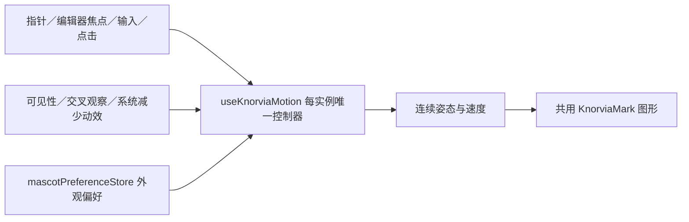

# Knorvia 应用内形象与动效

2026-09-22。用户提供黑色圆润机器人参考图，要求应用内 Knorvia 图标和小助手共用形象，参考 Grok Bot 的连贯代码动效，并授权微调外观。草案 03 按最新反馈移到主布局右下角、去掉双手，增加头部高度，避免扁平轮廓。

## 外观与入口

- 原聊天 GUI、四内核共用输入卡与白色初始主题保持不变。用户随后明确要求同步修改应用图标：保留白色 K 与青紫光泽，将图标上的机器人统一为新形象、去掉圆点，轮廓外保持透明；同时更新应用 PNG/ICO/平台图标与 Windows EXE 资源。
- 新应用内 Knorvia 形象采用原创 SVG：饱满、略有不对称的炭黑卵石轮廓、两只发光白眼睛、克制的青紫边光；去掉顶部悬浮圆点和双手，无边框和背景方块。头部接近等宽高，略微悬浮，不再扒住输入框。
- 内核选择、Agent 管理、原生 Agent 标识共用静态 `KnorviaMark`，不替换模型供应商的真实品牌。
- Knorvia 是应用小助手，不表示外部 CLI 已连接。主工作区布局只挂载一个实例，锚定主内容框右下角，不随消息滚动。由布局末端无边框的安全空隙承载，不覆盖发送按钮、节点小地图、终端或附件；隐藏时回收空隙。
- 四内核与群聊／工作流共用这一布局挂载点，切换页面不因新建草稿重置形象。输入卡不再拥有小助手。编辑反应只消费同一主区中明确标记的聊天输入容器的焦点／输入事件，不读取文字。
- 形象尺寸克制，不扩大标题，不新增主导航；窄屏缩小。点击小助手作出回应，不发送、不改草稿、不抢输入焦点。
- 设置／外观提供动态、静态、隐藏三档；系统减少动态效果优先，隐藏和后台不继续动画。

## 动作与单一所有者

`components/knorvia/` 属于既有 unmanaged ui。SVG 形象和姿态参数为自有代码，不引入参考工程的源文件或资源；生成图片仅作质感研究，不参与运行。

- 动画仅是本地呈现状态，不复制运行时任务状态、不持久化光标或输入内容，不读取其他内核上下文。
- 单个可见实例一条 requestAnimationFrame；时间按实际帧间隔积分、阻尼插值，眼睛与身体各自延迟响应，切动作保留当前速度，不先重置再播放。
- 呼吸、偶尔眨眼和左右观察为安静待机；指针跟随有幅度限制，专注输入时根据输入区域位置抬眼；悬停轻轻靠近、点击点头／弯眼笑／单眼眨动／歪头，长时间无交互后安静休息。眼睛使用连续变形路径，去掉阈值突然开闭；身体、眼睛与落地影子自然衔接。无滚动抢焦点、无全屏跟随挂件。
- 关闭动画、系统减少动态、页面不可见或组件离屏时取消帧循环；卸载移除监听与观察器。恢复时重置帧时间，不补播隐藏期间动作。
- 外观偏好唯一所有者为 `store/mascotPreferenceStore.ts`；本地键 `knorvia-studio:mascot:v1`。保存失败明确提示，本次窗口仍应用选择。默认动态，旧用户无数据迁移。
- 静态 SVG 不挂监听、不创建动画循环。文字与设置提供中英文，按钮有键盘与焦点支持；自动眨眼不进入读屏播报。

## 验收

1. 小尺寸内核图标和右下角形象来自同一 SVG，无圆点、无双手、无黑框，无运行时 PNG/GIF/视频；输入框上不再显示机器人。
2. 点击、输入、悬停与移开连续过渡；在 30/60/120Hz 的模拟帧步长下稳定，不因长暂停出现跳飞。
3. 静态／隐藏／减少动态／离屏停止动画；切换四内核仍是原输入框，草稿与提交行为不变。
4. 外观设置可恢复，存储失败有提示；检查亮暗主题与窄窗口，无遮挡操作。
5. 运行针对性测试、根类型检查、renderer 类型检查、lint、architecture、生产构建；实际 GUI 验证并更新既有便携版，data 文件哈希不变。

## 设计确认与交付阶段

用户已确认草案 03（“可以了”）：无手、无顶部圆点、饱满轮廓、主区右下角。接下来将确认形象同步到 K 应用图标和既有桌面便携版，保留用户 data。预览直接使用真实 KnorviaMark 与动作控制器，并继续保留供复核。K 图标使用原白色雕塑 K 和光泽，只替换机器人形象并清理透明边缘；不采用此前过早生成的候选。

## 参考

- 用户原图：`%USERPROFILE%/Downloads/file_00000000160881fab6bf45cb76b59ac3.png`。
- 官方角色状态说明：https://x.ai/news/designing-grok-bot
- 官方动作调校说明：https://x.ai/bot/guides/designing-grok-bot-with-grok-bot
- 本机 `_grokbot_ref` 仅用于确认 SVG／代码动画方式；其 reconstruction 不能当作官方开放源码或可直接复用许可。本实现独立绘制与编写。
