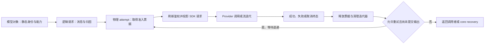

<!-- SPDX-License-Identifier: MIT; Copyright (c) 2026 Knorvia Studio contributors -->

# 模型适配器运行时

2026-09-30。本批按先行冻结的行为合同替换 `apps/cli/packages/adapters/src/model` 的 51 个模块。保持逐模块公共导出、三种模型协议、重试、流式事件、消息与媒体投影、诊断及取消行为；不改变界面、用户数据、模型配置或根许可。按文件记录来源，根 Apache-2.0 与 preview 身份在全面替换完成前保留。

## 所有者与边界

模型对象持有创建时冻结的 provider/model 身份、能力与已绑定选项；调用期覆盖只属于本次请求。适配器持有默认 retry/idle/debug 设置及进程状态接收端。逻辑请求持有 canonical messages、trace/session/turn 归因和请求状态接收端。每次物理 attempt 独占 requestId、准入票据、取消控制器、计时与终态。Provider、网络代理、模型选项映射、设备标识、CUA 媒体凭证谓词通过既有公开依赖调用。

模型调用前验证选项与能力，禁止把 runtime 状态、admission 或 retry 端口序列化给 provider。SDK 内置重试为 0，所有物理重试由适配器管理。静态 registry 不接受请求期鉴权写回；请求刷新仅覆盖允许的 key/headers，并维持 provider/model 身份。网络目的地来自显式 provider 配置。

## 协议与投影

- Anthropic Messages、OpenAI Responses 和 OpenAI Compatible 的公共路由保留。地址、header 大小写合并、请求归因、Anthropic metadata 及模型选项映射继续遵循冻结合同。
- 消息按角色保序。开头 system 合并、空 user 占位、reasoning 回放、签名拒绝后的单次请求副本修复均不得修改 canonical history。
- 图像、PDF、视频及工具结果投影保留能力检查和 CUA 凭证邻接规则。工具输入解析、空名闭合、strict schema 与 provider 原生工具按公共合同处理。
- 普通流在非空正文或完整工具调用对外可见后，不再由适配器重放；core 负责已提交输出后的恢复。compact 的 replay boundary 与 output commit boundary 分开保留。

## 尝试、状态与清理

准入票据在本次 attempt 的所有终止路径释放，并在退避前释放。取消等待、迟到结果、idle timeout、提前结束消费和失败流清理不得污染下一次尝试。迭代器收尾及 SDK consume 清理有原定的一秒上限，清理失败仅记录警告，不覆盖原始错误。

请求与进程状态接收端按对象身份去重；票据仍为独立接收端。一个接收端失败不能影响其他接收端或请求结果。保留 queued/admitted/started/completed/failed/retry_scheduled 的既有时序。每次物理重试重新生成 requestId，逻辑 trace/session/turn 归因保持。

错误归一保留原始 cause 和安全归因。默认有界重试、Retry-After 优先级、workflow unbounded 策略、off-peak 特例及输出提交门保持冻结合同；不能用一个 retryable 布尔值替代各层裁决。

## 调试持久化

模型 I/O 在 test runtime 关闭，其余环境含未设置时维持原有默认启用。development 使用显式 debugDir 或 data-root/cli/debug，其他环境使用显式目录或 data-root/cli/rollout。所有路径仍须脱敏 headers、Anthropic user id 及媒体原始数据；全量保留也不豁免脱敏。

普通生产记录最多保留三个 session 文件，单文件上限 64 MiB；开发上限 256 MiB。到限额用当前有界 baseline 覆写。非流记录遵守 skipTranscript，流式维持现有环境门。成功生产记录清除重复 SDK/provider request 与 response body，同时保留 canonical context 的 delta 或最近 64 条 baseline；开发 baseline 最多 256 条。连续性不明确时不得只留下 omitted 计数而丢失最近上下文。失败保留合同要求的 provider body。调试失败不影响请求结果。

## 兼容限制

保留先行合同明确列出的差异：pre-start 缺鉴权错误不会补发 failed event；addStatusSink 的组合只转发普通 publish；compact 的显式 error-chunk 分支仍有 replay 标志与实际 commit tracker 不同的状态字段语义。CUA 前置媒体谓词仍接受既有可投递媒体集合，不在本批暗改成仅 raster。准入期间及时取消依赖注入端口协作。任意非标准 provider payload 不在无限兼容保证内。

## 验收

冻结 v10 已通过独立的 75 个离线案例，含 provider、消息、媒体、工具、鉴权、状态、准入、流式、取消、重试、错误与日志保留。每案的实际构建图必须绑定全部 51 个冻结模块，不得回退到旧实现。运行网络守卫覆盖受检进程的 83 个入口，事件为零；这不等于操作系统沙箱或真实模型服务验收。

主仓已完成公共类型兼容、真实 CLI 构建、永久 source/dist 各 75 案例以及根类型、lint、架构和离线回归。完整回归 3800 项在新增两个模型顶层组接入前运行，新增两组另行通过；不能合写为一次 3802 项全量运行。详细检查、首次失败、配置修正和夹具观察修正见[验收记录](../docs/knorvia-model-adapter-runtime-acceptance.md)。旧实现的 66/75 对照和静态检查不代替候选行为验收。最终打包和稳定发布仍服从全量替换目标。
