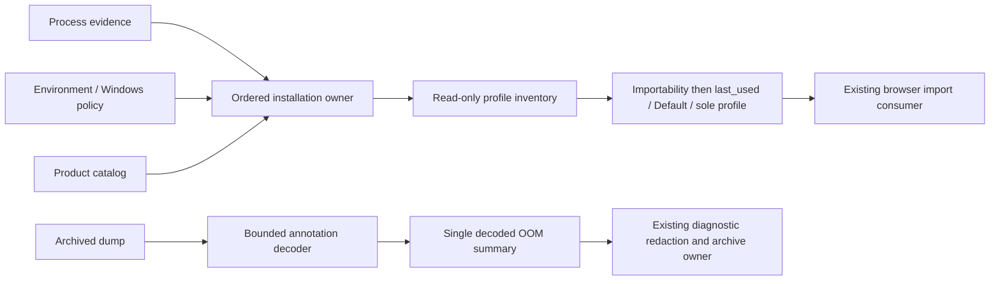

# Four bounded native implementation replacements

Continue `rewrite/native-20261003` and draft PR21 after the cloud packaging batch.
The integrator's PR19 head `1128e11a98a47d16ad19e9b3e60e65fc8b470cd7` binds four
complete Desktop main files to exact upstream
`872ad960de7ec172591f7e1952f7849229f94521` in
`third-party/source-verification-20261003/bounded-inherited-source-facts.json` and
`inherited-implementation-next.md`. The branch normally synced that head in
`3418776c6d90b3a205e312a115948a280e91309d`. This is a source-exposed replacement:
the prior files have been read to extract behavior, not used as a line-edit template.
No clean-room, whole-project-original or MIT grant is asserted. Apache application
choice, original license/NOTICE and historical source evidence remain.

## Ownership and design

Only `chromeInstallationCandidates.ts`, `chromeExecutableDiscovery.ts`,
`chromeProfileDiscovery.ts` and `crashDumpAnnotations.ts` in
`packages/desktop/src/main` are production replacement targets. Keep all exports,
public option/result shapes and their consumers in browserDataManager,
chromeLocalStorageManager and desktopCrashCapture unchanged. Desktop is currently
unmanaged in the architecture context, with no new cross-module contract needed.
No shared configuration, CI, registry, inventory or other lane is edited.

The replacement uses four existing owners, with no second cache or fallback to
the inherited implementation:

- Installation candidates: a product catalog materializes platform topology;
  running-process selection uses a first-wins executable index and explicit
  command evidence. System paths/product names are unchanged functional data.
- Executable discovery: one ordered, lazy search plan owns candidate admission.
  Platform collectors yield registry/index candidates in OS order and isolate
  failures per application/entry. No browser is executed during discovery.
- Profile discovery: one ordered installation iterator and one profile inventory
  own selection. Inventory combines known cache names with directory evidence,
  then applies importable-data availability before choosing any profile.
- Crash annotations: one bounded length-prefixed record decoder and one forward
  byte scan own extraction. Per-prefix first-value maps retain output ordering;
  a fixed metric schema feeds one summary and its ordered OOM policy.

All IO/command reads remain inside Desktop main. Profile discovery never imports
or modifies browser data. Crash file reading stays synchronous because the public
archive caller is a synchronous critical section before ARMS cleanup; changing
that contract is outside this batch. No transport, replay, schema or GUI change.

## Installation and running-process contract

Product order is Chrome, Beta, Dev, Canary, for Testing, Chromium. Preserve Mac
system-before-user Applications and Google/Chromium support directories; Windows
Program Files, x86, LocalAppData executable roots in trimmed unique order; Linux
CHROME_CONFIG_HOME then XDG_CONFIG_HOME then home/.config. Unsupported non-Mac/
non-Windows platforms currently use that Linux-style catalog. Linux standard
candidates precede Snap Chromium, Flatpak Chrome and Flatpak Chromium.

Retain the existing recognized executable basenames and parsing boundaries:
double-quoted executable, unquoted Mac app path, then unquoted terminal
chrome/chromium name. An unquoted suffixed Linux channel name is not promoted by
this parser even though the executable whitelist recognizes it. Executable-path
deduplication folds slash/case and preserves the first original spelling.

Every nonempty --user-data-dir occurrence emits a candidate in command/argument
order, including explicit directories on child processes. Without an explicit
directory, --type child processes are excluded and only the first slash/case
matching fallback is used. Preserve optional supported password-store evidence
and fallback store when no recognized override exists. Explicit-directory browser
kind follows the existing whole-command Chromium recognition. Ordinary regex,
path normalization, system words and these fixed rules are retained as contract
data, not used to claim independent authorship.

## Executable discovery contract

Process enumeration occurs first unless process lines are supplied or installations
are supplied. Preserve Windows PowerShell/CIM and Unix ps commands, 3-second
timeout, 2MiB buffer and suppressed Windows command window. Enumeration failure
does not block later sources. Candidate priority is CHROME_PATH, CHROME_EXECUTABLE,
running executables, registered/index entries, Linux PATH names, installations.
Environment quotes are stripped only when matching around the trimmed whole value.
Each tier deduplicates trimmed exact paths, keeps order, checks a recognized basename
and a regular file; Unix also requires X_OK, Windows does not. Failed candidates
continue; successful tiers do not query later registrations or catalog candidates.

Mac Spotlight uses the same six bundle identifiers. A stale app is skipped without
discarding later apps; files/symlinks in Contents/MacOS remain eligible. Linux XDG
applications roots, .desktop file order, Chrome/Chromium text prefilter and
TryExec/Exec line order remain. Preserve simple quoted token and env assignment/
option skipping. Resolve absolute commands directly, bare commands through PATH,
and reject relative commands containing slash/backslash. Injected registered paths
remain authoritative, including an empty array. No shell execution is introduced.

## Profile discovery contract

Candidate priority is running, Linux CHROME_USER_DATA_DIR, Windows HKCU policy,
HKLM policy, standard catalog. Supplied installations suppress implicit environment,
policy and process reads, while explicitly supplied process lines still apply.
Linux running-process fallbacks match environment then standard candidates. Trim
and exact-deduplicate user-data roots, retaining all first-candidate metadata.
Windows policy preserves reg.exe query keys/arguments, REG_SZ/REG_EXPAND_SZ,
case-insensitive ${local_app_data}/${profile}/${program_files} variables followed
by percent env expansion, unknown text and failure-continue behavior.

Local State info_cache names and actual Default/Profile N directories form the
inventory. Malformed/unreadable JSON falls back to directory discovery; unreadable
directory enumeration yields no profiles even when cache names exist. Preserve
existing valid-JSON-null rejection rather than silently repairing that separate
bad-input behavior. Check cached names' existence, retain sort order and last_used.
An empty cache name cannot become the selected sole profile; it still contributes
to ambiguity among unpreferred importable candidates, and empty last_used does not
gain preference over Default. This preserves the observed malformed-cache boundary.
Importability means existence of Network/Cookies, Cookies or Local Storage/leveldb;
empty Default must not hide another profile or later Snap/Flatpak installation.
Choose importable last_used, otherwise importable Default, otherwise the sole
profile. Multiple others return ambiguity immediately before later installations.
Profile executable resolution keeps its existing existence-only semantics and
explicit executablePath preference; it does not adopt the stricter executable
discovery policy. No source-data write, target-session import or credentials read.

## Crashpad and OOM contract

Known case-sensitive key prefixes remain v8-oom-, process_type, ptype, pid and
renderer_foreground. A record is accepted only with printable ASCII key bytes,
matching preceding little-endian u32 length, NUL key terminator, absolute 4-byte
value-length alignment, available value bytes and bounds of 64-byte key/64KiB value.
Trim only trailing value NUL bytes; allow tab/LF/CR, normal Unicode and replacement
decoding, reject other C0 controls. Empty values remain accepted. Invalid/truncated
records are skipped, scanning continues at every possible position, and first
valid value for a key wins. Preserve prefix-group object order. Reported file size
greater than 64MiB skips sync reading; IO/parse failure returns {}.

Summary returns null without a nonempty v8-oom-location. Keep all public V8 keys,
nullable output fields, binary B/KB/MB/GB units and rounding, strict Boolean strings,
parseInt semantics, process_type-over-ptype nullish preference and public summary
field order. Diagnostic text
limits: first 8 nonempty trimmed stack lines, 160 UTF-16 code units plus ellipsis
per line, last nonempty GC line at 240 plus ellipsis.

OOM rule order is code-space before JS heap before unknown. Code-space means a
case-insensitive 'ran out' code allocation status, or both cage size/free parsed
and free below 4MiB. JS heap means a nonempty main-cage status other than exact
'success', or old-space at least 1GiB. Threshold equality, missing fields and
malformed numeric text retain their current results. Fixed formats, conversion
helpers, rule thresholds and public field names are not artificial rewrite targets.

## Bounded acceptance and record

Add consumer-facing synthetic contract tests before replacement, run them on the
inherited baseline, then run the unchanged fixtures on candidates. Cover product
topology/ordering, process flags/first fallback, tier laziness and OS collectors,
profile availability/ambiguity/policy/isolation, byte bounds/corruption/first values,
OOM precedence/null fields/text bounds and existing crash redaction integration.
Use Node24.14.0 with the current tsx/module-mock test entrypoint, isolated temporary
files and mocked system commands; no host Chrome, model, user profiles or GUI.
Run required type/lint/architecture checks and preserve exact failures. These
source tests are not a new packaged artifact or real Windows/macOS acceptance.
Retain both prior and candidate digests in the native lane record, including which
short standard helpers and fixed compatibility syntax remain. Shared evidence and
current-source registration belongs to the integrator; no full-source audit here.
