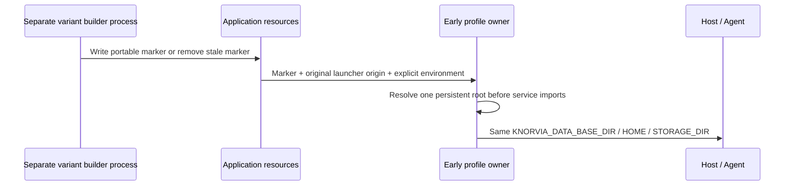

# Native installer and portable release variants

This additive installer batch starts after the completed maintainer/Linux packet
at `5c3120f0abfd4031a9c69b5b8a6d2082721ef57d` on the same persistent native
branch. The four successful Linux packages keep their original build input
`b5fbc3d89c34c45d6d9f7e16183bbdaec79d75f8`; they are not rebuilt or attributed
to this later installer source. Root Apache-2.0 and all file/component notices
remain intact. Existing NSIS/profile implementations are inspected compatibility
material, not new independent-replacement or clean-room credit.

## Ownership and scope

- Native owns `packages/desktop/electron-builder.config.js`,
  `packages/desktop/scripts/desktop-package-variant.mjs`, the existing NSIS
  template patcher, `packages/desktop/build/installer*.nsh`, profile selection,
  and focused desktop fixture files. No renderer/shared protocol/root/CI edits.
- `resolveDesktopProfile` remains the sole data-root decision. Early bootstrap
  applies that decision before service path imports, then passes the same root
  to Host/Agent. Installer choices own only new shortcut creation, not settings,
  migrations, model configuration or accepted task state.
- The existing UI task `01a10019-de88-7513-8dd6-b2a3981370c7` owns brand binary
  resources only: `build/installer-branding-20261003/installerHeader.bmp`
  (150x57, 24-bit Windows BMP), `build/installer-branding-20261003/installerSidebar.bmp`
  (164x314, 24-bit Windows BMP). Keep `build/icon_installer.ico` unchanged.
  Parent has relayed [UI draft PR28](https://github.com/accomplish07zrh-eng/knorvia-studio/pull/28)
  at `1a0febaf9b362b5bcd578d396ec566bf98a33e51`. Its README/INTEGRATION are
  read from that exact fetched head; native binds the three bitmap options to
  its supplied paths without copying image bytes or rewriting source records.
  UI previews are design drafts, not Windows acceptance. Integration must
  include PR28 before packaging this batch. Existing black/white presentation
  and English/Simplified Chinese remain. No replacement task or agent is created.
- Integration owns Windows/Linux CI, architecture matrices, signing, aggregate
  provenance and GitHub Release publication. This batch supplies package flags
  and source contracts, not Windows acceptance from a Linux machine.

## Installer contract

Use the existing assisted NSIS wizard: branded welcome, per-user/all-users mode,
installation-directory choice, existing unsafe-directory guard, shortcut options,
visible installation stages and finish-page launch of the installed executable.
New installations allow separate desktop and Start menu checkbox choices, both
checked by default. Honor the existing `--no-desktop-shortcut` flag and disable
choices forbidden by either build-time shortcut option. Silent
installation uses current defaults/flags. Auto-update and reinstall into an
existing executable directory skip the new options page and retain the current
KeepShortcuts/pinned-link behavior, including preserving user-deleted links.
Explicitly configure `deleteAppDataOnUninstall: false` and `runAfterFinish: true`.
No data-removal checkbox, new migration or data reset is introduced. Existing
ownership-manifest upgrade cleanup, diagnostics and stale-shortcut repair remain.
The inspected baseline's ordinary uninstall still recursively deletes `$INSTDIR`.
Do not retain that destructive path: ordinary uninstall must use the same owned
program-file manifest, then remove only empty parent directories and its own
manifest/uninstaller. Nonempty user data directories and unrelated files remain,
including profiles deliberately located inside the installation tree. Upgrade
keeps its existing missing-manifest preservation behavior; ordinary uninstall
without a readable ownership manifest aborts before deleting any program/data
file and requests reinstall to restore the manifest. Explicit external AppData
cleanup stays disabled by default. This does not alter database migrations or
add a data-management owner to NSIS.
Adopt UI PR28's concise welcome/finish copy and installation title/subtitle. The
welcome describes confirming installation scope, folder and shortcuts; it does
not promise the next page is already the directory page, because the existing
per-user/all-users page precedes it. Installation retains actual NSIS progress
and extracted file details, with no invented elapsed/remaining-time display.

## Physical packaging and persistent storage

`KNORVIA_PORTABLE_BUILD=1` selects portable packaging; absent, empty or `0` keeps
installed packaging. Reject other values. Build each mode in a separate builder
invocation/output directory; never use one marker-bearing application tree for
both NSIS and portable targets. Reject portable-mode Windows installer targets,
portable-mode Linux native-package targets, and an unmarked Windows `portable`
target. Default installed targets and names remain compatible. Portable names
include `-portable`, avoiding `.exe` clashes with installed products.
The NSIS builder output keeps its existing unsuffixed `.exe` filename for the
root `scripts/package-windows-release.ps1` consumer; that integration-owned
staging script already publishes it as `-setup.exe`. Portable builder outputs
carry `-portable`, so neither the existing consumer nor EXE names collide.

| Mode | Default Windows targets | Default Linux targets | Data root |
| --- | --- | --- | --- |
| Installed | NSIS | Existing AppImage/deb/rpm/pacman | Existing appData/Knorvia Studio (or explicit KNORVIA_DATA_BASE_DIR) |
| Portable | NSIS portable EXE + ZIP | AppImage + tar.gz | Original portable file/folder beside `data/` |

The afterPack hook writes `resources/knorvia-portable.json` for portable Windows
and Linux; installed packaging removes a stale marker from its own output tree.
The marker remains version 1 with the existing product/dataDirectory values.
Portable macOS packaging is outside this request and fails explicitly if selected.

Root precedence: explicit absolute `KNORVIA_PORTABLE_DIR` wins; otherwise a marked
Windows NSIS portable bundle uses the absolute `PORTABLE_EXECUTABLE_DIR` set by
the pinned builder launcher; a marked Linux AppImage uses the directory of the
absolute `APPIMAGE` file. Marked extracted ZIP/tar/directory bundles retain the
existing executable-directory rule. Launcher variables cannot enable portable
mode in an unmarked installed build. Validate only a selected launcher origin;
preserve the existing validation of explicit Knorvia directory variables.
Never store persistent data in NSIS extraction/TEMP or AppImage mount directories
when an original launcher location is supplied. Invalid/nonwritable selected
roots fail visibly instead of falling back to another profile. No existing data
is copied, removed, migrated or searched for automatically. Portable upgrade
continues to replace only program files while preserving the complete `data/`.

## Acceptance and deferred checks

Author focused fixtures for variant/target rejection, stale-marker removal,
shortcut hook fallback, original launcher locations across changing extraction
directories, explicit override precedence and installed-mode isolation. Do not
execute tests, lint, types, builds or full audit in this source batch; the user's
current verification deferral overrides repository check instructions. Source
reads, bounded architecture context, change diff and commit metadata inspection
are allowed. Mark this batch unverified even though the earlier Linux packet
passed its separately authorized product checks.
Add an explicit Windows-only cleanup acceptance module and a tiny NSIS fixture
that compiles/invokes the actual production `customRemoveFiles` macro against
owned temporary directories. Cover ordinary/update cleanup and missing manifests,
hash all synthetic data before/after, and retain unrelated files and nonempty
directories. This is a cleanup-macro fixture, not wizard/UAC/real-package proof;
its injected update flag and installer function prefix are explicit test ports.
It refuses Linux and a missing compiler instead of presenting simulated Windows
results. It is excluded from the general offline unit glob and remains unrun.

Integration must build both variants in native Windows/Linux runners, inspect
marker presence/absence and actual archive metadata, run Windows wizard/UAC/
upgrade/uninstall/shortcut/finish scenarios and portable two-launch data sentinels,
then publish real products, checksums and precise acceptance limits. Parent must
register the later source checkpoint separately; the retained b5fbc3d8 products
cannot establish acceptance of any installer/profile changes in this batch.

Primary launcher contracts: pinned local builder 26.8.1 `templates/nsis/portable.nsi`
sets `PORTABLE_EXECUTABLE_DIR=$EXEDIR`; the [AppImage runtime contract](https://docs.appimage.org/packaging-guide/environment-variables.html)
defines `APPIMAGE` as the resolved absolute file and `APPDIR` as its mount point.
