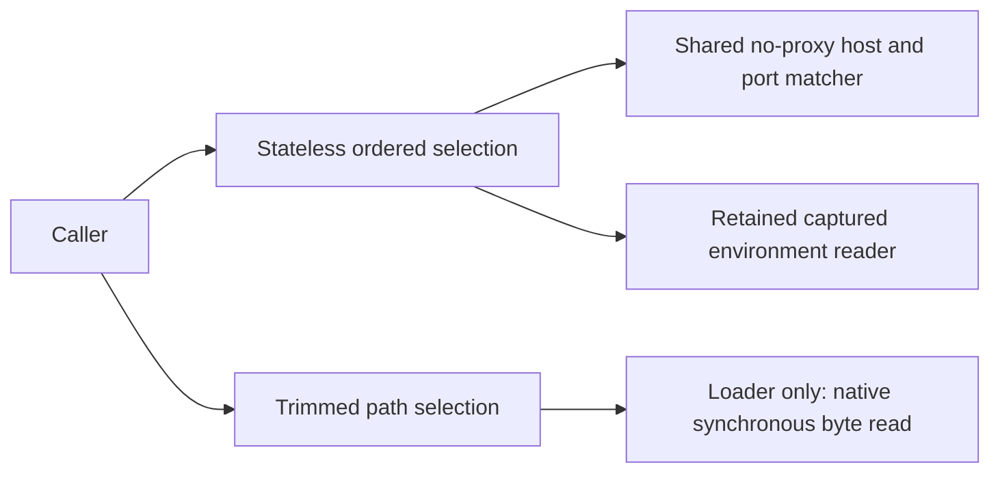

<!-- SPDX-License-Identifier: MIT; Copyright (c) 2026 Knorvia Studio contributors -->

# Network proxy and synchronous CA configuration contract

Behavior-only input for independent implementation. Root has read the old helper, public declarations and caller boundaries and made pure finite observations. The author may use this contract, the approved declarations and its own prior design review only; no inherited source, history, tests, probes, bundles or product execution. Prior author context remains, so this is not a whole-process clean-room claim. Root will judge source and finite runtime evidence separately from authorship claims.

## Public scope and ownership

Independently implement five synchronous exports: resolveProxyUrlForRequest, resolveProxyForRequest, resolveWebFetchProxyForRequest, resolveTlsCaCertFile, loadTlsCaCertificates. Exact declarations are supplied separately; function arities are 2/2/2/1/1. Keep existing options and result shape. No new runtime export, setting, dependency, permission, network request or IO beyond the CA loader. One stateless module is preferred; a private pure token module is allowed only if justified, each below 400 normal-format lines. Write design before source. The URL-only helper returns the ordinary resolver's proxyUrl.

Use retained public constants KNORVIA_HTTP_PROXY_ENV_KEY, KNORVIA_NO_PROXY_ENV_KEY, KNORVIA_AGENT_CA_CERT_ENV_KEY, KNORVIA_TOOL_ENV_PASSTHROUGH_ENV_KEY and readKnorviaToolEnvPassthroughEnv(env). Both @knorvia/shared and its public @knorvia/shared/runtime-env subpath are approved; exact type-only declarations are supplied. Do not copy JSON parsing/whitelisting. Read only the provided env, never implicit process.env. No cache, mutation/freeze of caller options/env/URL, or IO in proxy/path resolution. Sync native filesystem reads belong only to loadTlsCaCertificates; the already separate HTTP adapter owns successful instance caching.

## Ordered selection and result presence

Parse a string request URL with native URL, catching parse failure only; use supplied URL objects directly. Invalid or non-http/https URL returns exactly {noProxyMatched:false} before accessing options. A valid URL first uses trimmed nonblank options.noProxy or, if absent/blank, provided env KNORVIA_NO_PROXY. Only that selected list applies, not a union or a second env retry after an explicit nonmatching list. Matching returns exactly {noProxyMatched:true} and does not read proxy candidates further.

Otherwise select first valid normalized options.httpProxy, then provided env KNORVIA_HTTP_PROXY. Selected result has exactly own keys noProxyMatched:false, proxySource and proxyUrl; sources are network.httpProxy or env:KNORVIA_HTTP_PROXY. No selection/bypass object may own proxySource/proxyUrl with undefined values. The ordinary resolver stops after this stage.

WebFetch consults the retained captured-env reader only if no explicit/product-env proxy won and no preceding bypass matched. Use captured nonblank no_proxy, falling back to captured NO_PROXY if lowercase blank/absent. A match returns the same bypass shape. Else first valid proxy in fixed order https_proxy, HTTPS_PROXY, http_proxy, HTTP_PROXY, all_proxy, ALL_PROXY wins, regardless of requested HTTP versus HTTPS. Source is env:KNORVIA_TOOL_ENV_PASSTHROUGH_JSON.<key>. Captured rules must not override previously selected explicit/product proxy. Empty/invalid/nonstring captured data follows the retained reader, not a new implementation. Reading provided configuration afresh on every call and native getter failures are preserved; incidental duplicate property-read counts are not a new API guarantee.

Proxy normalization trims, skips empty, and prefixes http:// unless the value starts with scheme:// where scheme starts a letter then letters/digits/+.-, case-insensitive. Return native URL.href or absence on native parse failure. Preserve permissive scheme support, credentials and URL serialization; do not impose SOCKS/HTTP-only policy, strip credentials, consult OS proxies or add diagnostics. Redacted reporting remains caller-owned. Invalid earlier candidates can fall through.

## Shared no-proxy matching

Target host trims, lowercases, drops its IPv6 edge brackets and one trailing dot; effective port is native URL.port if nonempty, otherwise HTTPS443 or HTTP80. Empty host or absent/blank list cannot match. Lists split on commas only; trim and lowercase tokens, skip empty entries. Patterns example.invalid, .example.invalid and \*.example.invalid match apex and subdomains on a dot boundary; notexample.invalid must not match. Token host also drops edge paired brackets and one trailing dot. Keep this existing suffix rule for plain host/IP patterns. Do not add CIDR, arbitrary globs, whitespace-separated rules, IP policy or URL path routing.

Unscoped \* matches any host/port. A nonempty port constraint must be checked before wildcard or host matching. Bare host with exactly one non-leading colon has a textual port field; exact comparison, not parseInt/number normalization. Bare multi-colon IPv6 is host-only. Bracketed token has one paired outer [host], optionally followed by :port. Paired nonempty bracket host is structural, not a new IPv6 validator: [target.invalid] remains supported. Missing/extra brackets, non-colon suffixes, or additional colons in a bracket suffix are invalid and ignored; never truncate them into a different host. Unmatched brackets anywhere in a non-URL token cannot match.

Empty ports remain host-only for compatibility: target.invalid:, [::1]:, \*: and http://target.invalid: all match any effective port for their host. Bare/bracket nonempty ports remain exact text: :00080 does not match effective80, :0 matches effective0; nonnumeric, negative and out-of-range text does not match a native numeric request port. Unscoped bracket or unbracket IPv6 behavior stays unchanged.

URL-form tokens (containing ://) use native URL validity and hostname; path/query/fragment/userinfo do not route. Keep all previously accepted host-bearing schemes, including ftp/ws/wss/custom/file, without a new scheme allowlist. A genuinely omitted or empty authority port is host-only, even if URL protocol differs from target. An explicitly nonempty port is a constraint after native numeric canonicalization, including native default ports that URL.port omits. Thus http://target.invalid:80 and :00080 match effective80 but not443, ftp://target.invalid:21 matches effective21 but not80; http://target.invalid with no port matches either80 or443. Native URL rejection means skip, not a thrown error. Native accepted control-character removal, special-scheme extra slash/backslash authority parsing and encoded/userinfo/path delimiters must not misidentify a path colon as an authority port. Do not mutate caller URL objects for detection. URL host normalization remains native, including IDN; bare patterns do not gain new IDN conversion.

Approved corrections are scoped to ignored nonempty bracket/wildcard ports, lost explicit URL default ports, and malformed bracket truncation. Apply the same parser and matcher to explicit and captured bypass lists. Preserve empty-port and ordinary domain behavior. Native hostname/dot and URL behavior remain owned by Node, not a new URL parser.

## CA path and byte read

Select first nonblank trimmed options.caCertFile then provided env KNORVIA_AGENT_CA_CERT. No tilde expansion, resolve/realpath, content validation or existence precheck; relative paths remain native cwd-relative. Path helper does no filesystem IO. Loader returns undefined when no selected path, otherwise native readFileSync(path) Buffer with bytes unchanged. Keep synchronous throws and native error/cause identity. Do not fall back to env after explicit selected IO fails; do not add cache or validate certificate syntax. Read anew on every call, so owned test file changes remain observable.

## Evidence and limits

Root performs old-first pure selection/matcher checks and owned-temporary-directory CA reads with exact object presence/error identity, then candidate, source, actual compiled calls, strict types/lint, architecture, build and full offline regression. Do not run these in the author task. No external DNS/model/proxy/production server or real user config is needed. Type-only interfaces and short standard expressions are compatibility constraints, not authorship proof. Root Apache-2.0, retained shared dependency and third-party rights remain; this scoped batch does not complete the global replacement or authorize a final whole-project MIT claim.
