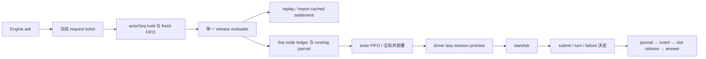

# Dynamic ask scheduler 行为契约

本批范围为 `apps/cli/packages/dynamic-workflow/src/engine/scheduler.ts`、`scheduler-submit.ts` 与新的内部纯记录投影；保留 `AskScheduler`、`SchedulerHost` 再导出、`hashMismatch` 再导出和 `SubmitSeam` 的现有公开面。不修改 engine 生命周期、imported-cache、driver、公共 contracts、已整合 `core/src/workflow/scheduler/**` 或 session context。

## 当前来源与目标

两个 owner 当前 history 只有导入和 4fd3e373 的拆分/格式化。保存的来源记录分别为 upstream-modified / upstream-unchanged、unreviewed、NOASSERTION，精确 publisher blob 为 `939f9437cfc9922f37e6789fa230cbb102703780` 和 `1489c215d32308edbc60daed6adfca098689f1a8`，没有精确 accepted expression receipt。此前 lifecycle selection 的负向筛选说明当时未提出足够实质的新设计，不代表后来已有完整独立实现。本次读取源、接口、Engine 调用者和既有说明，明确 source exposure，不声称 clean room 或 MIT。

新设计把一次 ask 的输入、deferred 和 replay 分类冻结成 request ticket；按 actorSeq 释放后的统一 ticket evaluator 选择 recorded/import/live，避免每个入口形成自己的缓存与派发 owner。live 的 running/completed/failed journal 记录使用同一纯字段投影；成功/失败共用同步终态流水线。submit/turn 回报先生成带预算动作的决定，再由同一裁决执行入口调用 driver/record/settlement。不得只是将旧方法搬进 helper。公开字段、固定错误、Promise/Map/数组等常规表达不是独立权利证据。

## 准入与缓存

- register 从 journal 所有 ask 行计算该 actor 的 recordedCount，返回同一个含 pendingRecorded/pendingLive/liveQueue 的 Actor。注册顺序独立于 id Map；重复 id 覆盖查找但不删除旧 actor 的扫描位置。可选 imported 键只在参数存在时加入；不能从旧 journal sessionId 预填 session/sessionPromise。
- admit 依序读取 actor、分配 site ordinal、构造 instance、计算 inputHash、建 deferred、读 journal。命中 hash 不符先 failRun，再返回同一个错误的 rejected Promise；不进入 hold/driver。recorded seq 默认 0，running/cache 分类在准入时确定。
- recorded 按 seq 放入 Map，只有 nextAdmitSeq 那项能取出；先删除并递增再调用释放。fresh 以到达顺序等待 recordedCount 排空，释放时分配并递增新的 seq。每轮重新查看状态，允许同步 record/journal 回调重入，不增加锁、timeout 或 deferred admission。
- recorded 释放时先对 imported 调 reconcileRecorded(seq, recorded.inputHash, wasLiveBeforeResume)，有 imported 才计算 wasLive。running 转 live；completed 发 cached ok 再 resolve；其它终态发 cached failed 再从 JSON 恢复错误并 reject，不写新 running、不开 driver session。
- fresh 释放时先问 importCacheClosed，再用 take / takeIfPure。命中写 importedAskRecord（包括 stats/messageBoundary），发 cached ok，再 resolve；无 queue/session/current 槽。转 live 本身不关闭 cache。
- drain 结束只 pump 该 actor；fresh admit 随后再按完整注册顺序 pumpAll；recorded admit 不额外 pumpAll。

## live、会话与派发

- live ledger 插入先于 running journal；journal 写入先于 liveQueue.push，queue 先于 node-queued。包含 actorRef/seq/hash 和可选作者 instructionsHead；repair/nudge 初始值保持现有常量。任一同步 port 异常保留其之前的变化并向上传播，不补回滚。
- pumpActor 按 run settled、actor.current、liveQueue 空、activeAsks/caps 依序阻断；取队首后先写 current 与递增槽，再调用 async dispatch。每 actor 串行，全 run 并发上限与注册顺序保持。
- ensureSession 复用同一 Promise，包括 rejected Promise；第一次从 imported.seed 获取种子并调用 driver.createActorSession。成功先写 actor.session，再从 journal 读回 driver 刚写的 resolvedModel，覆盖 actor 行并保留该值。缓存 Promise 的时刻不移到 driver 前。
- dispatch 只 await ensureSession；创建失败在 run/node 仍 live 时包装 DriverError（cause 与有界诊断文本）并结算该 ask。await 后再次检查 run/node。node-dispatched → dispatched=true → startAsk，message 的 instructions/typed/schema 键均保留。startAsk/record 的异常不混入 createActorSession catch，不添加 Promise catch 或额外 await。

## 回报、终态、取消

- submit 仅处理未结算的 live typed ask；先 validate 原值，合法 string 不解码。原值违规且是 string 时只尝试一次 JSON.parse + validate；合法则采用解码值，仍违规则采用解码值对应 violations；parse 或第二 validate 抛出则回原值违规。首次 validate 抛出传播。
- accepted：respond accept 再 settleOk。repair：先减预算，respond reject，再 record repairing（原 attempt 算法）。预算耗尽：cancel 再 ValidationFailed。untyped turn 用完整 finalText 结算；typed turn 先减 nudge 预算、respond nudge、record，耗尽后 cancel 再 ResultNotSubmitted（保留 finalText）。缺节点/已 settled 无动作。
- 正常 success/failure：先检查/设置 settled，写 completed/result 或 failed/error journal，发 node-settled，删除 live ledger，只有 current 身份匹配才清空并减槽，pumpAll，最后 resolve/reject。同一失败的 toJSON 在 journal 和 event 阶段分别调用，不能提前合并；节点失败不自动 failRun。stats 仅在存在时加入最终记录。
- noteStats：live 节点仅更新 lastStats；缺 live 时 getNode → 若存在浅拷贝并覆盖 stats → putNode，保留已有结果、错误、模型/身份和 messageBoundary；缺 row 无写入。
- failed/isLive/liveActorName 以同一 ledger 及 settled 位判读；name 来自 persona.name。
- abort 遍历现 live Map，先 settled=true，只有 dispatched 才 cancel，按参数可发 cancelled，最后 reject；结束后清 Map、activeAsks=0。不得写 failed journal、清 pending queues/current 或擅自泵下一项。保留 Map 的原生重入遍历语义与中途异常边界。

## 验收场景与暂缓项

编写包内离线用例覆盖 fresh FIFO/并发、乱序 recorded hold、running replay 重新建会话、import pure/seed、hash mismatch、typed JSON/repair/nudge、journal-before-answer 与 late stats、createSession 失败、dispatch 前后取消和重复终态。用虚构数据与内存端口，不触碰真实 workflows/providers/session 数据。

全部用例、类型/格式/lint/架构、构建、source/emitted、真实 Engine/driver 消费矩阵与来源表达核验均留最终阶段；本阶段不运行。新测试路径由整合者加入根 explicitTests，不越界编辑根脚本。原负向筛选、publisher 记录、accepted-byte HOLD、历史失败及第三方义务保留。
