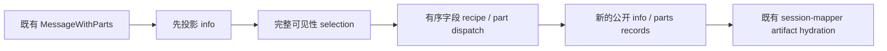

# CLI 历史消息的公开协议投影

本批只替换 `apps/cli/packages/bootstrap/src/protocol/message-mapper.ts` 的完整同步映射 owner，以及同目录的纯投影实现和包内新测试。保留 `mapMessageWithParts(MessageWithParts): KnorviaMessageWithParts` 的唯一公开入口；不修改 contracts/shared schema、session-mapper 的 artifact URL hydration、显示策略、UI、存储、快照或 replay 协议。

## 当前来源与实施依据

当前 Git 历史仅有 `7619e41b` 导入和 `88001f02` 格式化，没有本地完整替换提交。saved inventory 对此精确路径为 unreviewed / upstream:null / NOASSERTION；不能把缺失匹配当作原创。此次没有查到已有明确 accepted-byte HOLD。先静态读取当前 owner、直接消费者及公开 schema，提取以下行为，再写独立的有序字段 recipe 解释器和有限 dispatch，替换原嵌套 case/record 构造组合。

执行者已经读过 predecessor，来源暴露明确；不是隔离 author 或 clean-room。固定 wire 字段、身份转换、状态/错误词汇和兼容分支条件必须保留，不将这些字段表或通用 record/array 操作当作新权利证明。独立表达、片段对应、贡献权和来源核验由最终整合阶段处理，本批不改变全局 ledger 或许可声明。

## 唯一所有者与顺序

本模块只是 current message 的一次纯投影，拥有的都是返回记录/数组，无长期 state、cache 或 IO。既有 session/runtime/command owner 继续拥有事实。消息 info 先投影；随后对全部 parts 执行既有 invalid-tool visibility 判读；最后按保留次序投影可见 parts。不能改为 filter 与 project 交错的一遍扫描，不能读取隐藏 part 的 id/state 等投影字段。

## 固定投影契约

- User info 字段次序：agent、messageId、model、metadata、role、semantics、sessionId、source、system、synthetic、time、tools、visibility；嵌套对象/arrays 原引用共享。id 使用 String，model 使用原 modelSelection。
- Assistant info 次序：agent、cost、error、finish、messageId、model、parentMessageId、path、role、semantics、sessionId、structured、time、tokens。error truthy 才构造 `{name,data}`；providerId/modelId 都 truthy 才构造 model；reasoningLevel truthy 才增加 options。parent id 无论是否 undefined 都用 String，不借默认值补写。
- 所有 part 先有 messageId、partId、sessionId 三个 String 字段。保留 text、reasoning、file、tool、step-start、step-finish、snapshot、patch、compaction、timeline、subtask→subagent、agent、retry 全部十三种路由及原字段/次序。optional 字段要保留显式 undefined，不新增 schema 验证或转换旧数据。
- compaction metadata 保留 attempt、boundaryId、compactReason、endedAt、maxAttempts、operationId、phase、post/pre token counts、reason、replace、startedAt、summaryMessageId、timelineStatus、truePostCompactTokenCount、trigger 全字段及固定顺序。
- timeline 始终有全部固定可选字段。anchor id 与 compaction summary id 仅 truthy 时 String；fork parent/target id 是无条件 String。context_compaction、goal_verification、session_fork、model_change 各自字段不得泄露到其他 timeline 类型；fromModel/toModel/verification/time 原引用保留。
- Tool part metadata 只有自有 providerToolName 才浅拷贝并删除；删后无 enumerable string keys 返回 undefined，没有这个自有键则原引用返回。running/completed/error state 先去掉自有 readFileState；error 再去 modelContent；completed 再去 modelContentLayout，且缺 metadata 返回新普通空对象。其他情况的空对象/原引用区别、symbol/own-property 行为不变，source metadata 不被修改。
- pending/running/completed/error tool state 的字段次序、input/output/error/title、time start/end 和 metadata 三种保留规则原样存在；不调用工具、权限、provider 或文件层。

## 验收与整合需求

新增测试覆盖 role info、全部 part 标签、String/undefined 字段、timeline 类型隔离、compaction、tool 四种状态、私有 metadata 去除和全 selection 在投影前的顺序。保留历史 fixture/oracle，不弱化既有 privacy 或 hydration 行为。

用户本阶段禁止测试、lint、类型/格式/架构检查、构建和完整审计，所以所有新增用例 **未运行**；候选类型和实际 source/emitted/消费者组合 **未验证**。根 `scripts/test-studio.mjs` 使用显式包内用例列表，本路不能修改根脚本，最终验收由整合者加入/执行新增 bootstrap 用例。公开接口没有变化，不需要同步 schema；最终仍须验证 desktop continuous 与 mobile replay 使用同样 projection/hydration 的完整链路。
