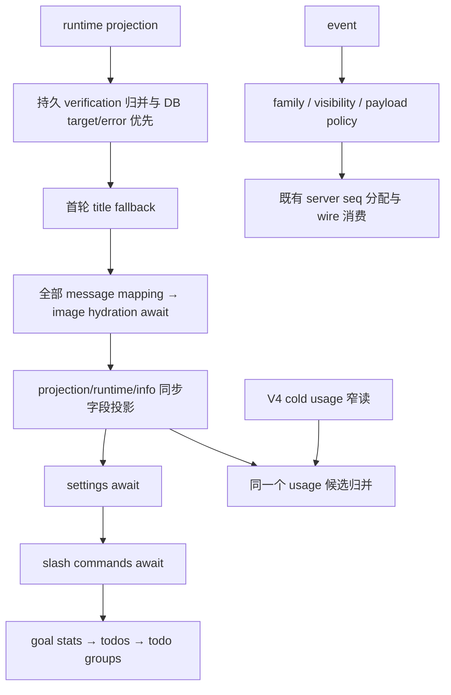

# Session snapshot / event / usage 完整行为契约

本批替换 bootstrap `protocol/session-mapper.ts` 的完整 owner；原公开入口 buildSessionSnapshot、mapSessionSettings、mapSessionInfo、mapSessionEvent、mapSessionEventForProtocol、mapSessionEvents、shouldExposeSessionEventToProtocol、resolveSessionContextUsage 全部保留。mapper.ts、server-operations.ts、公共 contracts/shared、UI 和数据 store 只读。message-mapper 沿本路已装完整候选，不重复重写。

当前 history 只有导入及格式化；精确保存来源为 unreviewed / upstream:null / NOASSERTION，没有精确 accepted expression receipt。upstream:null 不是原创证明，也不认定其为已知上游 body。本次 source/API/消费者暴露披露在 lane 记录；不宣称隔离作者、whole-expression 接纳或 MIT。不得用移出巨文件、改名/格式化作为完整实现。

设计：薄组合入口按原阶段固定事实；有序 typed recipe 投影固定字段；事件以 family 描述表选择类型、可见性与 payload policy；usage 用请求计数/向量累计和最近有效水位候选归并；目标历史分别维护 verifier 边界与 todo 归属索引；图片回填只经现 app artifact port。每个状态/决定只有一个 owner，无旧实现 fallback、第二 session 状态或新 schema。

## Snapshot 阶段与公开字段

- await runtime.getProjection 后立即 getActiveTurnInfo；先 merge persisted verification（第三参数取 input.target 存在性），再按输入存在性覆写 target/lastError，最后首轮标题 fallback。不从未恢复的 runtime.target 代替已读取 DB target，null 与 undefined 不等同。
- await 全部 messages 的公开映射/图片回填，再按原次序构造 messages、projection、protocol(name/version)、runtime、session、await settings、await slashCommands、goalStats、todos、todoGroups。slash 传参先 spread 原 options 再覆盖 workspacePath；不把这些 await 并行化或提前计算 goal/history。
- projection 字段次序/存在性：activeToolCalls、backgroundJobs（浅拷贝）、contextUsed/window、currentTurnId（truthy String）、lastError、mode、pendingPermissions、sessionId、status、target、totalTokenCount、turnCount。
- runtime 字段次序：activeTurnId（只能来自 activeTurn，不用 projection.currentTurnId）、activeTurnKind、deliveryKind、eventSeq、pendingRequestIds（requestId ?? toolCallId）、可选 contextUsage、goalVerifications、goalVerificationTimeline、stateRevision。verification nextAction ?? null；timeline 固定 version/kind/type/display、id/status，truthy optional iteration/anchors/verification/startedAt、最后 updatedAt；所有 Date 转毫秒。
- info 的 id 优先 session.id → app.sessionId → unknown；created 优先 session.time → fallback → projection Date → lazy Date.now，updated 同序最终 created。mode 优先 projection → optional app.getMode → build；model 仅有 app 时取 app.getModel 并用已有 model mapper；parent/trace/kind/status/target/title/titleSource/workspace 均保留原 nullish/存在性和引用。
- goal 映射保留 undefined/null；固定 created/objective/session/status/title/id、timeUsedSeconds ?? 0、tokenBudget ?? null、tokensUsed ?? 0、三个 active-run 字段 ?? null、updated。

## Settings 与权限

读取顺序保持 listThoughtLevels → getThoughtLevel → getDefaultThoughtLevel → getModel → optional getCurrentModelOption（无论 availability）→ 必要时 listModels。current/default thought 只接纳 truthy 且在 list 中的值。current-only 模型列表优先当前 option（可用正整数 currentModelContextWindow 覆盖），没有 option 才过滤 catalog；all 仍完整 catalog。mode.getMode、runtime 原 SessionModelSelection、lastUsed parse、permission.getMode 两次读取及 thought 字段保持原输出顺序。

pending permission 只投影 input、truthy origin、经过 legacy policy 的 options、reason ?? 空串、requestId ?? toolCallId、requestedAt/risk/tool id/name；不透出 display/optionsPolicy。PermissionRequested payload 先移除两个字段，保留其他自有键/符号，再根据输入/suggestedUpdates、legacy policy 和 string toolName（否则 unknown）覆盖 options。Denied 复制 object payload 并写 decision=deny。旧客户端 strict schema 的 gate 与裁剪规则不能放宽。

## Event family、顺序与隐私

- envelope 顺序 deliveryKind、String id、mapped payload、seq override ?? internal sequence、String sessionId、timestamp.getTime、String traceId、truthy String turnId、mapped type。server-operations 继续独占 protocol seq 分配；本 owner 不补 seq 或做去重。
- StreamingToolLedgerUpdated 和 DynamicWorkflowRunProgress 不出协议。ModelStreaming 的 text/reasoning delta 要非空 string；tool_input_start/delta/end 和 tool_call 始终保留，其他 kind 丢弃；读取 kind 后仍读取 delta。其他事件可见。
- type family 对应现有全部 tags：session created/resumed/title/closed、turn started/steerQueued/steerDrained/completed/failed、三类 message upsert、streaming、六类 tool.updated、permission request/resolved/denied、checkpoint/rewind、六类 streamRecovery；default session.updated。完整常量表是兼容配置，不计原创表达。
- tool scheduled/progress/result/error/batch 浅 spread 任意 payload 再写 kind；started 只接受 object record，startedAt 优先有效 Date/有限 number/非空 string，再 fallback eventTimestamp，写 kind=started。
- ModelRequest 只返回 messageCount 以及存在的 providerId/modelId/temperature/maxTokens/toolCount/iteration，绝不泄漏完整 messages。网络/streamRecovery 经共享 apiRetry helper；没有 retry 返回原 object 引用，有则保留原 record/meta/knorvia 的浅复制和字段次序，再加 apiRetry。其他 payload 直接保留引用。
- mapSessionEvents 按输入每项选择并投影，过滤 null 为 dense 输出；保留 map/filter 的空槽行为和单项抛错边界。

## Context usage 与 cache

先计算 persisted usage，再优先 projection 水位（仅 used/window > 0，保留原数值规则）；只有 persisted.used === projection.contextUsed 才承接 persisted cache。没有 projection 水位则 fallback persisted。

cache 按原顺序扫描所有非 summary assistant，将 input/cache read/write 非负整数累计；三个值全 0 的请求不计。保留最新三值、总三值、requestCount、latestHitRate 和 hitRate（分母 0 → null）。

persisted 水位要求 window > 0；逆扫时 user summary 的 compaction boundary 优先 truePostCompactTokenCount ?? postCompactTokenCount 正整数，成功即无 cache；其他 summary 跳过，普通 assistant 优先 positive total，否则 positive input + nonnegative output（不含 reasoning/cache）。NaN/Infinity 不能因重写变成有效整数。

breakdown 逆扫 ModelComplete，只接纳缺 querySource 或 main_turn、共享 schema 成功且非空、共享 getModelUsageContextTokens 有值的首个候选；optional window 仅 positive integer。只有 usage 无非空 breakdown、candidate 非空、used 相等、optional window 与 size 相等才挂该候选；不跳过最近但不对齐的候选去捞更旧事件。原 V4 readSessionContextUsage 取数时序和本函数入口不变。

## 目标恢复、统计与 todo 归属

- 没有 persisted verification events 返回原 projection 引用；否则 seed 两个数组 fallback，clone/filter TargetCompletionVerification，再按 timestamp/sequence 排序，通过共享 EventReducer 按序 apply。event targetId 缺失或当前 targetId 不 truthy 可接纳；当前 targetId 取 explicit target?.id ?? projection.target?.id（保留 null 分支）。timeline 依据第三参数 target 做过滤/排序；summary 先已有再 timeline verification，以 passed + 规范化 reason/nextAction 的 NUL 分隔 key 首次稳定去重。
- timeline 顺序：两个正 iteration 不同则先 iteration，其它按 startedAt ?? updatedAt，最后 verificationId.localeCompare。消息按 created/time 再 String id.localeCompare。不得改变这些 tie-break 或排序 locale 规则。
- title fallback 只有 target 存在、title 缺失、session title truthy、最早 user 在 target.created ±5000ms、所有 text parts 按换行合并后 trim/压缩 whitespace/lower 与 objective 相同时浅复制补 title，否则保留原引用。
- verifier 边界决定 iteration：target 之前无 iteration；初始 1，每项 messageTime <= updatedAt 归该 iteration；started 保持该轮，completed 且 passed 后后续无轮，其它终态推进一轮。iteration 起点为 target.created，后续轮取前一轮最后非 started boundary，否则 fallback message.created。
- stats 无 target → undefined。按有轮次的 assistant 在原排序和每轮累计顺序计算 tool part 数、tokens(total ?? input+output+reasoning+cache)、ceil(max elapsed / seconds) 非负时间，再按首遇轮次顺序归并；iterationCount 仅共享 verifier active-count helper。target tokens >0 优先；time >0 或 activeRunStartedAtMs != null 时以 target time 为准，避免 live 时间双算；预算 ?? null。
- todo 只读 assistant 的 TodoWrite 等价名称（小写去 underscore/whitespace/hyphen）且共享 main-agent projection-source 校验通过的 tool parts。整个 input.todos 必须数组、每项 trimmed content 非空、priority/status 合法，否则整批不接纳；空数组也创建空 group。state metadata/time 随 status 分派，pending 无 metadata/time；更新时间 fallback assistant completed/created。
- 分组按 verifier iteration 或 session；第一次建立该 group 决定 start/target/source，后续更新时间 max。todo ownerKey 用 targetId ?? session + NUL + 规范 content 固定首个 group；同内容后续更新仍写原 owner group，不能迁移到当前轮；当前 group 即使最终空也保留。group 内首次内容位置稳定，后续整项替换。没有任何历史 group 时，currentTodos 非空生成 session-current。最终按 start fallback MAX_SAFE_INTEGER，再 id.localeCompare。

## 图片与验收

先同步 map 全部 message，再按原并发 Message/part Promise.all 回填；只对原 MIME image/* 或 image/ 前缀且 URL 尚非可用 data:（逗号后非空）处理。string metadata.artifactUri 优先 url，包括空字符串的 nullish 规则；共享 isArtifactUri 接纳后才经 app.readToolResultArtifact。可用 artifact content data URL 原样用，否则 contentType 的规范具体 image MIME 优先 part fallback，生成 base64 URL；最终 UTF8 byteLength <= 20MiB 才替换 url。读/转换失败按现有兼容行为保留原 part，不能移除附件、读取用户目录或泄漏 artifact 本地路径。

编写纯投影/内存 artifact/同步调用序列用例，覆盖公开 keys、settings、visibility/privacy、legacy permission、上下文压缩/cache/breakdown、持久 goal title/timeline、跨轮 TodoWrite owner、图片 URI/MIME/cap 与 snapshot await 次序。所有测试、lint/type/build/全量审计、消费者矩阵及来源核验均未运行；最终统一执行。根测试接纳由整合者维护，本路不改 root 或公共 schema。
