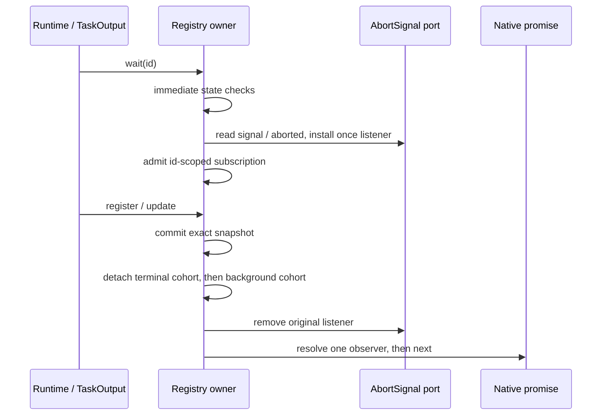
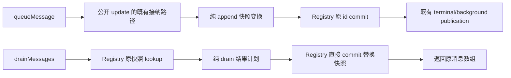

# CLI runtime task registry 的契约实现

本路从整合基线 `3b1ff0f715a43cbc51c576fd524479a08e58e203` 开始，持久分支为 `lane/cli-rewrite-20261003`。本批范围仅为 `apps/cli/packages/core/src/runtime-task/registry.ts` 和本路新增测试，不改变公开 contracts、任务执行、权限、通知呈现、持久化或其他已安装 owner。

## 输入与目标

旧完整 owner 尚未替换：`docs/knorvia-task-registry-restricted-author-handoff-20261002.md` 记录 author 启动失败，没有候选；该路径的已有 Git 历史只有导入和格式化。以 `docs/knorvia-task-registry-author-inputs-20261002/{behavior.md,api.d.ts,supporting-types.d.ts,inputs.json}` 的行为、公开类型和固定词汇为实现输入。它们是从旧源码提取的契约，不是已执行的全面验收。

实现允许同等复杂度；目标是依据行为规则写出完整实现，不要求人为减少功能或发明新策略。历史方案、源码和 fixture 在初稿之后用于差异复核，不能成为逐行改写模板。本执行者已经读过历史选择说明；不声称隔离 author、clean room 或已完成权利核验。

## 唯一所有者与内部组织

`InMemoryRuntimeTaskRegistry` 继续独占已注册快照、后续注册默认 branch generation 和按任务 id 的等待订阅。快照使用有序索引，订阅独立于快照存活：没有快照的 id 也能保留在 listener 安装时重入形成的订阅。每个 id 的订阅簿包含两个双向 FIFO cohort，ticket 记录所属 cohort 和相邻 ticket；abort 只摘掉当前仍挂在簿上的 ticket，发布先摘掉整个 cohort 再沿原链逐个清理、结算。这样 detached cohort 的稍后 abort 仍可以先 reject，且不会改动同 id 的新 cohort。避免将 observer 的寿命绑定到 snapshot 槽位。两种 wait 共用 admission 与发布机制，但终态和后台判读保留不同顺序。

没有新 generation fence、策略授权、任务停止、超时、retry、异步 setup 或第二状态所有者。observer cleanup 出错保留 commit 和 cohort detachment；不恢复或吞掉剩余 detached observer。Abort 只取消该观察，不取消任务，也不显式移除 once listener。

## 保留的不变量与验收场景

- register 浅拷贝、嵌套身份、nullish generation fallback、id 插入次序、普通 record 的整数键及 `__proto__` 自有属性行为。
- update 在原 id 上存储 patcher 的原结果，missing 不调用；patcher 重入效果和异常边界原样保留。
- terminal 先发布，background 再发布；每次 cohort 先整体脱离再逐个 cleanup / resolve。清理重入的新 cohort 不能加入已脱离的 cohort。
- listener 安装先于 admission。安装时 remove/register、inline abort 或抛错保留原同步/native promise 边界。
- immediate waits 不读取 options；pending path 在 promise 构造前读取 signal / aborted；后台 immediate 检查按既有 truthiness 和重复读取规则保留。
- queue 走一次公开 update；drain 返回原消息数组并用新空数组更新快照，不发布、不调用 sink。
- 六个固定 terminal status 和 running-background helper 的 literal-true 条件不变；trace、output、日期、session、usage 等引用不归一化。

新增测试覆盖外部可观察的快照身份、message receiver、特殊 id、发布时序、错误后部分状态和 signal 重入。保留历史 fixture、oracle、selector 与所有旧失败记录，不改预期以迁就新实现。

## 本阶段验证与许可边界

用户明确本阶段不运行测试、lint、类型检查、格式/架构检查、构建或全量审计。新增测试只编写，不执行；只阅读契约、相关源码和提交差异，并确认完整提交在远端。所有候选标记 **未验证**，source/emitted/真实消费者、跨平台和整合组合验收留待最终阶段。

本路只维护 `docs/lane-cli-20261003.md`，不改全局 inventory/reviews 或 LICENSE/NOTICE。固定 API、行为词汇与关联第三方声明继续保留。独立表达、来源、贡献权和最终 MIT 决定仍待整合者核验；写出新代码不会自动授予 MIT。

## 较晚 accepted-byte 记录与 HOLD

以下记录是批次一恢复生产基线时的决定；新的接纳路线见末节，旧证据和 HOLD 不改写。

之后读取 `specs/knorvia-core-task-notification-owner-20261003.md` 和 `docs/evidence/core-published-ownership-next-screen-20261003/README.md`，发现 root 已接受 registry SHA256 `12a18abdd47a1639a86726a92f7b9bf55227c8918109c3934b33925b066603e2` 的报告；它们明确要求保持 local `ac09ec1b...`，等最终整合。本固定基线中的 `licensing/reviews.json` 没有 registry 的精确条目，引用的 `licensing/evidence/contract-authored-task-registry-expression-20261002.json` 也不存在。因此这是一份需要整合者提供精确源提交与 receipt 的 reported accepted-byte HOLD，不能用本路重写解除。

本批新实现保留在 `apps/cli/packages/core/test/candidates/task-registry-20261003/{registry.ts,registry-waits.ts}`；新增 contract test 只导入这个候选。生产 `runtime-task/registry.ts` 恢复到固定基线的精确版本，不安装 fallback、双 owner 或替代路由。此前新代码提交仍保留在本路 Git 历史，候选可审查；不计为生产 owner 完成。对账后由整合者决定接受原已接受稿或评审本候选，不能默认为 MIT 或验收通过。

## 新授权下的完整候选接纳契约

父任务随后明确授权：读取整合者 `f969c9a7869ba33257968bcf0d15c1ffb63094bb` 的真实来源结果；若当前 owner 仍需替换，可按完整行为契约接纳新的 Registry 候选，消除对丢失旧候选的运行时依赖。不得伪造取回或旧 receipt，不再尝试受限来源，归档候选须先复核具体缺陷。该授权允许新实现路线，不能证明历史 accepted 稿已取回或解除它的证据 HOLD。

整合者找到 `e972ca88b458787d59b31b914a73f32d0297f567` 的 runtime-fragment 推荐评审：6097 bytes、SHA256 `3f0420e83be7796d7c767112cc5f10ac3aa66d92e8fd6b91d08847502257eac4`。它明确没有完整 integrated file/final digest。报告的 whole-file SHA256 `12a18abd…` 仍没有对应的原发布完整源码提交及原 whole-file receipt；本轮只读取已在仓库的评审记录，不恢复旧 `/tmp` 或取得受限外部素材，不执行历史 probes。

接纳前限定读取四文件行为输入、当前原 owner、归档候选和直接消费者。`runtime-task/index.ts` 与 `subagent/runtime-task-registry.ts` 都重导出同一生产 owner；subagent foreground 的后台竞争、runner 的 terminal wait、child 的 drain/requeue 均保留同步/native Promise API。包的现有 `include: src/**/*` 覆盖新内部 helper，归档目录不成为生产依赖。根构建配置、公开声明形状和上述调用方不改。

归档候选的限定源码复核未发现明确契约缺陷，具体对照包括：

- shallow-copy 的 getter/字段顺序，register 的额外 generation 阅读，drain 的 presence→length→identity→copy 四次消息 getter 阅读；公开 queue receiver 和 all 的整数键/特殊 id。
- immediate 先于 options 的重复 flag 阅读，pending 的同步 signal/aborted 边界，listener 安装前后重入、inline abort 的原 admission 结果。
- 每个 channel 的 FIFO cohort 在 cleanup 前脱离；旧 cohort abort 保留 reject 优先权，不摘除新 cohort；cleanup 抛错后的 commit、未结算旧成员和不可重放边界。
- terminal→background undefined→再读 flag 后的 background snapshot 发布，保留各阶段新建 cohort 的接纳位置，不引入 fencing、timeout 或任务执行。

这只是静态对照结果，尚未通过测试、类型检查、emitted/消费者绑定或表达/权利评审。生产接纳复用本路已经独立写出的 snapshot + 双向 ticket/cohort 候选，不根据旧 Set waiter owner 改名重排，也不为“再重写一次”改动已满足契约的算法。API 声明、固定词汇、浅复制等不可避免的兼容表达仍明确保留。

接入文件为生产 `runtime-task/registry.ts` 和新内部 `runtime-task/registry-waits.ts`，唯一入口保持不变，归档快照原样保留。本路新增的 11 个 contract 场景将改为导入当前生产入口，另编写 getter/发布/abort/FIFO 的针对性场景；历史 observation pins、旧 oracle/selector 和失败记录不变。最终当前产物验收须选择两个生产文件与真实消费者，不能借旧 fragment 评审或归档路径证明通过。全部新场景本阶段仍不执行；来源和 MIT 决定留待整合者。

## Apache 下继续独立维护：消息缓冲最小候选批次

用户最新澄清：继续 Apache-2.0，保留常用第三方许可与通知；停止 MIT 专项，不停止去除原项目继承实现、成为自维护上游的目标。本节只准备方案，**未安装候选**；生产文件须先与整合者协调，避免同文件同时写入。它不改前述历史 HOLD、旧失败记录或已完成技术整合结论。

### 事实范围与替换理由

以 `801179367c13fce707049aeb8ae5f92fe7cc9328` 的来源报告为输入，当前生产 Registry 仍为 SHA-256 `c7f4fc09641ddd04fe1692635ede2a5fde8b61c36dec82f35c21fa981fb97d84`。最小可辨认表达候选是 `registry.ts` 的 **147–152 行 queueMessage** 和 **154–160 行 drainMessages**：前者完整方法体语法与确切上游相同，后者完整方法体仅将 `tasks` 改为 `snapshots`。这是整段消息快照变换组织的事实，不只是接口同名或作者接触过源码；仍不证明作者曾逐行复制，也不把常规 spread/Map 单句自动判为原项目特有算法。

可按主动消除可辨认实现表达的目标，单独重作这一组合；**不据此认定它是法律上必须重写的范围**。新等待订阅簿已有不同的 id/book/ticket/cohort 结构及先行提交，不列入该批次。公开声明、六个状态、单行 generation setter / Map get / terminal 判断，以及 register/update 的必要 commit 与通知契约，不因为相同接口或普通原语而另列残留。没有发现仍需沿用上游任务执行、工作流取消、持久化或 UI 策略的证据。

### 拟改动和唯一所有者

待协调的生产改动仅为两方法及其一个内部 import，拟新增 `apps/cli/packages/core/src/runtime-task/message-buffer-transform.ts`。后者是纯快照变换程序，不持有 Map、队列、订阅或任何可变业务状态；不是把旧两个方法体移到新文件。Registry 仍是快照唯一写入者，`TaskWaitSubscriptions` 的现有所有权、发布和 abort 时序完全不变。

### 新内部组织及不可改变的行为

新程序以“枚举并物化自有字段 → 消息变换 → 生成替换结果”为内部组织，代替原来在方法内直接 spread/append 与 drain 分支/Map 写入的组合。实现须从行为规则重新写出，不搬运旧方法、不只改变量名，也不为语法不同强造新的产品策略。

- append 的 factory 只捕获传入消息，返回供公开 update 使用的 patcher。queue 必须仍调用可覆盖的 `this.update` 一次，并原样返回它的结果；override 没有调用 patcher 时，不得读取快照、消息字段或触发额外效果。没有 sink 调用、id/timestamp 生成、归一化或异步包装。
- patcher 先物化快照的自有可枚举字段，再读取原快照的 pendingMessages。消息容器通过迭代协议产生新的有序数组，最后加入同一个传入消息引用；保留 nullish fallback、迭代错误及先前 getter 副作用，不能改为只读取数组 length/index。所有新数组、快照及消息引用关系与契约一致。
- 物化可采用显式 own-key / descriptor / value 处理，保留字符串及 Symbol 的标准顺序、enumerable 判断、每个 getter 的接收者和读取时机，在 fresh ordinary object 上创建普通自有 data property，再覆盖 pendingMessages 而不移动已有键位置。不得直接用 Object.assign，使 `__proto__` 变成原型修改；不得用 JSON、structuredClone 或字段白名单丢弃扩展元数据。这是新物化算法，不是封装原 spread 方法体。
- drain 返回带判别的结果：无替换的 fresh empty array，或原消息引用及待提交快照。helper 不调用 update、发布、Map 或 sink。Registry 只在需要替换时将该结果提交到调用时的原 id，再返回原消息引用；getter 自身的重入副作用不能被回滚或吞掉。
- drain 必须按 presence → length → 返回引用的三次独立 getter 阅读，随后才物化快照（其中 pendingMessages 可再次读取）；不能把首个数组缓存后用于全部阶段。missing/absent/empty 不复制或 commit，每次返回新的空数组。非空的替换快照带新的空数组，返回的数组仍是原第三次读取结果。
- 注册表的立即等待、同步 options/signal 异常、terminal/background 顺序、重入、detached FIFO、branch generation、Read/scheduler/context 修复、数据形状和 UI 均不进入此候选批次。

### 协调与验证边界

需整合者先协调本批次在 `registry.ts` 的两方法/import 写入时段，以及之后的当前源码摘要与已有 source/emitted receipt 绑定刷新；这是现有全局记录和验收绑定的维护请求，不需要修改任何共享 schema、root config、CI 或其他模块。拟新增 helper 文件名尚未占用；协调前不创建生产 helper 或替换生产方法。

现有 contract fixture 的消息身份/fresh empty 场景、read-order fixture 的四次消息 getter 轨迹和 runner-child 的 drain/requeue 是后续适配必须保持的观察边界。真正编写时须再明确自有可枚举字符串/Symbol、属性描述符/接收者、迭代协议/错误和重入部分效果；此方案尚未证明这些边界全部等价，不用“实现更短/结构不同”代替证据。

本轮只准备 spec 和限定源码结论，**未验证、未落地**。不运行测试、lint、类型检查、构建或全量审计，不把普通第三方库列入删除/重写范围，不修改版权或 Apache/第三方通知来制造独立完成。

## 独占落实授权与精简实现契约

整合者随后确认本路独占 Registry，授权落实两消息变换、必要定向行为对比及确定性当前产物绑定，再开新 draft PR。Apache-2.0 和全部来源/第三方历史保留，法律独立性不由本次结构变化或测试宣布。

上一节的手工 own-key/descriptor 物化只是草案，**不采用**：它增加维护和兼容风险，不能仅为降低相似性重造标准 JavaScript 操作。native object spread 是浅拷贝/enumerable/Symbol/属性顺序/原型安全的常见实现；array spread 是 iterator/fresh-array/引用语义的常见实现。四次 drain getter 读取、公开 update 拦截等由契约约束，仍如实保留这些共同表达。

实际内部程序采用一条两阶段快照投影路径：先用 object spread 物化快照，并建立 pendingMessages 自有可写槽；之后才运行消息数组 producer，再写入这个槽。这避免源 getter 临时安装原型 setter 时拦截新的消息字段，同时保留 copy → 原消息再读/迭代的顺序，不新增手工反射复制或一份业务状态。

- append 提供仅捕获 message 的 patcher factory，由公开 update 决定是否调用；factory 本身不读取 message 或快照。其 producer 通过 native array spread 复制 prior iterable，再追加原消息引用。
- drain 按 presence、length、原返回引用读取后，调用同一投影器产生空数组快照，返回 messages + 可选 replacement。Registry 根据 replacement 做一次原 id 直接 commit，不调用公开 update 或发布。
- producer/field getter/iterator 抛错同步传播。此前 reentrant register/remove 的效果保留，失败外层不 commit。队列 update 成功后的终态发布和 cleanup 异常仍由原 Registry 路径处理。
- 仅新增内部纯 helper 和两个方法调用，保留原 API、其余 Registry、等待订阅、scheduler/context/Read、用户数据与 UI。为 Registry 添加实际修改/原来源说明，不删除既有注释、版权、许可或原 Git 历史。

定向观察新增在现有 Registry observation 入口，覆盖公开 update 无调用时的惰性、枚举/Symbol/原型字段与 iterator 次序、原型 setter 防护、copy/iterator 失败与重入保留、drain 第三/第四读取的身份及错误后不提交。使用相同观察分别对精确前驱源码、前驱实际 emitted、当前源码和当前实际 emitted 比较；不把重复路线算作新行为场景。既有 Registry observation/consumer 场景只定向运行，不重跑整库回归。

当前 receipt 使用新版本，旧 format-1 / format-2 JSON 保留原字节。生成器从固定前版本及明确两项源码变动出发，按原 core/contracts tsconfig 和完整 file-root 次序只捕获已登记输出，添加新 helper 的 source/JS/declaration，刷新源码 checkpoint、输入摘要与当前 reader 的固定摘要。依赖合同只读，不运行 root/全 CLI build、typecheck 或 lint；必要 Compiler API emit 不以本地旧 dist 或任意运行时字节自动生成 pin。
