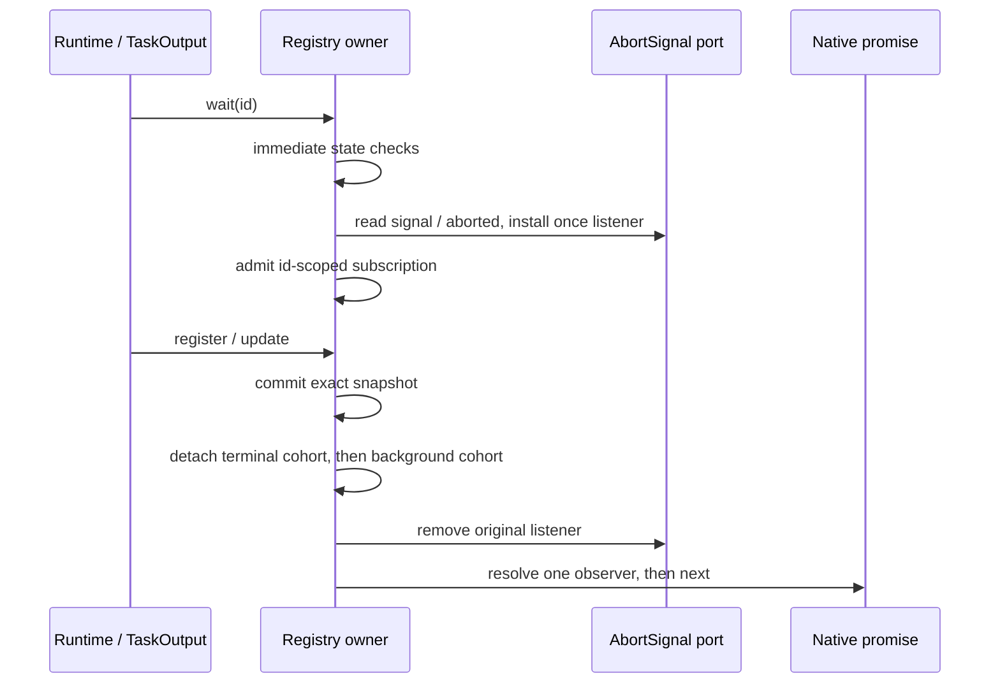

# CLI runtime task registry 的契约实现

本路从整合基线 `3b1ff0f715a43cbc51c576fd524479a08e58e203` 开始，持久分支为 `lane/cli-rewrite-20261003`。本批范围仅为 `apps/cli/packages/core/src/runtime-task/registry.ts` 和本路新增测试，不改变公开 contracts、任务执行、权限、通知呈现、持久化或其他已安装 owner。

## 输入与目标

旧完整 owner 尚未替换：`docs/knorvia-task-registry-restricted-author-handoff-20261002.md` 记录 author 启动失败，没有候选；该路径的已有 Git 历史只有导入和格式化。以 `docs/knorvia-task-registry-author-inputs-20261002/{behavior.md,api.d.ts,supporting-types.d.ts,inputs.json}` 的行为、公开类型和固定词汇为实现输入。它们是从旧源码提取的契约，不是已执行的全面验收。

实现允许同等复杂度；目标是依据行为规则写出完整实现，不要求人为减少功能或发明新策略。历史方案、源码和 fixture 在初稿之后用于差异复核，不能成为逐行改写模板。本执行者已经读过历史选择说明；不声称隔离 author、clean room 或已完成权利核验。

## 唯一所有者与内部组织

`InMemoryRuntimeTaskRegistry` 继续独占已注册快照、后续注册默认 branch generation 和按任务 id 的等待订阅。快照使用有序索引，订阅独立于快照存活：没有快照的 id 也能保留在 listener 安装时重入形成的订阅。每个 id 的订阅簿包含两个双向 FIFO cohort，ticket 记录所属 cohort 和相邻 ticket；abort 只摘掉当前仍挂在簿上的 ticket，发布先摘掉整个 cohort 再沿原链逐个清理、结算。这样 detached cohort 的稍后 abort 仍可以先 reject，且不会改动同 id 的新 cohort。避免将 observer 的寿命绑定到 snapshot 槽位。两种 wait 共用 admission 与发布机制，但终态和后台判读保留不同顺序。

没有新 generation fence、策略授权、任务停止、超时、retry、异步 setup 或第二状态所有者。observer cleanup 出错保留 commit 和 cohort detachment；不恢复或吞掉剩余 detached observer。Abort 只取消该观察，不取消任务，也不显式移除 once listener。

## 保留的不变量与验收场景

- register 浅拷贝、嵌套身份、nullish generation fallback、id 插入次序、普通 record 的整数键及 `__proto__` 自有属性行为。
- update 在原 id 上存储 patcher 的原结果，missing 不调用；patcher 重入效果和异常边界原样保留。
- terminal 先发布，background 再发布；每次 cohort 先整体脱离再逐个 cleanup / resolve。清理重入的新 cohort 不能加入已脱离的 cohort。
- listener 安装先于 admission。安装时 remove/register、inline abort 或抛错保留原同步/native promise 边界。
- immediate waits 不读取 options；pending path 在 promise 构造前读取 signal / aborted；后台 immediate 检查按既有 truthiness 和重复读取规则保留。
- queue 走一次公开 update；drain 返回原消息数组并用新空数组更新快照，不发布、不调用 sink。
- 六个固定 terminal status 和 running-background helper 的 literal-true 条件不变；trace、output、日期、session、usage 等引用不归一化。

新增测试覆盖外部可观察的快照身份、message receiver、特殊 id、发布时序、错误后部分状态和 signal 重入。保留历史 fixture、oracle、selector 与所有旧失败记录，不改预期以迁就新实现。

## 本阶段验证与许可边界

用户明确本阶段不运行测试、lint、类型检查、格式/架构检查、构建或全量审计。新增测试只编写，不执行；只阅读契约、相关源码和提交差异，并确认完整提交在远端。所有候选标记 **未验证**，source/emitted/真实消费者、跨平台和整合组合验收留待最终阶段。

本路只维护 `docs/lane-cli-20261003.md`，不改全局 inventory/reviews 或 LICENSE/NOTICE。固定 API、行为词汇与关联第三方声明继续保留。独立表达、来源、贡献权和最终 MIT 决定仍待整合者核验；写出新代码不会自动授予 MIT。
