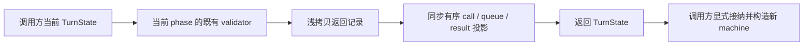

# CLI TurnMachine 的同步投影实现

本批继续 `lane/cli-rewrite-20261003`，仅替换 `apps/cli/packages/core/src/agent/turn-machine.ts` 及其内部同步 tool-call 投影，并新增本路回归用例。`turn-state.ts`、contracts、runtime loop、command admission、权限 owner、模型/工具执行、scheduler/context 与 UI 保持原接口及数据格式。

## 依据与行为边界

`docs/knorvia-core-next-owner-handoff-20261003.md` 记录旧候选因表达对应被拒，尚未安装，不能继续修饰旧 draft。以 `docs/evidence/turn-machine-author-20261003/{contract.md,api.d.ts,state-api.d.ts,ports.d.ts,imports.txt}` 为行为和固定 API 输入。实现前不读取旧 draft 或 predecessor body；本路先写完整初稿，再用当前 source/消费者作静态复核。原 author 和 oracle 历史保持不变。

`TurnMachineImpl.state` 仍是调用方拥有并可替换的原 state 引用。操作返回投影，不给 `this.state` 赋新值，不保留第二份事实、队列、phase 或 cache。公开名称、品牌类型、错误词汇和对象字段顺序保留。状态工厂和 phase validator 使用现有公开接口。

## 实现组织与事件顺序

本实现从契约写出显式的结果记录构造：验证 phase 后浅拷贝一次，按合同顺序写返回记录的字段；无 phase guard 的操作只对新记录更新。tool-call 的 scheduling、execution、completion 与 permission projection 由同步纯 helper 承担，使用有序遍历及局部 record 编辑，保留所有未修改条目的身份，匹配重复 id 时修改全部匹配项。helper 不读权限服务、不运行工具、不访问文件或 provider。

模型请求的 admission 必须先于 phase validator；streaming 两种入口先验证再拼接。scheduleTools 先验证才读取/遍历输入，每条 call 有自己的 Date。startToolExecution 先选择是否 AwaitingPermission，再验证，最后给非 waiting call 分别创建 startedAt；waiting call 的 startedAt 和 status 保留。

completeTool 的失败文本转换必须在任何 call 投影或 Date 之前发生；所有匹配项拥有新 record、完成日期和二字段 result。无匹配也追加一条三字段 result，成功 result 含显式 `error: undefined`。complete 验证后生成 completion Date，fail 绕过 validator。permission 只是 state projection，不颁发 grant；deny/allow/escalate/modify、nullish input fallback、重复 id 与 pending request 删除规则不变。

## 验收场景

- 返回 state 与 machine 的原 state 不同；原 state、原 arrays 与未修改 nested object 不被修改，外部替换 machine.state 后所有读取使用新的 state。
- phase 不合法保持固定错误 category、message、context 和 recoverable；失败路径不提前产生 tool timestamp。
- supplied 空字符串 turn/trace id 保留，默认只在 nullish 时生成；调用现有 createTurnState，不自制 persisted state 格式。
- tool schema 限定字段、schedule 引用、独立 Date、matching/nonmatching identity 与 duplicate id 行为；失败 content 转换错误原样传播。
- input enqueue/drain 返回身份；permission projection 全决策、false/0/空字符串替换、null/undefined fallback，以及未改动条目共享。
- getNextPhase 的 streaming、running/waiting、failed/denied 优先级与终态判断沿现有规则，不引入自动执行或停止。

新增测试只写不跑；历史 source/emitted selectors、fixture 和 oracle 保持原字节。用户要求本阶段不运行测试、lint、类型/格式/架构检查、构建或全量审计，当前候选全部 **未验证**。最终 source/emitted/真实调用链验收和来源/表达/贡献权复核仍须另做。本规格不授予 MIT、不改变 LICENSE/NOTICE 和全局 ledger。
