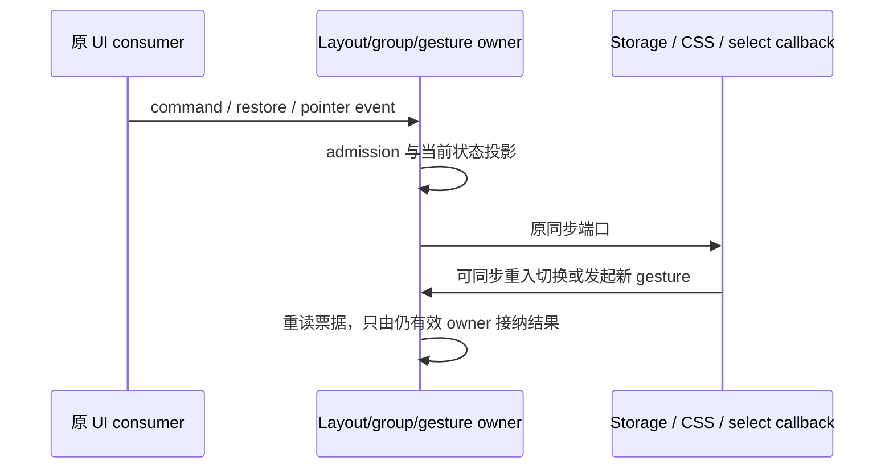

# CLI 路移交切片：v4 布局与恢复

本切片由父任务从 UI 路明确移交给固定 CLI 路；继续 `lane/cli-rewrite-20261003` 与 Draft PR #14，不建立其他任务、分支或 PR。指定 UI checkpoint 为 `662b64276a7271324efcbc6de36497058250d521`。该 head 相对原基线未改下述九个文件；pointer tracker、pointer drop registry、grouped hook 等 UI 路新候选保留，仅作为只读接口/调用方，不重复安装。

源码写入只限 `packages/ui/src/v4/` 下 `paneLayoutTree.ts`、`paneLayoutStore.ts`、`paneLayoutPersistence.ts`、`workbenchGroupStore.ts`、`workbenchSessionPlacement.ts`、`workbenchNewTaskTarget.ts`、`usePaneSessionPersistence.ts`、`WorkbenchSplitDivider.tsx`、`workbenchDragDrop.ts`。规格和来源记录使用 CLI 路自己的文件，不改 UI lane 文档、其他 UI 文件、根配置、共享协议或全局许可台账。

## 现状与设计

本路读取当前九个 owner、直接 consumer、UI PR15 lane/spec、仓库指令与 DESIGN/CONTEXT；不是隔离作者。九个文件的当前 Git history 只有 import snapshot，精确 saved origin 为 upstream-modified/unchanged、NOASSERTION，reviews 无精确条目。没有据此声称原作者或已接受稿不存在，也没有重新取得 publisher body。原版权/许可/来源材料保留，写出候选不等于 MIT-ready。

新实现以显式树编辑 continuation、单一 pane command reducer、两种持久化 profile、group command/commit、placement effect plan 和 gesture/restore 资源票据接入唯一入口。共用树/scope/binding 模型与 codec 放在已有移交文件内；公开旧入口仍可导入，不建立 runtime fallback。短公共声明、固定 key/MIME、geometry grammar、错误边界和 JSX/class/testid 是兼容材料，不计独立表达证明。

## 必须保留的行为

- `workspace-main` 固定 primary，不在普通 pane bindings；树顺序 first→second，最多四个叶子，比例有限值 clamp 25%–75%，非有限值 50%。id 按已出现数值最大值分配 `pane-<n>`/`n<k>`，历史 `split` id 有效。树编辑保持未变化分支与 no-op 的原引用；关闭 primary 在 pane 模型中 no-op，在 group 模型中解散 group。
- split side 的方向/前后顺序、focus 回 primary、session identity 的 trim-or-path、pane bind/confirm 原字段投影、group bind 保留 readOnly 且清验证标记、重复 session 阻止再入、draft primary 与普通 group 归属、group 更新时间/激活/index 重建均保留。关闭 pane 只关闭视图，不停止 session。
- pane store 在模块读取持久值后才判 renderer reload，cold start 不恢复；仍报告是否曾有可读布局。action 引用稳定，Zustand shallow merge、no-op 不通知，subscribe 同步持久化。
- pane v2 key `knorvia-v4-pane-layout:v2` 优先；有 v2 即不回退 v1，哪怕损坏。v1 只允许 `/` 或 Windows drive 的可信本地 key，保持 `split`/`n1`/row 迁移与原 focus。v2 整体坏布局拒绝；比例、scope 可选字段和空 session 归一、restoredUnvalidated 内存标记、序列化字段顺序/省略规则和写成功才更新去重缓存保留。
- group key `knorvia-v4-session-workbench-groups:v1`、version 1、activeGroupId/groups/sessionIndex 格式不改。group 恢复与 pane 恢复的空字符串/array 接纳差异保留；无效 group/重复 id/跨 group 已占 session 按原顺序跳过，至少两叶子。旧 readOnly group 丢弃，普通 binding 进入待验证态；不额外禁止同一恢复 group 内旧有重复 binding。group 写出保留其他自有字段，只删验证标记，不借新 codec 改 schema。
- `web-remote-replayable` gate 先关闭再清内存，不读/写 desktop groups；再次 desktop 只 hydrate 一次。cold-start 与 reload 规则不混用。
- placement 的 focused same-session 阻止、已有 group/pane 优先、菜单可 focus 而 drag 不可、容量、draft split 返回 false、promote→reset→读取新 group→split 顺序、new-task 的 group→focused secondary→active workspace 优先级保留。sidebar 替换 secondary 完整 scope/session 后才走普通选择，原日志与 public return shape 保留。
- last-session key `knorvia-v4-last-session:v1:<workspaceKey>` 不变；每 key 只首次尝试恢复，reload 资格仅首个 enabled workspace 消费，cold/workspace-only 保持 draft。选择 callback 使用最新引用，pending restore 的初始 null 不覆盖存储，remote 禁用不消费资格。
- divider JSX、CSS、testid、ARIA、pointer capture 的可失败边界、非左鼠标过滤、rAF 合帧、main-axis/regionPx 公式不变。pointerup 与 pointercancel 均以最终坐标提交一次，拖动中不进入 pane store；unmount 只取消，绝不提交。native payload 的 type 检查、空 getData 使用当前指针 drag payload、JSON guard/optional fields、异常返回 null，以及 drop-side 的 rect 边界、tie 顺序 left/right/up/down、0.32 阈值与 NaN 行为保留。

## 有界生命周期缺口

在契约内补回实际源码缺口：新 divider gesture 或 split/container/direction 变化撤销旧 rAF 写入权，end 在外部 commit 前释放旧票据以允许同步重入；group storage hydrate 在返回后重读 client-mode/configuration 接受权，防止 getItem 同步切换 remote 或显式 reset 后回填旧 group；last-session 的明确 draftFocusVersion 变更撤销 pending restore，避免永远把用户 null 当作等待恢复。重复同一 desktop mode 仍属 no-op，不撤销在途 hydration；remote 切换和明确 reset 才失效旧票据。存储/选择等已发出的同步端口不假装 abort，也不增加 timeout/retry。必要 cleanup 在外部 callback 前撤销本地许可。

## 最终验收场景与本阶段限制

统一阶段需覆盖四叶子嵌套/方向/塌缩/结构共享、重复 session/remote identity、pane v1/v2 与 group v1 实际旧数据、cold/reload/remote gates、storage failure/reentry、group promotion/active focus、菜单/drag 返回边界、restore 初始 null 与明确 draft 取消、divider rAF/cancel/reentry/unmount、DataTransfer 与 geometry 全边界，以及 PR15 pointer owner 与 desktop/Web/React/DOM 的实际组合。

本阶段不运行测试、lint、类型/格式/架构检查、构建或全量审计，不安装依赖/启动应用/触碰真实用户数据。九文件限制不扩展到范围外 UI 测试；最终测试接纳及当前产物验证交整合阶段。只做必要源码/差异阅读、提交推送与远端 ref/API 核对。全部候选 **未验证**，最终独立表达/来源/作者权利和 MIT 决定仍待核验。
