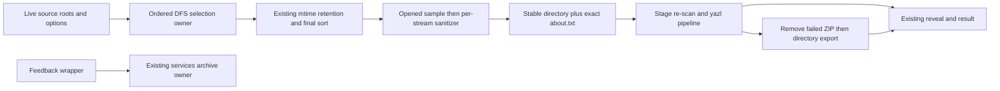

# Complete native diagnostic export owner

Continue `rewrite/native-20261003` / draft PR17 from
`642cf17e2501288bfee834daba54c1db64a4c1aa`. Replace the whole
`packages/desktop/src/main/exportLogs.ts`, still matching recorded
upstream-modified SHA256
`709db7c977ce2998b7ac9ef558b2f3a80912474d54c06957a5c104bef2016e77`.
The installed services feedback archive is a retained public dependency; its
handoff covers a wrapper consumer rather than this complete manual exporter.
No services/shared/renderer/CLI source, global provenance, configuration or UI
change. Same source-exposed author curated all 1,271 baseline lines and the
existing security/feedback handoffs; no fresh-author/clean-room/rights/MIT claim.

## Ownership and public surface

One ordered selection owner maintains visited real directories and file entries;
explicit DFS frames replace recursive traversal. One encoding evidence owner
evaluates fixed compatibility thresholds. Each sanitizer stream owns its decoder,
incomplete line and private-key-block phase. One copy owner records skipped files
and controls admission/recheck. One staged ZIP owner controls its temporary path
and existing writer lifecycle. One export operation snapshots dependencies and
owns ZIP-to-directory outcome routing. These are native diagnostic projections,
not service/task/connection state, caches or new data authorities.

Keep exactly the three exports and existing private types/dependency shapes:
`createFeedbackLogArchiveFromExportLogs(sourceDir,options={})`,
`writeSanitizedDiagnosticLogSnapshot(outputDir,options={})`,
`exportLogs(dependencies={})`. Keep path/size, void and success/path/error result
formats. No new exports/options/schema/admission or cancellation APIs. Feedback
forwards its onProgress reference to the services owner; its declared stageRootDir
remains ignored. Preserve supplied-function unbound calls and live argument/
artifact/error references. No protocol, persistence or user-data migration.

## Ordered selection and retention

Data root calls getAppConfigDir. CLI root is dirname(getAppConfigDir)/cli/log;
helper root is dirname(getAppConfigDir)/computer-use/run. Resolve each at its
existing phase, without caching/combining config reads. Manual artifacts traverse
source root then CLI log root with one visited set; helper collection reads only
regular immediate entries whose case-sensitive name ends .exit.log. Never recurse
helper directories or follow their symlinks. Then retain recent entries, sort by
archivePath.localeCompare and generate about via readBuildMetadata,
createAboutSnapshot({buildMetadata}), formatAboutDetail in that order.

Directory-root admission uses stat catch-null/isDirectory. Entering a directory
uses realpath catch-original-path, visited check/add before readdir. On readdir
failure warn with exact directory/relative/error fields then skip; logging errors
propagate. Sort the actual returned dirents in-place by name.localeCompare. Walk
depth-first in that order, making archive paths with posix.join unless prefix
empty. Apply path exclusion before absolute join/type/IO. Directory entries recurse;
regular files require diagnostic extension; symlinks stat catch-null, then recurse
directory targets or accept regular diagnostic targets. Other types skip. Preserve
realpath dedup across roots and symlink loops. Stage collection traverses just its
root with a fresh visited set and sorts the selected files, including about.txt.

Retain exact path-policy data and case sensitivity: credentials basenames and
debug path segments case-insensitive; retired ACP/dev/cache exact segment rules;
docshot first-segment names/prefix; non-log-state broad startsWith rules; existing
star glob support with empty initial patterns. Final approved roots (lowercase
comparison) are about.txt, logs and descendants, .knorvia-studio/cli/log and
descendants, .knorvia-studio/computer-use/run and descendants. Diagnostic extensions
are log/jsonl/txt case-insensitive. Normalize backslash to slash only; no new
canonical-path/containment check or authority. Preserve every current exclusion.

Retention snapshots lookbackDays default3; <=0 returns the original array without
clock/stat. Otherwise snapshot supplied now/default Date factory and invoke unbound
once for cutoff now().getTime()-days*86400000. Only case-sensitive normalized logs/
and .knorvia-studio/cli/log/ entries require stat catch-null, isFile and mtime>=cutoff.
Others pass without stat. No calendar-day rounding, finite-number validation or
helper age filtering; preserve NaN/fraction/invalid-Date native behavior.

## Encoding and streaming content

Sample each file with open(path,'r') outside try, allocate65536, one handle.read at
position0, return subarray(bytesRead), await close in finally (close error priority).
Keep empty UTF8 and exact UTF8/UTF16LE/UTF16BE BOM admission, BOM bytes/skip lengths.
Without BOM: if sample contains NUL and neither parity has >=.3 null ratio with
other <=.1, reject binary first. NUL-free fatal-UTF8-valid samples return UTF8 first.
Then choose ASCII-pair runs, null parity, decoded score in that order; no selection
falls back to fatal UTF8 success or binary rejection. No unknown-binary copying.

ASCII-pair evidence ignores odd trailing byte; ASCII is tab/LF/CR or20..7e; only
contiguous same-endian runs>=3 count, score>=6 and >=other*1.5 qualifies, LE before
BE. Null ratios count all sample bytes by parity, length<4 absent. Decoded scoring
uses even prefix>=4, LE then BE TextDecoder. Invalid codepoints: replacement/NUL/
DEL/surrogates/C0 except tab/LF/CR. Preferred: tab/LF/CR/space, ASCII20..7e,
4e00..9fff,3400..4dbf,3000..303f,ff00..ffef,3040..30ff,ac00..d7af.
Denominator max(codepointCount,1); qualified preferred>=.55 and invalid<=.2. If
one qualifies choose it, neither returns null; if both and preferred gap>=.08
choose higher preferred, otherwise lower invalid, equality LE. Thresholds/ranges,
regexes, path lists, placeholder and native idioms are retained compatibility data.

Keep original redaction order: connection credentials, sensitive JSON keys,
assignment keys, header keys, Bearer, query keys, sk/rk/pk forms, GitHub forms.
Preserve exact sensitive-family/allowlist and regex matching/capture behavior,
quote/leading/trailing whitespace, header Bearer normalization and placeholder
***REDACTED***. Do not replace it with shared redaction or strengthen/relax rules.

Each Transform has streaming TextDecoder and live pending text. Merge decoded
chunk, split after last LF preferentially; if no LF split after last CR only when
not last character, otherwise retain all. PEM state uses the exact line/BEGIN/END
regexes: nonempty BEGIN emits placeholder plus LF and enters; inside strips lines,
END leaves; repeated BEGIN has priority. Retain lone-CR and final-line behavior.
Run scalar redaction after PEM filtering, encode UTF8/UTF16LE or swap16 for BE.
No output callback data when no complete text; empty redacted buffers still pass
as data. Flush pending+decoder.decode with same error/callback behavior. Per-file
pipeline constructs read(start:bomLength), then write; write BOM before constructing
Transform/pipeline. Preserve default stream encodings and original error identities.

## Copy, archive and public outcomes

For each file join destination/split archive segments and mkdir parent before
source stat. Stat/access failure records the original path/archive/error text and
skips; non-regular stats skip without record. Sample/detect/sanitize in a separate
try; binary adds exact unsupported reason. On processing failure re-stat and
access source; unreadable now records original processing error and continues,
still-readable rethrows that error. Do not remove partial output, parallelize,
retry, repair or alter races. At end warn once for skips with count and first10.
Directory writer mkdirs output, copies, warns, then writes exact about content UTF8.

ZIP writer snapshots stageRoot(default service path), mkdirs, mkdtemp(stage-),
then inside try writes directory, constructs ZipFile, re-collects stage files,
creates output stream, arms one ZIP error callback destroying output with original
Error or Error(String(value)), adds ordered files, starts pipeline, calls end and
awaits pipeline. Finally rm(stage,{recursive:true,force:true}) catch-ignore. Preserve
existing synchronous-construction failure/lifetime semantics; no unrelated cleanup
fix or new stream error policy. Output archive removal belongs only to fallback.

Export snapshots dependency functions in existing getter order before calls.
Call source, now for local YYYYMMDD-HHMMSS, output root; mkdir root, mkdtemp with
knorvia-logs-timestamp- prefix, derive ZIP/directory paths, log start, build artifacts
with exact {now}. Inner try includes stage-root getter invocation, writeZIP, reveal
ZIP and success log. Any inner failure (including reveal/log) warns, rmZIP catch-
ignore, then tries directory writer. Directory writer failure combines exact two
error descriptions; fallback reveal/success log follow outside that directory try.
Outer errors log exact error then return {success:false,error}; logger error itself
may reject. Preserve directory/ZIP result labels, warning/error prose and no output
directory cleanup. Default reveal imports Electron lazily and calls shell API.

Feedback wrapper builds sources in existing order: source/logs, live CLI, live
helper(exitLogsOnly:true); snapshot outputRoot/default feedback path then now and
onProgress, invoke existing service. Snapshot wrapper chooses source/default and
forwards now to artifact builder then same directory writer. No uploads, new
permissions or source mutation.

## Deferred acceptance and evidence

Author only a small focused fake-port batch for real selection/sanitizer/staged ZIP
and public fallback/dependency/feedback wiring. Existing native security and
services source/emitted/archive consumer cases remain exact and unrun here.
Freeze complete candidate/dependency bytes before source diff. No tests (including
synthetic), lint, types, format/architecture checks, build, application/native/UI
execution, full audit or real log/user data access. Only source/diff and byte/Git/
remote metadata. Preserve source/licence records and qualify retained expressions;
final integration owns native/platform/consumer acceptance and provenance/rights.
