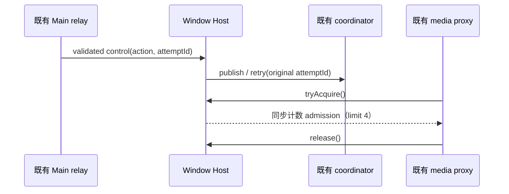

# Native 最终集中验收修复

本批复用 `rewrite/native-20261003`，先普通 merge 精确整合提交
`19f6ccf74ba1064ca81d93194b4f25a36030e361`；PR17 已合并，不新开 PR。
首轮真实失败来自 `docs/evidence/backlog-integration-20261003/final-first-pass.json`
及其 typecheck 日志：desktop 18 条、server 4 条不同诊断，另有 7 个测试文件
max-lines 和本路 35 个格式路径。整合树继承内容没有新的重写完成信用。

本路 lint 的附带维护仅去除已有模块的空 export 和未使用 type import；测试事件端口
将原监听集合复制显式命名为 snapshot，保留回调中增删监听时的派发集合，不改为 live
迭代。Host 假端口拆为入口、场景、共享工具、初始控制、注册表及依赖端口，uuid
递增和 tracker reporter 赋值仍由原 harness 闭包拥有。

## 契约与修复边界

- Window Host 仍是编排、启动控制 admission 和全 Host 媒体请求计数的唯一所有者。
  已验证的共享启动控制用 `action` 区分 snapshot/retry；Main 已处理 exit。
  Host 必须读取真实字段，并向 coordinator 传原 attemptId。
  媒体 proxy 的现有端口调用 `tryAcquire`，Host 提供同名方法，保留同步上限 4、
  release 下限 0 和观测形状；不创建第二份计数。
- 远端 workspace proxy state 只承诺 taskId/traceId/workspace identity，不能在
  Host 将该最小身份宣称为完整 task meta。tracker finish 只需要 workspace context。
  prompt 包装传入已收窄参数的调用闭包，保留原动态函数、target receiver、原单参数
  调用以及 materialize → lease → mirror → prompt → release 次序。
- 已验证的任务 ID 数组先读取并收窄首个 ID，空数组保持原空结果。附件使用 entries
  同步迭代，保留索引、原附件引用、异步上传次序、清理/原错误优先级和内容替换；
  不跳过附件或填造附件字段。
- 浏览器 modifier 是共享封闭联合。完整 modifier 表及类型 predicate 表达该事实，
  key-up 使用反向值迭代，保留原顺序、CDP 参数个数和平台映射。
  snapshot 的 root 与可空祖先栈分开，已弹空时真实父节点是 root；保留缩进树、
  匿名组折叠、img 过滤和全部渲染文本。
- tar 只在完整 512-byte header 入场后以 Buffer 的单字节 API 读取 type flag，
  保留 NUL/ASCII 0 的 regular-file 意义及原安全校验/模式恢复。
  WSL IPv4 明确收窄第二个 octet；regex capture 使用原 token/source 的既有缺省值，
  保留 route 优先、resolv 私网/链路本地限制、IPv6 与 malformed/loopback 排除。
- 所有 UI JSX、协议/数据形状、来源和第三方义务不变。不用 any、ts-ignore 或新
  强制断言掩盖错误；不改 shared/contracts、根规则或 CI。

## 定向验收

先补启动 action/媒体限流端口的假端口断言及 tar/WSL 边界场景；复用现有 Host、
附件、input/snapshot 受影响场景。过长 mjs 测试拆分为同入口下的场景模块和 fixture，
保留场景名、选择参数、断言、端口和注册顺序，不关闭 lint 规则或扩大 root 发现。
仅运行受影响 types、指定测试、本路 lint/format。Node 24.14.0、pnpm 10.33.2，
frozen lockfile + ignore-scripts 只装检查依赖，不装载 native 二进制或启动产品。
不运行根全套测试、build、全量架构/来源审计。跨路错误单独报告，不能标成通过。
当前来源/权利 HOLD 仍由整合者核验；本批是编译/接口/测试维护修复，零独立重写或 MIT
增量信用。历史 authored-and-unrun 记录不回填成全量通过。

实际集中定向结果：server/Host/Main 各自 `tsc -p … --noEmit` exit 0；先前
`tsc -b` 引用链检查仍 exit 2，43 条诊断全部在 services，本路 22 条已不出现。
单工程通过使用该引用检查产生的依赖声明，不能宣称引用链或 root typecheck 通过。
本路 7 个包 lint 检查 580 files，0 errors / 0 warnings；35 个既有格式路径加
受影响/新增文件共 77 paths 格式通过。定向 43 场景全通过；后续 fixture 维护
只复跑受影响 6 场景和最终 Host 4 场景，均通过。锁 2 场景先前另有独立执行收据。
35 个格式路径的有限 AST 投影一致、拆分前后 40 个场景语句投影一致，是差异阅读证据，
不能代替运行或 UI/平台验收。所有 command/log/source digest 写入本路独立证据目录。
