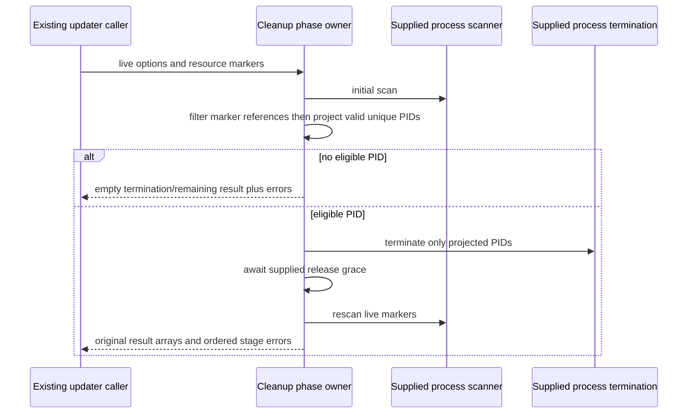

# Windows installation locks and Host log relay

Continue native lane on the same branch/PR after
`388b69ccf08feacee73fbffb31a48faaa32c07ce`. Select complete
`packages/desktop/src/main/windowsInstallResourceLocks.ts` and `hostLogRelay.ts`.
The first still matches its upstream-modified inventory digest; the second
matches its recorded upstream blob/digest. Bounded exact-path receipts found no
installed complete replacement and Git shows only the initial snapshot. This
does not prove private history absent or grant MIT. Same source-exposed author
derives this contract, authors and freezes whole candidates before source diff.
No renderer, CLI/Core, services, updater caller, shared protocol or global record
is edited. Public types/data and ordinary expressions remain retained material.

## Windows cleanup owner

Keep all six exports and public structural return/parameter types, including
WINDOWS_UPDATE_LOCK_RELEASE_GRACE_MS=750 and the generic cleanup result.
Resources are the ordered literal directories `knorvia`, `tools`; marker
resolution uses node:path join for both, without IO/normalization.
Cleanup creates a fresh errors array and empty initial/termination/remaining
arrays. Initial scan invokes options.scan with options receiver and its live
resourceLockMarkers; after await filter each row by current live markers.
Normalize each marker by trim, slash-to-backslash, lowercase; discard blank
normalized markers. Normalize the concatenated nullish-defaulted commandLine,
space, executablePath, and admit a row when any retained marker is a substring.
Filter errors belong to `initial-scan`. Preserve row identity/order/duplicates.
PID projection occurs outside that catch: map all row pids, keep only positive
Number.isSafeInteger values and deduplicate in first-seen Set order. If empty,
return immediately with original errors and empty termination/remaining arrays.

Otherwise execute exactly three phases in order: options.terminate(pids), then
options.delay(options.lockReleaseGraceMs), then options.scan(live markers).
All option callbacks keep the options receiver, arguments are read live at their
phase, all phases continue after rejection, and each result array is retained by
identity without cloning/schema validation. Initial scan is filtered; rescan is
**not filtered**. Error text is `${stage}: ${Error.message or String(error)}` for
initial-scan/terminate/release-grace/rescan. Exceptions in error stringification
still escape. Return property order remains initialLockProcesses, terminationPids,
terminationResults, remainingLockProcesses, errors. Implement the later effects
as one phase loop with one result ledger; no retries or persistent process owner.

The native query defaults to 3000ms and skips exec entirely for an empty marker
array. Keep execFile/promisify construction, `powershell.exe`, flags
`-NoProfile -NonInteractive -ExecutionPolicy Bypass -Command`, utf8, windowsHide,
supplied timeout and maxBuffer=2097152. The exact PowerShell program is retained
compatibility data, including the publisher/source lineage: quoted markers
escape single quotes by doubling, query Win32_Process, exclude the script PID,
match command/executable markers and emit compressed JSON. It receives no new
independent-expression credit. Trim stdout; blank gives [], otherwise JSON.parse
and scalar-to-one-element-array conversion. Project ProcessId nullish 0 and
commandLine/executablePath nullish undefined, then keep positive integer PIDs.
No new row validation, safe-integer change, platform guard or scanner fallback.

Snapshot/probe public APIs are synchronous and must remain so for the existing
updater handoff; changing them to async needs a separate caller contract. Snapshot
checks existence before listing, retains first 20 directory entries in native
order with directory `/` suffix, and returns [] on listing failure. Probe checks
each directory existence first; missing returns writable=false without generating
a sentinel. Existing directory gets exact name
`.knorvia_resource_probe_${pid}_${Date.now()}_${Math.random().toString(16).slice(2)}`,
and `.renamed` partner, generated before the probe catch. Within the catch boundary,
write 'probe\n' utf8, rename to partner, rename back, best-effort remove both.
On failure best-effort remove both and return Error.message/String(error), with
no new exception normalization or data directory operation. Preserve fields/order
dir,path,exists,writable[,error]. Only these diagnostic sentinels are targeted;
no packaged resource/data removal is introduced. Implement create/rename/restore
through a synchronous operation phase loop with the same native failure boundary.

## Host log relay owner

One relay retains an initially raw phase and ordered raw records. Factory API
remains createHostLogRelay(label,logger,optional renderer callback), returning
onStdout/onStderr/onStructuredLog/flushRawLogs in order and their void signatures.
Stdout/stderr append original messages only while phase is raw. First and all
later structured events set structured phase and clear raw records **before**
spreading the entry, formatting the timestamp or logging. Preserve entry extras,
spread getter ordering and timestamp replacement: new Date().toLocaleTimeString
(undefined,{hour12:false,hour:'2-digit',minute:'2-digit',second:'2-digit'}).
Log exact line `[host-log] (${label}) [${source}] ${message}`; error/warn use those
logger methods, every other level uses info. Keep logger receiver and call it
before invoking renderer callback unbound with the same structured object.
Any spread/clock/logger/callback exception propagates and does not undo phase.

Raw stdout logs info with `[host-stdout] (${label}):`, original message. Stderr
uses warn only when trimStart matches the exact retained Node warning regex
`^\(node:\d+\)\s+(?:ExperimentalWarning|DeprecationWarning|Warning):` with u flag;
then retain first CRLF/LF line with trimEnd. Other stderr logs error with
`[host-stderr] (${label}):`, original message. Flush in structured phase only
clears. Flush in raw phase iterates the **live** buffer in order, clearing only
after complete success. Reentrant raw additions participate; a thrown logger
leaves the buffer, including previously emitted records, for a later flush.
Do not dedup by text, cap/drop buffered messages, change severities, log twice,
emit raw entries to renderer or create a second Host/connection state owner.
Desktop live/RPC and mobile replay delivery remain unchanged.

## Deferred acceptance

Author bounded supplied-port scenarios for marker/PID admission and live phase
options, ordered errors/array identity, native query envelopes, sentinel cleanup,
log warning/raw replay/structured precedence and failure/reentrancy boundaries.
Do not execute them. No tests, lint, types, builds, format/architecture gates or
audit; only source/diff reading, exact byte bindings and Git/remote metadata.
No subprocess, process termination, actual filesystem probe, updater, Host,
Electron app, renderer or user data/local computer operation. Retain original
license/third-party records and defer origin/rights/native acceptance to parent.
